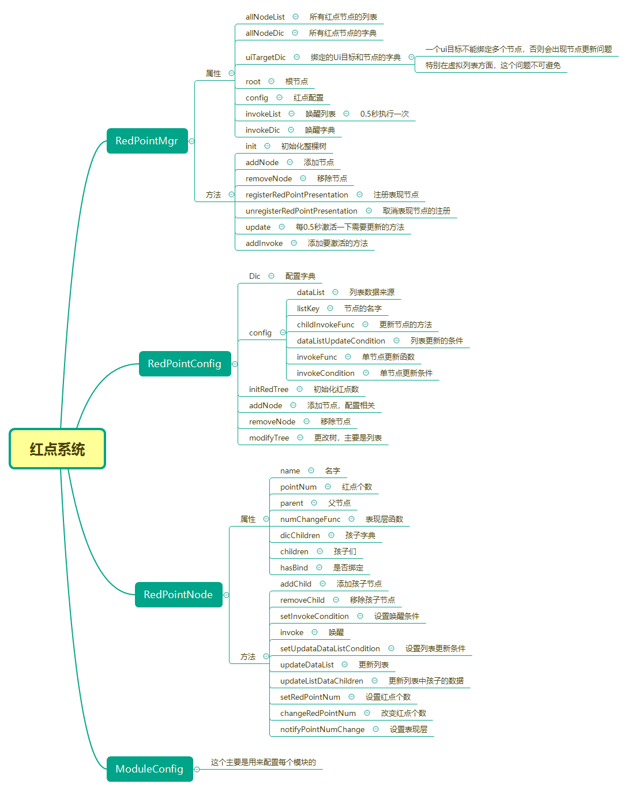

# 红点系统

参照：https://zhuanlan.zhihu.com/p/85978429

规划红点系统的时候，我们将整个系统分为独立的三个部分：结构层、驱动层和表现层。

结构层用来部署红点的层级结构，做过红点系统的都知道，很多时候红点系统的层级都很深，所以我们要用一个结构来描述层级，这个就是我们今天的主题，树结构。

驱动层是指，如何驱动这个树结构产生状态变化，以及状态变化之后如何将变化的行为通知到指定的表现层，在一定的程度上将数据和表现分离开。

表现层就专门承担表现的职责，比如有的红点就是一个单纯的红点，有的需要显示数字，有的可能是图标晃动，有的是显示new标签，有的是播放特效等等。这些都可以归属在表现层统一去管控。


## 代码设计

树结构：

```c#
public class RedPointConst
{
    public const string main = "Main";
    public const string mail = "Main.Mail";
    public const string mailSystem = "Main.Mail.System";
    public const string mailTeam = "Main.Mail.Team";
    public const string mailGuild = "Main.Mail.Guild";
    public const string task = "Main.Task";
    public const string guild = "Main.Guild";
}
```

节点：

```c#
using System.Collections.Generic;
using UnityEngine;

public class RedPointNode
{
    public string nodeName;
    public int pointNum = 0;
    public RedPointNode parent = null;
    public RedPointSystem.OnPointNumChange numChangeFunc;

    public Dictionary<string, RedPointNode> dicChilds = new Dictionary<string, RedPointNode>();

    public void SetRedPointNum(int rpNum)
    {
        if (dicChilds.Count > 0)
        {
            Debug.LogError("Only Can Set Leaf Node!");
            return;
        }

        pointNum = rpNum;
        NotifyPointNumChange();
        if (parent != null)
        {
            parent.ChangeRedPointNum();
        }
    }

    public void ChangeRedPointNum()
    {
        int num = 0;
        foreach (var node in dicChilds.Values)
        {
            num += node.pointNum;
        }
        if (num != pointNum)
        {
            pointNum = num;
            NotifyPointNumChange();
        }

        if (parent != null)
        {
            parent.ChangeRedPointNum();
        }
    }

    public void NotifyPointNumChange()
    {
        numChangeFunc?.Invoke(this);
    }
}


```

system:

```C#
using System.Collections.Generic;
using UnityEngine;

public class RedPointSystem
{
    public delegate void OnPointNumChange(RedPointNode node);
    RedPointNode mRootNode;

    static List<string> lstRedPointTreeList = new List<string>
    {
        RedPointConst.main,
        RedPointConst.mail,
        RedPointConst.mailSystem,
        RedPointConst.mailTeam,
        RedPointConst.mailGuild,

        RedPointConst.task,
        RedPointConst.guild,
    };

    public void InitRedPointTreeNode()
    {
        mRootNode = new RedPointNode();
        mRootNode.nodeName = RedPointConst.main;

        foreach (var s in lstRedPointTreeList)
        {
            var node = mRootNode;
            var treeNodeAy = s.Split('.');
            if (treeNodeAy[0] != mRootNode.nodeName)
            {
                Debug.Log("RedPointTree Root node Error:" + treeNodeAy[0]);
                continue;
            }
            if (treeNodeAy.Length > 1)
            {
                for (int i = 1; i < treeNodeAy.Length; i++)
                {
                    if (!node.dicChilds.ContainsKey(treeNodeAy[i]))
                    {
                        node.dicChilds.Add(treeNodeAy[i], new RedPointNode());
                    }
                    node.dicChilds[treeNodeAy[i]].nodeName = treeNodeAy[i];
                    node.dicChilds[treeNodeAy[i]].parent = node;
                    node = node.dicChilds[treeNodeAy[i]];
                }
            }
        }
    }

    public void SetRedPointNodeCallBack(string strNode, RedPointSystem.OnPointNumChange callBack)
    {
        var nodeList = strNode.Split('.');
        if (nodeList.Length == 1)
        {
            if (nodeList[0] != RedPointConst.main)
            {
                Debug.Log("Get Wrong Root Node! Current is " + nodeList[0]);
                return;
            }
        }

        var node = mRootNode;
        for (int i = 1; i < nodeList.Length; i++)
        {
            if (!node.dicChilds.ContainsKey(nodeList[i]))
            {
                Debug.Log("Does Not Contains Child Node:" + nodeList[i]);
                return;
            }
            node = node.dicChilds[nodeList[i]];
            if (i == nodeList.Length - 1)
            {
                node.numChangeFunc = callBack;
                return;
            }
        }
    }

    public void SetInvoke(string strNode, int rpNum)
    {
        var nodeList = strNode.Split('.');
        if (nodeList.Length == 1)
        {
            Debug.Log("Get Wrong Root Node! Current is " + nodeList[0]);
            return;
        }

        var node = mRootNode;
        for (int i = 1; i < nodeList.Length; i++)
        {
            if (!node.dicChilds.ContainsKey(nodeList[i]))
            {
                Debug.Log("Does Not Contains Child Node:" + nodeList[i]);
                return;
            }
            node = node.dicChilds[nodeList[i]];
            if (i == nodeList.Length - 1)
            {
                node.SetRedPointNum(rpNum);
            }
        }
    }
}

```

demo:

```c#
using TMPro;
using UnityEngine;
using UnityEngine.UI;

public class BootStart : MonoBehaviour
{
    public Image imgMail;
    public Image imgMailSystem;
    public Image imgMailTeam;

    public Text txtMail;
    public Text txtMailSystem;
    public Text txtMailTeam;

    // Start is called before the first frame update
    void Start()
    {
        RedPointSystem rps = new RedPointSystem();
        rps.InitRedPointTreeNode();

        rps.SetRedPointNodeCallBack(RedPointConst.mail, MailCallBack);
        rps.SetRedPointNodeCallBack(RedPointConst.mailSystem, MailSystemCallBack);
        rps.SetRedPointNodeCallBack(RedPointConst.mailTeam, MailTeamCallBack);

        rps.SetInvoke(RedPointConst.mailSystem, 3);
        rps.SetInvoke(RedPointConst.mailTeam, 2);
    }

    void MailCallBack(RedPointNode node)
    {
        txtMail.text = node.pointNum.ToString();
        imgMail.gameObject.SetActive(node.pointNum > 0);
    }

    void MailSystemCallBack(RedPointNode node)
    {
        txtMailSystem.text = node.pointNum.ToString();
        imgMailSystem.gameObject.SetActive(node.pointNum > 0);
    }

    void MailTeamCallBack(RedPointNode node)
    {
        txtMailTeam.text = node.pointNum.ToString();
        imgMailTeam.gameObject.SetActive(node.pointNum > 0);
    }
}

```


# BombMan 红点系统



## RedPointMgr

```lua
-- @Author: jow
-- @Date:   2021/4/19 9:51
-- @Des:    
local LuaClass = LuaClass
local super = nil
---@class RedPointMgr
---@field invokeList function
local RedPointMgr = class("RedPointMgr", super)

function RedPointMgr:ctor()
    local temp
    for _, key in pairs(LuaClass.RedPointConfigModuleList) do
        temp = LuaClass[key]
    end

    ---@type RedPointNode[]
    self.allNodeList = {}
    ---@type table<string,RedPointNode>
    self.allNodeDic = {}

    ---@type table<FairyGUI.GComponent, RedPointNode>
    self.uiTargetDic = {}

    local root = LuaClass.RedPointNode("Root")
    self.root = root
    table.insert(self.allNodeList, root)
    self.allNodeDic[root.name] = root

    self.config = LuaClass.RedPointNodeConfig()

    self.invokeList = {}
    self.invokeDic = {}
end

function RedPointMgr:init()
    self.config:initRedTree()
    self:update()
end

---@param node RedPointNode
function RedPointMgr:addNode(node)
    table.insert(self.allNodeList, node)
    self.allNodeDic[node.name] = node
end

---@param node RedPointNode
function RedPointMgr:removeNode(node)
    table.removebyvalue(self.allNodeList, node)
    self.allNodeDic[node.name] = nil
end

function RedPointMgr:registerRedPointPresentation(name, target, func)
    --虚拟列表的target可能会对应多个node
    if self.uiTargetDic[target] then
        self:unregisterRedPointPresentation(self.uiTargetDic[target])
        self.uiTargetDic[target] = name
    end
    local node = self.allNodeDic[name]
    if node then
        node.hasBind = true
        node.target = target
        node.presentationFunc = func
        if node.parent.dataListFunc then
            local dataDic = node.parent.dataListDic
            node:invoke(dataDic[node.name])
        end
        node:notifyPointNumChange()
    end
end

function RedPointMgr:unregisterRedPointPresentation(name)
    local node = self.allNodeDic[name]
    if node then
        self.uiTargetDic[node.target] = nil
        node.hasBind = false
        node.target = nil
        node.presentationFunc = nil
    end
end

function RedPointMgr:update()
    coroutine.start(function()
        while true do
            coroutine.wait(0.5)
            for i, v in ipairs(self.invokeList) do
                v()
            end
            self.invokeList = {}
            self.invokeDic = {}
        end
    end)
end

function RedPointMgr:addInvoke(func)
    if self.invokeDic[func] then
        return
    end
    self.invokeDic[func] = true
    table.insert(self.invokeList, func)
end

return RedPointMgr

```

## RedPointNode

```lua
-- @Author: jow
-- @Date:   2021/4/19 9:35
-- @Des:    
local LuaClass = LuaClass
local super = nil
---@class RedPointNode
---@field invokeFunc function
---@field dataListFunc function
---@field listKey string
---@field dataListDic string
---@field target FairyGUI.GComponent
---@field presentationFunc function
---@field needNum boolean
local RedPointNode = class("RedPointNode", super)

---@param parent RedPointNode
function RedPointNode:ctor(name, parent)
    ---@type string
    self.name = name
    ---@type integer
    self.pointNum = 0
    ---@type RedPointNode
    self.parent = parent
    ---@type fun(node:RedPointNode)
    self.numChangeFunc = nil
    ---@type table<string,RedPointNode>
    self.dicChildren = {}
    ---@type RedPointNode[]
    self.children = {}
    --是否绑定在界面中绑定了
    self.hasBind = false
    if name ~= "Root" then
        parent:addChild(self)
    end
end

---@param node RedPointNode
function RedPointNode:addChild(node)
    table.insert(self.children, node)
    self.dicChildren[node.name] = node
end

---@param node RedPointNode
function RedPointNode:removeChild(node)
    table.removebyvalue(self.children, node)
    self.dicChildren[node.name] = nil
end

function RedPointNode:setInvokeCondition(conditions)
    local eventDispatcher = App.event
    for i, event in ipairs(conditions) do
        eventDispatcher:addEventListener(event, function()
            App.redPointMgr:addInvoke(handler(self, self.invoke))
        end)
    end
end

function RedPointNode:invoke(data)
    if #self.children > 0 then
        return
    end
    local redNum = self.invokeFunc(data)
    if redNum ~= self.pointNum then
        self:setRedPointNum(redNum)
    end
end

function RedPointNode:setUpdateDataListCondition(conditions)
    local eventDispatcher = App.event
    for i, event in ipairs(conditions) do
        eventDispatcher:addEventListener(event, function()
            App.redPointMgr:addInvoke(handler(self, self.updateDataList))
        end)
    end
end

function RedPointNode:updateDataList()
    App.redPointMgr.config:modifyTree(self)
    self:updateListDataChildren()
end

function RedPointNode:updateListDataChildren()
    local dataListDic = self.dataListDic
    for i, node in ipairs(self.children) do
        node:invoke(dataListDic[node.name])
        if not self.needNum and node.pointNum > 0 then
            return
        end
    end
end

function RedPointNode:setRedPointNum(rpNum)
    if #self.children > 0 then
        error("Only Can Set Leaf Node!!")
        return
    end

    self.pointNum = rpNum
    self:notifyPointNumChange()
    if self.parent then
        self.parent:changeRedPointNum()
    end
end

function RedPointNode:changeRedPointNum()
    local num = 0
    for i, v in ipairs(self.children) do
        num = num + v.pointNum
    end
    if num ~= self.pointNum then
        self.pointNum = num
        self:notifyPointNumChange()
    end

    if self.parent then
        self.parent:changeRedPointNum()
    end
end

function RedPointNode:notifyPointNumChange()
    if not self.hasBind then
        return
    end
    if self.presentationFunc then
        self.presentationFunc(self.pointNum)
        return
    end
    if not self.target._redImg then
        local url = LuaClass.AssetPathUtilEx.getNormalizeUrl(LuaClass.ModuleConstant.COMMON, "Res/Other/comm_hongdian")
        local img = LuaClass.GuiUIPackage.CreateObjectFromURL(url)
        self.target:AddChild(img)
        img:SetXY(self.target.size.x - 8, -8)
        self.target["_redImg"] = img
    end
    if self.pointNum > 0 then
        self.target._redImg.visible = true
    else
        self.target._redImg.visible = false
    end
end

return RedPointNode

```

## RedPointConfig

```lua
-- @Author: jow
-- @Date:   2021/4/19 12:01
-- @Des:
local LuaClass = LuaClass
local super = nil
---@class RedPointNodeConfig
---@field Root_Mail string
---@field Root_Mail_Mail string
---@field Root_Mail_Notice string
---@field Root_PlayerInfo string
---@field Root_HookReward string
---@field Root_ActivityDungeons string
---@field Root_Mall string
---@field Root_Equip string
---@field Root_PlayerInfo_Name string
---@field Root_PlayerInfo_Power string
---@field Root_PlayerInfo_HeadIcon string
local RedPointNodeConfig = class("RedPointNodeConfig", super)

---@class RedPointItemConfig
local config = {
    dataList = nil,
    listKey = nil,
    dataListUpdateCondition = nil,
    invokeFunc = nil,
    invokeCondition = nil,
    childInvokeFunc = nil
}

---@type table<string,RedPointItemConfig>
RedPointNodeConfig.Dic = {}

RedPointNodeConfig.ListDic = {}
setmetatable(RedPointNodeConfig.ListDic, { __index = function(t, k, v)
    local a = getmetatable(t)
    if a[k] and a[k] ~= v then
        error("被重复设置了！！！")
    end
    a[k] = v
end })

function RedPointNodeConfig:initRedTree()
    local mgr = App.redPointMgr
    for name, _ in pairs(RedPointNodeConfig.Dic) do
        if not self[name] then
            local strArr = string.split(name, '_')
            local parent = strArr[1]
            for i = 2, #strArr - 1 do
                parent = parent .. "_" .. strArr[i]
            end
            self:addNode(mgr, name, parent)
        end
    end
end

function RedPointNodeConfig:addNode(mgr, name, parent)
    ---@type RedPointNode
    local parentNode = mgr.allNodeDic[parent]
    if not parentNode then
        local strArr = string.split(parent, '_')
        local pp = strArr[1]
        for i = 2, #strArr - 1 do
            pp = pp .. "_" .. strArr[i]
        end
        parentNode = self:addNode(mgr, parent, pp)
    end
    local nodeConfig = RedPointNodeConfig.Dic[name]
    self[name] = name
    local node = LuaClass.RedPointNode(name, parentNode)
    mgr:addNode(node)
    if nodeConfig and nodeConfig.dataList then
        --这是一个列表,列表中的元素只能是叶子节点，如果是父节点要使用RedPointNodeConfigMainSceneEx的中的方式ListDic
        node.dataListFunc = nodeConfig.dataList
        node.listKey = nodeConfig.listKey
        node:setUpdateDataListCondition(nodeConfig.dataListUpdateCondition)
    elseif nodeConfig then
        if nodeConfig.invokeFunc then
            node.invokeFunc = nodeConfig.invokeFunc
            node:setInvokeCondition(nodeConfig.invokeCondition)
        end
    else
        local parentConfig = RedPointNodeConfig.Dic[parentNode.name]
        node.invokeFunc = parentConfig.childInvokeFunc
    end
    return node
end

---@param parentNode RedPointNode
---@param node RedPointNode
function RedPointNodeConfig:removeNode(parentNode, node)
    parentNode:removeChild(node)
    App.redPointMgr:removeNode(node)
end

---@param node RedPointNode
function RedPointNodeConfig:modifyTree(node)
    local dataList = node.dataListFunc()
    local mgr = App.redPointMgr
    local oldDataList = node.dataListDic or {}
    local dataListDic = {}
    for i, v in ipairs(dataList) do
        local nodeName = node.name .. '_' .. v[node.listKey]
        dataListDic[nodeName] = v
        if not self[nodeName] then
            self:addNode(mgr, nodeName, node.name)
        end
    end
    node.dataListDic = dataListDic
    for name, v in pairs(oldDataList) do
        if not dataListDic[name] then
            self:removeNode(node, v)
        end
    end
end

return RedPointNodeConfig

```


##  RedPointConfigModuleList

```lua
-- @Author: jow
-- @Date:   2021/4/19 10:17
-- @Des:    
---@class RedPointConfigModuleList
local RedPointConfigModuleList = {
    "RedPointNodeConfigMailEx",
    "RedPointNodeConfigMainSceneEx",
    "RedPointNodeConfigPersonalInformationEx",
}

return RedPointConfigModuleList

```

## 

```lua
-- @Author: jow
-- @Date:   2021/4/19 12:01
-- @Des:
---@type RedPointNodeConfig
local RedPointNodeConfig = LuaClass.RedPointNodeConfig

RedPointNodeConfig.Dic.Root_Mail = {}

RedPointNodeConfig.Dic.Root_PlayerInfo = {}

RedPointNodeConfig.Dic.Root_HookReward = {}

RedPointNodeConfig.Dic.Root_ActivityDungeons = {}

RedPointNodeConfig.Dic.Root_Mall = {
    invokeFunc = handler(App.mallMgr, App.mallMgr.needTip),
    invokeCondition = {
        LuaClass.ShopEvent.SHOP_UPDATE,
        LuaClass.ShopEvent.FREE_GOODS_UPDATE
    }
}

RedPointNodeConfig.Dic.Root_Equip = {}

--列表中的元素是父节点
RedPointNodeConfig.ListDic.mall = "Root_Mall"
RedPointNodeConfig.ListDic.equip = "Root_Equip"

return RedPointNodeConfig

```

```lua
-- @Author: jow
-- @Date:   2021/4/19 12:01
-- @Des:
---@type RedPointNodeConfig
local RedPointNodeConfig = LuaClass.RedPointNodeConfig

RedPointNodeConfig.Dic.Root_Mail_Mail = {
    needNum = true,
    dataList = handler(App.mailMgr, App.mailMgr.getMailDatas),
    listKey = "mailId",
    dataListUpdateCondition = {
        LuaClass.MailEvent.ON_SYNC_MAIL_RED
    },
    childInvokeFunc = function(data)
        if data.state == 0 then
            return 1
        else
            return 0
        end
    end
}
RedPointNodeConfig.Dic.Root_Mail_Notice = {
    needNum = true,
    dataList = handler(App.noticeMgr, App.noticeMgr.getNoticeDatas),
    listKey = "noticeId",
    dataListUpdateCondition = {
        LuaClass.NoticeEvent.ON_SYNC_NOTICE_RED
    },
    childInvokeFunc = function(data)
        if data.unread then
            return 1
        else
            return 0
        end
    end
}


return RedPointNodeConfig

```

