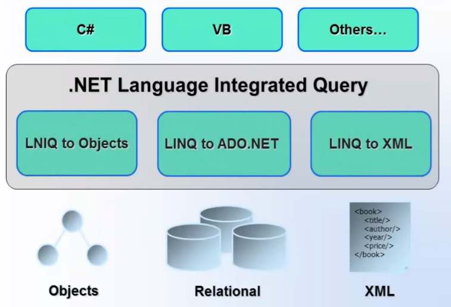
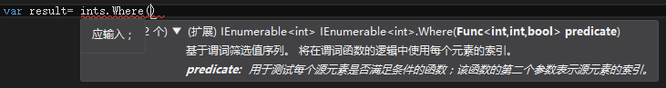
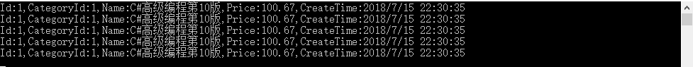
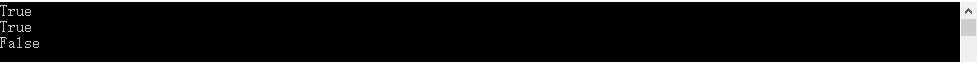
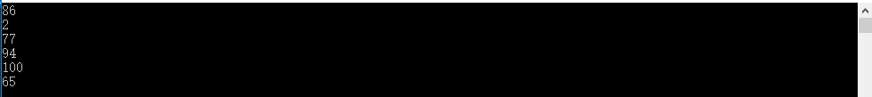
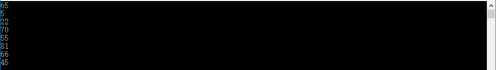

# Linq

[toc]

## 为什么使用Linq

要理解为什么使用LINQ，先来看下面一个例子。假设有一个整数类型的数组，找到里面的偶数并进行降序排序。

```c#
using System;
using System.Collections.Generic;
using System.Linq;
using System.Text;
using System.Threading.Tasks;

namespace LinqOfSelectOperation
{
    class Program
    {
        static void Main(string[] args)
        {
            // 查询出数组中的偶数并排序
            int[] ints = { 5, 2, 0, 66, 4, 32, 7, 1 };
            // 定义一个整数类型的集合，用来存放数组中的偶数
            List<int> list = new List<int>();
            // 遍历数组查询出偶数放到集合中
            foreach (int i in ints)
            {
                // 如果是偶数，把偶数加入到集合中
                if (i % 2 == 0)
                {
                    list.Add(i);
                }
            }

            // 正序排序
            list.Sort();
            // 反转
            list.Reverse();
            // 输出
            Console.WriteLine(string.Join(",",list));

            Console.ReadKey();
        }
    }
}
```

使用for循环很麻烦，而且不可维护和可读。C#2.0引入了delegate，可以使用委托来处理这种场景，代码如下图所示：

```c#
using System;
using System.Collections.Generic;
using System.Linq;
using System.Text;
using System.Threading.Tasks;

namespace LinqOfSelectOperation
{
    // 定义委托
    delegate bool FindEven(int item);

    class IntExtension
    {
        public static int[] where(int[] array, FindEven dele)
        {
            int[] result=new int[5];
            int i = 0;
            foreach (int item in array)
            {
                if (dele(item))
                {
                   result[i]=item;
                    i++;
                }
            }

            return result;
        }
    }
    class Program
    {
        static void Main(string[] args)
        {
            // 查询出数组中的偶数并排序
            int[] ints = { 5, 2, 0, 66, 4, 32, 7, 1 };

            //delegate(int item){return item % 2 == 0;}表示委托的实现
            List<int> list = IntExtension.where(ints, delegate(int item)
            {
                return item % 2 == 0;
            }).ToList();
            // 正序排序
            list.Sort();
            // 反转
            list.Reverse();
            // 输出
            Console.WriteLine(string.Join(",", list));

            Console.ReadKey();
        }
    }
}
```

 所以，有了C#2.0，通过使用委托有了代理的优势，不必使用for循环来查询不同条件的数组。例如你可以使用相同的委托来查找数组中的奇数，并降序排序输出，代码如下图所示：

```c#
using System;
using System.Collections.Generic;
using System.Linq;
using System.Text;
using System.Threading.Tasks;

namespace LinqOfSelectOperation
{
    // 定义委托
    delegate bool FindEven(int item);

    class IntExtension
    {
        public static int[] where(int[] array, FindEven dele)
        {
            int[] result=new int[3];
            int i = 0;
            foreach (int item in array)
            {
                if (dele(item))
                {
                   result[i]=item;
                    i++;
                }
            }

            return result;
        }
    }
    class Program
    {
        static void Main(string[] args)
        {
            // 查询出数组中的奇数并排序
            int[] ints = { 5, 2, 0, 66, 4, 32, 7, 1 };

            //delegate(int item){return item % 2 != 0;}表示委托的实现
            List<int> list = IntExtension.where(ints, delegate(int item)
            {
                return item % 2 != 0;
            }).ToList();
            // 正序排序
            list.Sort();
            // 反转
            list.Reverse();
            // 输出
            Console.WriteLine(string.Join(",", list));

            Console.ReadKey();
        }
    }
}
```

 虽然使用delegate可以使程序的可读性增加了，但是C#团队认为他们仍然需要使代码更加紧凑和可读，所以他们在C#3.0中引入了扩展方法、Lambda表达式、匿名类型等新特性，你可以使用C#3.0的这些新特性，这些新特性的使用LINQ的前提，可以用来查询不同类型的集合，并返回需要的结果。

下面的示例演示了如何使用LINQ和Lambda表达式根据特定条件来查询数组，示例代码如下：

```c#
using System;
using System.Collections.Generic;
using System.Linq;
using System.Text;
using System.Threading.Tasks;

namespace LinqOfSelectOperation
{
    class Program
    {
        static void Main(string[] args)
        {
            // 查询出数组中的奇数并排序
            int[] ints = { 5, 2, 0, 66, 4, 32, 7, 1 };

            // 使用LINQ和Lambda表达式查询数组中的偶数
            int[] intEvens= ints.Where(p => p % 2 == 0).ToArray();
            // 使用LINQ和Lambda表达式查询数组中的奇数
            int[] intOdds = ints.Where(p => p % 2 != 0).ToArray();

            // 输出
            Console.WriteLine("偶数：" + string.Join(",", intEvens));
            Console.WriteLine("奇数：" + string.Join(",", intOdds));

            Console.ReadKey();
        }
    }
}
```

在上面的例子中可以看到，我们在单个语句中使用LINQ和Lambda表达式指定不同的查询条件，因此，LINQ使代码更加紧凑和可读，并且它也可以用于查询不同的数据源。看到这里的时候，你可能会问：究竟什么是LINQ呢？下面将会具体讲解什么是LINQ。

## 什么是LINQ

长期以来，开发社区形成以下的格局：

1. 面向对象与数据访问两个领域长期分裂，各自为政。

2. 编程语言中的数据类型与数据库中的数据类型形成两套不同的体系，例如：
   C#中字符串用string数据类型表示。

   SQL中字符串用NVarchar/Varchar/Char数据类型表示。

3. SQL编码体验落后没有智能感知效果。没有严格意义上的强类型和类型检查。

4. SQL和XML都有各自的查询语言，而对象没有自己的查询语言。

上面描述的问题，都可以使用LINQ解决，那么究竟什么是LINQ呢？

LINQ（Language Integrated Query）即语言集成查询。

LINQ是一组语言特性和API，使得你可以使用统一的方式编写各种查询。用于保存和检索来自不同数据源的数据，从而消除了编程语言和数据库之间的不匹配，以及为不同类型的数据源提供单个查询接口。

LINQ总是使用对象，因此你可以使用相同的查询语法来查询和转换XML、对象集合、SQL数据库、ADO.NET数据集以及任何其他可用的LINQ提供程序格式的数据。

LINQ主要包含以下三部分：

1、LINQ to Objects   主要负责对象的查询。

2、LINQ to XML      主要负责XML的查询。

3、LINQ to ADO.NET  主要负责数据库的查询。

　　LINQ to SQL

　　LINQ to DataSet

　　LINQ to Entities



## LINQ的优势

1、熟悉的语言：开发人员不必为每种类型的数据源或数据格式学习新的语言。

2、更少的编码：相比较传统的方式，LINQ减少了要编写的代码量。

3、可读性强：LINQ增加了代码的可读性，因此其他开发人员可以很轻松地理解和维护。

4、标准化的查询方式：可以使用相同的LINQ语法查询多个数据源。

5、类型检查：程序会在编译的时候提供类型检查。

6、智能感知提示：LINQ为通用集合提供智能感知提示。

7、整形数据：LINQ可以检索不同形状的数据。

## LINQ操作语法

LINQ查询时有两种语法可供选择：查询表达式语法（Query Expression）和方法语法（Fluent Syntax）。

### 查询表达式语法

查询表达式语法是一种更接近SQL语法的查询方式。

LINQ查询表达式语法如下：

```c#
from<range variable> in <IEnumerable<T> or IQueryable<T> Collection>
<Standard Query  Operators> <lambda expression>
<select or groupBy operator> <result   formation>
```

LINQ查询表达式

| 约束 | LINQ查询表达式必须以from子句开头，以select或group子句介绍 |
| ---- | --------------------------------------------------------- |

| 关键字              | 功能                                                         |
| ------------------- | ------------------------------------------------------------ |
| from....in...       | 指定要查询的数据源以及范围变量，多个from子句则表示从多个数据源查找数据。注意：C#编译器会把“复合from子句”的查询表达式转换为SelectMany()扩展方法。 |
| join…in…on…equals…  | 指定多个数据源的关联方式                                     |
| let                 | 引入用于存储查询表达式中子表达式结果的范围变量。通常能达到层次感会更好，使代码更易于阅读。 |
| orderby、descending | 指定元素的排序字段和排序方式。当有多个排序字段时，由字段顺序确定主次关系，可指定升序和降序两种排序方式 |
| where               | 指定元素的筛选条件。多个where子句则表示了并列条件，必须全部都满足才能入选。每个where子句可以使用谓词&&、\|\|连接多个条件表达式。 |
| group               | 指定元素的分组字段。                                         |
| select              | 指定查询要返回的目标数据，可以指定任何类型，甚至是匿名类型。（目前通常被指定为匿名类型） |
| into                | 提供一个临时的标识符。该标识可以引用join、group和select子句的结果。1)    直接出现在join子句之后的into关键字会被翻译为GroupJoin。（into之前的查询变量可以继续使用）2)    select或group子句之后的into它会重新开始一个查询，让我们可以继续引入where, orderby和select子句，它是对分步构建查询表达式的一种简写方式。（into之前的查询变量都不可再使用） |

查询语法从一个From子句开始，然后是一个Range变量。 From子句的结构类似于“From rangeVariableName in IEnumerablecollection”。 在英语中，这意味着，从集合中的每个对象。 它类似于foreach循环：foreach（student in studentList）。

在From子句之后，您可以使用不同的标准查询运算符来过滤，分组，连接集合的元素。 LINQ中有大约50个标准查询运算符。标准查询运算符后面通常跟一个条件，这个条件通常使用lambda表达式来表示。

LINQ查询语法总是以Select或Group子句结束。 Select子句用于对数据进行整形。 您可以选择整个对象，因为它是或只有它的一些属性。 在上面的例子中，我们选择了每个结果字符串元素。

例如：我们要从数组中查询出偶数，查询表达式示例代码如下：

```c#
var result = from p in ints where p % 2 == 0 select p;
```

查询表达式语法要点总结：

1. 查询表达式语法与SQL（结构查询语言）语法相同。
2. 查询语法必须以from子句开头，可以以Select或GroupBy子句结束 。
3. 使用各种其他操作，如过滤，连接，分组，排序运算符以构造所需的结果。
4. 隐式类型变量 - var可以用于保存LINQ查询的结果。

## 方法语法

方法语法（也称为流利语法）主要利用System.Linq.Enumerable类中定义的扩展方法和Lambda表达式方式进行查询，类似于如何调用任何类的扩展方法。

以下是一个示例LINQ方法语法的查询，返回数组中的偶数：

```c#
var result = ints.Where(p => p % 2 == 0).ToArray();
```

从上面的示例代码中可以看出：方法语法包括扩展方法和Lambda表达式。 扩展方法Where（）在Enumerable类中定义。

如果你检查Where扩展方法的签名，你会发现Where方法接受一个谓词委托，如`Func <Student，bool>`。 这意味着您可以传递任何接受Student对象作为输入参数的委托函数，并返回一个布尔值，如下图所示。 lambda表达式作为在Where子句中传递的委托传递。 在下一节中学习lambda表达式。

### 查询表达式语法VS方法语法

查询表达式语法与方法语法存在着紧密的关系

1. CLR本身并不理解查询表达式语法，它只理解方法语法。
2. 编译器负责在编译时将查询表达式语法翻译为方法语法。
3. 大部分方法语法都有对应的查询表达式语法形式：如Select()对应select、OrderBy()对应orderby
4. 部分查询方法目前在C#中还没有对应的查询语句：如Count()和Max()，这是只能采用以下替代方案：
   　　方法语法
      　　查询表达式语法+方法语法的混合方式

## Lambda表达式解剖

C#3.0（.NET3.5）中引入了Lambda表达式和LINQ。Lambda表达式是使用一些特殊语法表示匿名方法的较短方法。

最基本的Lambda表达式语法如下：

（参数列表）=>{方法体}

1. 参数列表中的参数类型可以是明确类型或者推断类型。
2. 如果是推断类型，则参数的数据类型将由编辑器根据上下文自动推断出来。

****

**让我们看看Lambda表达式是如何从匿名方法演变而来的。**

相关示例：

```c#
delegate(int item) { return item % 2 == 0; };
```

1. Lambda表达式从匿名方法演变，首先删除delegate关键字和参数类型并添加Lambda运算符=>，演变后的代码如下：

   ```c#
   (item)=>{return item % 2 == 0;};
   ```

2. 如果我们只有一个返回值的语句，那么我们不需要花括号、返回和分号，所以我们可以去掉这些符号，演变后的代码如下：

   ```c#
   (item)=>item %2 == 0;
   ```

3. 如果我们只有一个参数，我们也可以删除（），代码如下：

   ```c#
   item=>item %2 == 0;
   ```

   因此，我们得到如下所示的Lambda表达式：

   item => item % 2 == 0

   其中item是参数，=>是Lambda运算符，item % 2 == 0是正文表达式。


---

**具有多个参数的Lambda表达式**

如果需要传递多个参数，那么必须将参数括在括号内，如下所示：

```c#
(ints, item) => ints.Contains(item);
```

 如果不想使用推断类型，那么可以给出每个参数的类型，如下所示：

```c#
(int[] ints, int item) => ints.Contains(item)
```

---

**不带任何参数的Lambda表达式**

```c#
() => Console.WriteLine("这是一个不带任何参数的Lambda表达式");
```

---

**正文表达式中有多条语句**

在前面讲过，如果正文表达式有一个语句，那么可以去掉方法体外面的大括号。如果正文表达式中有多条语句，那么必须用大括号将正文表达式括起来，如下所示：

```c#
(ints, item) =>
{
        Console.WriteLine("这是包含多条语句的Lambda表达式");
        return ints.Contains(item);
}; 
```

---

**表达式中的局部变量**

你可以在表达式的主体中声明一个变量，以便在表达式主体的任何位置使用它，如下所示：

```c#
ints=>{
	int item = 10;
	return ints.Contains(item);
}
```

## Lambda表达式中的内置泛型委托

### 当你想从lambda表达式返回一些东西时，使用Func <> delegate。 

其中T是输入参数的类型，TResult是返回类型。

示例代码如下：

```c#
Func<int[], bool> isContains = p =>p.Equals(10);
int[] ints = {5,2,3,8,56,3};
bool isEquals = isContains(ints);
```

在上面的例子中，Func委托期望第一个输入参数是int[]类型，返回类型是boolean。Lambda表达式是p => p.Equals(10)。

### Action委托

与Func委托不同，Action委托只能有输入参数。 当不需要从lambda表达式返回任何值时，请使用Action委托类型。

示例代码如下：

```c#
Action<int[]> PrintItem = p=>{
    foreach(int item in p){
        Console.WriteLine(item);
    }
};
int[] ints = {5,2,3,8,56,76};
PrintItem(ints);

```

### 在LINQ中使用Lambda表达式 

通常情况下，Lambda表达式与LINQ查询一起使用。枚举静态类包括接受Func <TSource，bool>的IEnumerable <T>的Where扩展方法。IEnumerable <Int>集合的Where（）扩展方法需要传递Func <Student，bool>，如下所示：



现在，您可以将分配给Func委托的lambda表达式传递给方法语法中的Where（）扩展方法，如下所示：

```c#
Func<int, bool> isContains = p =>p.Equals (4);
int[] ints = { 5, 2, 0, 66, 4, 32, 7, 1 };
var result = ints.Where(isContains).ToList();
```

### Lambda表达式要点总结

1. Lambda表达式是一种表示匿名方法的更短的方法。 
2. Lambda表达式语法：parameters =>正文表达式
3. Lambda表达式可以在（）中具有零个或多个参数。 
4. Lambda表达式可以在大括号{}中的正文表达式中有一条或多条语句。 
5. Lambda表达式可以分配给Func，Action或Predicate委托。
6. Lambda表达式可以以类似的方式调用委托。

## Linq操作符

### Select

Select操作符对单个序列或集合中的值进行投影。所谓投影，比如有一个数据集，想用LINQ语法去操作数据集，会写一个LINQ的表达式，表达式会把数据集合中的数据简单的投影到一个变量中，并且可以通过这个变量去筛选数据。

在查询表达式中，select 子句可以指定将在执行查询时产生的值的类型。 该子句的结果将基于前面所有子句的计算结果以及 select 子句本身中的所有表达式。 查询表达式必须以 select 子句或 group 子句结束。

```c#
public class Employees
{
        public Guid Id { get; set; }
        public string Name { get; set; }
        public int Sex { get; set; }
        public string CompanyName { get; set; }
}
```

```c#
class Program
{
        static void Main(string[] args)
        {
            //使用集合初始化器给集合赋值
            List<Employees> emp = new List<Employees> 
            { 
               new Employees(){Id=Guid.NewGuid(),Name="张三",Sex=0,CompanyName="xx技术有限公司"},
               new Employees(){Id=Guid.NewGuid(),Name="李四",Sex=0,CompanyName="xx培训"},
               new Employees(){Id=Guid.NewGuid(),Name="王五",Sex=0,CompanyName="xx集团"}
            };

            //查询语法：不能省略最后的select
            var query = (from p in emp where p.Name.StartsWith("王") select p).FirstOrDefault();

            //查询方法:设计到Lambda表达式，全部返回 可以省略最后的select 延迟加载
            var query1 = emp.Where(p => p.Name.StartsWith("王")).Select(e => new { e.Name,e.CompanyName});

            //查询方法:返回匿名类
            var query2 = emp.Where(p => p.Name.StartsWith("王")).Select(p => p);
            foreach (var item in query1)
            {
                Console.WriteLine(item.Name);
            }
            Console.ReadKey();
        }
}
```

Select操作包括7种形式，分别为简单用法、匿名类型形式、条件形式、筛选形式、嵌套类型形式、本地方法调用形式、Distinct形式。下面分别用实例举例下：

```c#
class Student
{
    public string Name { get; set; }
    public int Score { get; set; }
}
List<Student> students = new List<Student>{
    new Student {Name="Terry", Score=50},
    new Student {Name="AI", Score=80},
    new Student {Name="AI", Score=70},
};
```


#### 简单用法

说明:当以select结尾时表示的只是一个声明或者一个描述，并没有真正把数据取出来，只有当你需要该数据的时候，它才会执行这个语句，这就是延迟加载(deferred loading)。

查询学生的姓名：

```c#
 var query = from student in students
                        select student.Name;
foreach (var student in query)
{
    Console.WriteLine("{0}", student);
    //Terry
    //AI
    //AI
}
```

#### **匿名类型形式**

说明：其实质是编译器根据我们自定义产生一个匿名的类来帮助我们实现临时变量的储存。例如 var ob = new {Name = "Harry"}，编译器自动产生一个有property叫做Name的匿名类，然后按这个类型分配内存，并初始化对象。

查询学生的姓名：

```c#
var query = from student in students
                        select new
                        {
                            newName = "学生姓名：" + student.Name
                        };
foreach (var student in query)
{
    Console.WriteLine(student.newName);
    //学生姓名：Terry
    //学生姓名：AI
    //学生姓名：AI
}
```

#### **条件形式**

说明：三元运算，类似于SQL语句case when condition then else的用法。

查询学生的分数等级：

```c#
var query = from student in students
                        select new
                        {
                            student.Name,
                            level = student.Score < 60 ? "不及格" : "合格"
                        };
foreach (var student in query)
{
    Console.WriteLine("{0}:{1}", student.Name, student.level);
    //Terry:不及格
    //AI:及格
    //AI:及格
}

```

#### **筛选形式**

说明：结合where用起到过滤的作用。

查询Terry的分数：

```c#
var query = from student in students
                        where student.Name == "Terry"
                        select student;
foreach (var student in query)
{
    Console.WriteLine("{0}:{1}",student.Name,student.Score);
    //Terry:50
}
```

#### **嵌套类型形式**

说明：如果一个数据源里面又包含了一个或多个集合列表，那么应该使用复合的select子句来进行查询。

查询大于80分的学生分数：

```c#
class Student
{
    public string Name { get; set; }
    public List<int> Scores { get; set; }
}
List<Student> students = new List<Student>{
    new Student {Name="Terry", Scores=new List<int> {97, 72, 81, 60}},
    new Student {Name="AI", Scores=new List<int> {75, 84, 91, 39}},
    new Student {Name="Wade", Scores=new List<int> {88, 94, 65, 85}},
    new Student {Name="Tracy", Scores=new List<int>{97, 89, 85, 82}},
    new Student {Name="Kobe", Scores=new List<int> {35, 72, 91, 70}} 
};
var query = from student in students
    select new
{
    student.Name,
    //生成新的集合对象
    highScore=from sc in student.Scores
        where sc>80
        select sc
};
foreach (var student in query)
{
    Console.Write("{0}:",student.Name);
    foreach (var scores in student.highScore)
    {
        Console.Write("{0},",scores);
    }
    Console.WriteLine();
    //Terry:97,81,
    //AI:84,91,
    //Wade:88,94,85,
    //Tracy:97,89,85,82,
    //Kobe:91,
}

```

#### **本地方法调用形式**

说明：调用自定义方法。

```c#
 var query = from student in students
                        select new
                        {
                            student.Name,
                            //调用GetLevel方法
                            level = GetLevel(student.Score)
                        };
foreach (var student in query)
{
    Console.WriteLine("{0}:{1}", student.Name, student.level);
    //Terry:不及格
    //AI:及格
    //AI:及格
}

protected static string GetLevel(int score)
{
    if (score > 60)
    {
        return "及格";
    }
    else
    {
        return "不及格";
    }
}

```

#### **Distinct形式**

说明：用于查询不重复的结果集。类似于SQL语句SELECT DISTINCT 。

查询不重复的学生姓名：

```c#
var query = (from student in students
                         select student.Name).Distinct();
foreach (var student in query)
{
    Console.WriteLine("{0}", student);
    //Terry:
    //AI
}
```

### SelectMany

SelectMany操作符提供了将多个from子句组合起来的功能，相当于数据库中的多表连接查询，它将每个对象的结果合并成单个序列。

示例：

student类：

```c#
using System;
using System.Collections.Generic;
using System.Linq;
using System.Text;
using System.Threading.Tasks;

namespace SelectMany操作符
{
    /// <summary>
    /// 学生类
    /// </summary>
    public class Student
    {
        //姓名
        public string Name { get; set; }
        //成绩
        public int Score { get; set; }
        //构造函数
        public Student(string name, int score)
        {
            this.Name = name;
            this.Score = score;
        }
    }
}
```

teacher类：

```c#
using System;
using System.Collections.Generic;
using System.Linq;
using System.Text;
using System.Threading.Tasks;

namespace SelectMany操作符
{
    /// <summary>
    /// Teacher类
    /// </summary>
    public class Teacher
    {
        //姓名
        public string Name { get; set; }
        //学生集合
        public List<Student> Students { get; set; }

        public Teacher(string name, List<Student> students)
        {
            this.Name = name;
            this.Students = students;
        }
    }
}
```

Program类

```c#
using System;
using System.Collections.Generic;
using System.Linq;
using System.Text;
using System.Threading.Tasks;

namespace SelectMany操作符
{
    class Program
    {
        static void Main(string[] args)
        {
            //使用集合初始化器初始化Teacher集合
            List<Teacher> teachers = new List<Teacher> {
               new Teacher("徐老师",
               new List<Student>(){
                 new Student("宋江",80),
                new Student("卢俊义",95),
                new Student("朱武",45)
               }
               ),
                new Teacher("姜老师",
               new List<Student>(){
                 new Student("林冲",90),
                new Student("花荣",85),
                new Student("柴进",58)
               }
               ),
                new Teacher("樊老师",
               new List<Student>(){
                 new Student("关胜",100),
                new Student("阮小七",70),
                new Student("时迁",30)
               }
               )
            };

            //问题：查询Score小于60的学生
            //方法1：循环遍历、会有性能的损失
            foreach (Teacher t in teachers)
            {
                foreach (Student s in t.Students)
                {
                    if (s.Score < 60)
                    {
                        Console.WriteLine("姓名:" + s.Name + ",成绩:"+s.Score);
                    }
                }
            }

            //查询表达式
            //方法2：使用SelectMany  延迟加载：在不需要数据的时候，就不执行调用数据，能减轻程序和数据库的交互，可以提供程序的性能，执行循环的时候才去访问数据库取数据
            //直接返回学生的数据
            var query = from t in teachers
                        from s in t.Students
                        where s.Score < 60
                        select s;
            foreach (var item in query)
            {
                Console.WriteLine("姓名:" + item.Name + ",成绩:"+item.Score);
            }
            //只返回老师的数据
            var query1 = from t in teachers
                         from s in t.Students
                         where s.Score < 60
                         select new {
                            t,
                            teacherName=t.Name,
                            student=t.Students.Where(p=>p.Score<60).ToList()
                         };
            foreach (var item in query1)
            {
                Console.WriteLine("老师姓名:" + item.teacherName + ",学生姓名:" +item.student.FirstOrDefault().Name+ ",成绩:" + item.student.FirstOrDefault().Score);
            }
            // 使用匿名类 返回老师和学生的数据
            var query2 = from t in teachers
                         from s in t.Students
                         where s.Score < 60
                         select new { teacherName=t.Name, studentName=s.Name,studentScore=s.Score };
            foreach (var item in query2)
            {
                Console.WriteLine("老师姓名:" + item.teacherName + ",学生姓名:" + item.studentName + ",成绩:" + item.studentScore);
            }

            //使用查询方法
            var query3 = teachers.SelectMany(p => p.Students.Where(t=>t.Score<60).ToList());
            foreach (var item in query3)
            {
                Console.WriteLine("姓名:" + item.Name + ",成绩:" + item.Score);
            }
            Console.ReadKey();

        }
    }
}
```

#### 第一种用法：

```c#
public static IEnumerable<TResult> SelectMany<TSource, TResult>(this IEnumerable<TSource> source, Func<TSource, IEnumerable<TResult>> selector);
```

官方释义：将序列的每个元素投影到 IEnumerable<TResult> 并将结果序列合并为一个序列。

在这里，SelectMany的作用就是：将personList集合对象的每个元素（每个Teacher实例对象，如名为“T1”，“T2”，“T3”）

映射到每个Teacher类对应的Student集合（如名为“T1”对应Student名为S1及S2的Student集合），

并将每个Teacher类对应Student的集合重新组合成一个大的Student集合。

```c#
 var students = from t in teacherList
            from s in p.Students
            select s;
```

#### 第二种用法

```c#
public static IEnumerable<TResult> SelectMany<TSource, TResult>(this IEnumerable<TSource> source, Func<TSource, int, IEnumerable<TResult>> selector);
```

官方释义：将序列的每个元素投影到 IEnumerable<TResult>，并将结果序列合并为一个序列。每个源元素的索引用于该元素的投影表。

其实，就是比第一种使用方法多一个索引而已，该索引是从0开始，针对的是TSource指定类型的集合，最大索引值为TSource个数-1。

我们将第一种客户端试验代码中的:

```c#
var studentss = teacherList.SelectMany(t => t.Students);
```

修改为：

```c#
var students = teacherList.SelectMany((t, i) => 
    t.Students.Select( s=>
    {
        s.Name = $"{i},{s.Name}";
        return s;
    }));
```

以上方法仅仅是把索引值加到Student类的Name属性上。

#### 第三种方法：

```
public static IEnumerable<TResult> SelectMany<TSource, TCollection, TResult>(this IEnumerable<TSource> source, Func<TSource, IEnumerable<TCollection>> collectionSelector, Func<TSource, TCollection, TResult> resultSelector);
```

官方释义：将序列的每个元素投影到 IEnumerable<TCollection>，并将结果序列合并为一个序列，并对其中每个元素调用结果选择器函数。

这个用法，跟第一种用法相比，就是可以对已合成一个大集合的每个元素调用结果选择器，返回自己想要的集合类型。

#### 第四种用法：

```
public static IEnumerable<TResult> SelectMany<TSource, TCollection, TResult>(this IEnumerable<TSource> source, Func<TSource, int, IEnumerable<TCollection>> collectionSelector, Func<TSource, TCollection, TResult> resultSelector);
```

官方释义：将序列的每个元素投影到 IEnumerable<TCollection>，并将结果序列合并为一个序列，并对其中每个元素调用结果选择器函数。每个源元素的索引用于该元素的中间投影表。

其实，就是比第三种使用方法多一个索引而已，该索引是从0开始，针对的是TSource指定类型的集合，最大索引值为TSource个数-1。

### Where

where是限制操作符，它将过滤标准应用在序列上，按照提供的逻辑对序列中的数据进行过滤。

where操作符不启动查询的执行。当开始对序列进行遍历时才开始执行，此时过滤条件将被应用到查询中。

```c#
//where限制操作符：使用延迟加载
var q = teachers.SelectMany(p => p.Students).Where(s => s.Score < 60).Select(a => new { name = a.Name });
foreach (var item in q)
{
     Console.WriteLine("姓名:"+item.name);
}
```


**示例**
在写项目的时候看到了一段比较有意思的单例.如下图：

```c#
using System.Collections;
using System.Collections.Generic;
using UnityEngine;
/// <summary>
/// 单例模型
/// </summary>
/// <typeparam name="T">模板</typeparam>
public class MonoSingleton<T> : MonoBehaviour where T :Component
{
    private static T _instance;

    private static readonly object _lock = new object();

    public static T Instance
    {
        get
        {
            if(_instance == null)
            {
                lock (_lock)
                {
                    _instance = FindObjectOfType<T>();
                    if(_instance == null)
                    {
                        GameObject obj = new GameObject("TempObj");
                        _instance = obj.AddComponent<T>();
                    }
                }
            }
            return _instance;
        }
    }
}
```

其中有一段我很好奇：

```c#
public class MonoSingleton<T> : MonoBehaviour where T :Component
```

后来我打算去找答案，东西很久没有用都忘了什么作用了。

**where 在SQL语句中是限制条件的意思 **

```sql
select column_name ,column_name form table_name WHERE column_name operator value;
```

**where在C# 指的是约束**

为什么要使用约束？官方给的解释是：

使用约束的原因:

约束指定类型参数的功能和预期。 声明这些约束意味着你可以使用约束类型的操作和方法调用。 如果泛型类或方法对泛型成员使用除简单赋值之外的任何操作或调用 System.Object 不支持的任何方法，则必须对类型参数应用约束。 例如，基类约束告诉编译器，仅此类型的对象或派生自此类型的对象可用作类型参数。 编译器有了此保证后，就能够允许在泛型类中调用该类型的方法。 以下代码示例演示可通过应用基类约束添加到（泛型介绍中的）GenericList<T> 类的功能。

**为了验证一下，我将where 后面的** `where T :Component`这一部分删除，发现

```c#
_instance = FindObjectOfType<T>();
//提示是：类型“T”不能用作泛型类型或方法“Object.FindObjectOfType<T>()"中的类型参数”T“.
//没有从”T“到”UnityEngine.Object"装箱转换或者类型参数转换
```

第一反应是有点懵，官方 指的 和这个有什么关系嘛,约定指定类型参数的功能和预期。

```c#
//在 Object 中找到了该方法
 public static T FindObjectOfType<T>() where T : Object;
```

用我目前理解到了东西来说，应该是 要求 泛型T 是继承自 Object 的，才可以使用 FindObjectOfType<T>() 这个函数 ，我认为`Component`必须也是集成Object的，所以才能够使用这个函数。

```c#
//在Component 类中找到了这个 
public class Component : Object
```

简单的说就是，还是直接用官方的说法：

约束告知编译器类型参数必须具备的功能。 在没有任何约束的情况下，类型参数可以是任何类型。 编译器只能假定 System.Object 

#### where 子句用于指定类型约束，这些约束可以作为泛型声明中定义的类型参数的变量。

---

**接口约束：**

 例如，可以声明一个泛型类 `MyGenericClass`，这样，类型参数 `T` 就可以实现 `IComparable<T>` 接口：

```c#
public class MyGenericClass<T> where T:IComparable { }
```

---

**基类约束：**指出某个类型必须将指定的类作为基类（或者就是该类本身），才能用作该泛型类型的类型参数。

 这样的约束一经使用，就必须出现在该类型参数的所有其他约束之前。

```c#
class MyClassy<T, U>
 where T : class
 where U : struct
{
}
```

---

**where 子句还可以包括构造函数约束。**

可以使用 new 运算符创建类型参数的实例；但类型参数为此必须受构造函数约束 new() 的约束。new() 约束可以让编译器知道：提供的任何类型参数都必须具有可访问的无参数（或默认）构造函数。例如：

```c#
public class MyGenericClass <T> where T: IComparable, new()
{
 // The following line is not possible without new() constraint:
 T item = new T();
}
```

new() 约束出现在 where 子句的最后。

---

**对于多个类型参数，每个类型参数都使用一个 where 子句**

```c#
interface MyI { }
class Dictionary<TKey,TVal>
where TKey: IComparable, IEnumerable
where TVal: MyI
{
 public void Add(TKey key, TVal val)
 {
 }
}
```

---

**还可以将约束附加到泛型方法的类型参数**

```c#
public bool MyMethod<T>(T t) where T : IMyInterface { }
```

请注意，对于委托和方法两者来说，描述类型参数约束的语法是一样的：

```c#
delegate T MyDelegate<T>() where T : new()
```

---

#### 总结

* where T : struct 这表明T必须是一个值类型，像是int,decimal这样的
* where T : class 这表明T必须是一个引用类型，像是自定义的类、接口、委托等
* where T : new() 这表明T必须有无参构造函数，且如果有多个where约束，new()放在最后面
* where T : [base class name] 这表明T必须是base class类获其派生类
* where T : [interface name] 这表明T必须实现了相应的接口

### 排序操作符 :OrderBy、OrderByDescending、ThenBy、ThenByDescending和Reverse

Linq中的排序操作符包括OrderBy、OrderByDescending、ThenBy、ThenByDescending和Reverse，提供了升序或者降序排序。


#### OrderBy操作符

OrderBy操作符用于对输入序列中的元素进行排序，排序基于一个委托方法的返回值顺序。排序过程完成后，会返回一个类型为IOrderEnumerable<T>的集合对象。其中IOrderEnumerable<T>接口继承自IEnumerable<T>接口。下面来看看OrderBy的定义：

从上面的截图中可以看出，OrderBy是一个扩展方法，只要实现了IEnumerable<T>接口的就可以使用OrderBy进行排序。OrderBy共有两个重载方法：第一个重载的参数是一个委托类型和一个实现了IComparer<T>接口的类型。第二个重载的参数是一个委托类型。看看下面的示例：

Product类：

```c#
using System;
using System.Collections.Generic;
using System.Linq;
using System.Text;
using System.Threading.Tasks;

namespace OrderOperation
{
    public class Products
    {
        public int Id { get; set; }
        public int CategoryId { get; set; }
        public string Name { get; set; }
        public double Price { get; set; }
        public DateTime CreateTime { get; set; }
    }
}
```

在Main调用：

```c#
using System;
using System.Collections.Generic;
using System.Linq;
using System.Text;
using System.Threading.Tasks;

namespace OrderOperation
{
    class Program
    {
        static void Main(string[] args)
        {
            // 初始化数据
            List<Products> listProduct = new List<Products>()
            {
               new Products(){Id=1,CategoryId=1, Name="C#高级编程第10版", Price=100.67,CreateTime=DateTime.Now},
               new Products(){Id=2,CategoryId=1, Name="Redis开发和运维", Price=69.9,CreateTime=DateTime.Now.AddDays(-19)},
               new Products(){Id=3,CategoryId=1, Name="ASP.NET Core", Price=57,CreateTime=DateTime.Now.AddMonths(-3)},
               new Products(){Id=4,CategoryId=1, Name="Entity Framework 6.x", Price=97,CreateTime=DateTime.Now.AddMonths(-1)}
            };
            Console.WriteLine("方法语法");
            // 1、查询方法，返回匿名类
            var list = listProduct.OrderBy(p => p.CreateTime).Select(p => new { id = p.Id, ProductName = p.Name,ProductPrice=p.Price,PublishTime=p.CreateTime }).ToList();
            foreach (var item in list)
            {
                Console.WriteLine($"item:{item}");
            }
            Console.WriteLine("查询表达式");
            // 2、查询表达式,返回匿名类
            var listExpress = from p in listProduct orderby p.CreateTime select new { id = p.Id, ProductName = p.Name, ProductPrice = p.Price, PublishTime = p.CreateTime };
            foreach (var item in listExpress)
            {
                Console.WriteLine($"item:{item}");
            }

            Console.ReadKey();
        }
    }
}
```

结果：


从截图中可以看出，集合按照CreateTime进行升序排序。

在来看看第一个重载方法的实现：

先定义PriceComparer类实现IComparer<T>接口，PriceComparer类定义如下：

```c#
using System;
using System.Collections.Generic;
using System.Linq;
using System.Text;
using System.Threading.Tasks;

namespace OrderOperation
{
    public class PriceComparer : IComparer<double>
    {
        public int Compare(double x, double y)
        {
            if (x > y)
            {
                return 1;     //表示x>y
            }
            else if (x < y)
            {
                return -1;    //表示x<y
            }
            else
            {
                return 0;     //表示x=y
            }
        }
    }
}
```

```c#
using System;
using System.Collections.Generic;
using System.Linq;
using System.Text;
using System.Threading.Tasks;

namespace OrderOperation
{
    class Program
    {
        static void Main(string[] args)
        {
            // 初始化数据
            List<Products> listProduct = new List<Products>()
            {
               new Products(){Id=1,CategoryId=1, Name="C#高级编程第10版", Price=100.67,CreateTime=DateTime.Now},
               new Products(){Id=2,CategoryId=1, Name="Redis开发和运维", Price=69.9,CreateTime=DateTime.Now.AddDays(-19)},
               new Products(){Id=3,CategoryId=1, Name="ASP.NET Core", Price=57,CreateTime=DateTime.Now.AddMonths(-3)},
               new Products(){Id=4,CategoryId=1, Name="Entity Framework 6.x", Price=97,CreateTime=DateTime.Now.AddMonths(-1)}
            };
            Console.WriteLine("方法语法");
            // 1、查询方法，按照价格升序排序,返回匿名类
            var list = listProduct.OrderBy(p => p.Price,new PriceComparer()).Select(p => new { id = p.Id, ProductName = p.Name, ProductPrice = p.Price, PublishTime = p.CreateTime }).ToList();
            foreach (var item in list)
            {
                Console.WriteLine($"item:{item}");
            }
            Console.ReadKey();
        }
    }
}
```

结果：


注意：orderby必须在select之前出现,查询表达式最后只可能出现select或者groupby。

#### OrderByDescending

OrderByDescending操作符的功能与OrderBy操作符基本相同，二者只是排序的方式不同。OrderBy是升序排序，而OrderByDescending则是降序排列。下面看看OrderByDescending的定义：


从方法定义中可以看出，OrderByDescending的方法重载和OrderBy的方法重载一致。

#### ThenBy排序

ThenBy操作符可以对一个类型为IOrderedEnumerable<T>,(OrderBy和OrderByDesceding操作符的返回值类型)的序列再次按照特定的条件顺序排序。ThenBy操作符实现按照次关键字对序列进行升序排列。下面来看看ThenBy的定义：


从截图中可以看出：ThenBy()方法扩展的是IOrderedEnumerable<T>，因此ThenBy操作符长常常跟在OrderBy和OrderByDesceding之后。

#### ThenByDescending

ThenByDescending操作符于ThenBy操作符非常类似，只是是按照降序排序，实现按照次关键字对序列进行降序排列。来看看ThenByDescending的定义：


从截图中可以看出：ThenByDescending()方法扩展的是IOrderedEnumerable<T>，因此ThenByDescending操作符也是常常跟在OrderBy和OrderByDesceding之后。

#### Reverse

Reverse操作符用于生成一个与输入序列中元素相同，但元素排列顺序相反的新序列。下面来看看Reverse()方法的定义：

```c#
public static IEnumerable<TSource> Reverse<TSource>(this IEnumerable<TSource> source)
```

 

从方法定义中可以看到，这个扩展方法，不需要输入参数，返回一个新集合。需要注意的是，Reverse方法的返回值是void。

### 连接操作符Join()和GroupJoin()

#### Join()操作符

Join()操作符非常类似于T-SQL中的inner join，它将两个数据源进行连接，根据两个数据源中相等的值进行匹配。例如：可以将产品表和产品类别表进行连接，得到产品名称和与其对应的类型名称。下面看看Join()方法的定义：

```c#
public static IEnumerable<TResult> Join<TOuter, TInner, TKey, TResult>(this IEnumerable<TOuter> outer, IEnumerable<TInner> inner, Func<TOuter, TKey> outerKeySelector, Func<TInner, TKey> innerKeySelector, Func<TOuter, TInner, TResult> resultSelector);
public static IEnumerable<TResult> Join<TOuter, TInner, TKey, TResult>(this IEnumerable<TOuter> outer, IEnumerable<TInner> inner, Func<TOuter, TKey> outerKeySelector, Func<TInner, TKey> innerKeySelector, Func<TOuter, TInner, TResult> resultSelector, IEqualityComparer<TKey> comparer);
```

从Join()方法的定义中可以看到：Join操作符的方法原型非常复杂，参数outer和inner是需要连接输入集合。其中outer代表的是调用的集合。当Join操作符被调用时，首先举inner序列中的所有元素，为序列中每一个类型为U的元素调用委托InnerKeySelector，生成一个类型为K的的对象innerKey作为连接关键字。(相当于数据库中的外键)，将inner序列中的每一个元素和其对应的连接关键字innerKey存储在一个临时哈希表中；其次列举outer序列中的所有元素，为每一个类型为T的元素调用委托outerKeySelector，生成一个类型为K的对象outKey用作连接关键字，在第一步生成的临时哈希表中查找与outKey相等的对应的innerKey对象，如果找到对应的记录，会将当前outer序列中的类型为T的元素和对应的inner序列中类型为U的元素作为一组参数传递给委托resultSelector，resultSelector会根据这两个参数返回一个类型为V的对象，此类型为V的对象会被添加到Join操作符的输出结果序列中去。Join操作符返回一个类型为IEnumerable<T>的序列。来看下面的例子：

Category：

```c#
using System;
using System.Collections.Generic;
using System.Linq;
using System.Text;
using System.Threading.Tasks;

namespace ConnectOperation
{
    public class Category
    {
        public int Id { get; set; }
        public string CategoryName { get; set; }

        public DateTime CreateTime { get; set; }
    }
}
```

 Product：

```c#
using System;
using System.Collections.Generic;
using System.Linq;
using System.Text;
using System.Threading.Tasks;

namespace ConnectOperation
{
    public class Product
    {
        public int Id { get; set; }
        public int CategoryId { get; set; }
        public string Name { get; set; }
        public double Price { get; set; }
        public DateTime CreateTime { get; set; }
    }
}
```

在Main()方法中调用：

```c#
using System;
using System.Collections.Generic;
using System.Linq;
using System.Text;
using System.Threading.Tasks;

namespace ConnectOperation
{
    class Program
    {
        static void Main(string[] args)
        {
            // 初始化数据
            List<Category> listCategory = new List<Category>()
            {
              new Category(){ Id=1,CategoryName="计算机",CreateTime=DateTime.Now.AddYears(-1)},
              new Category(){ Id=2,CategoryName="文学",CreateTime=DateTime.Now.AddYears(-2)},
              new Category(){ Id=3,CategoryName="高校教材",CreateTime=DateTime.Now.AddMonths(-34)},
              new Category(){ Id=4,CategoryName="心理学",CreateTime=DateTime.Now.AddMonths(-34)}
            };
            List<Product> listProduct = new List<Product>()
            {
               new Product(){Id=1,CategoryId=1, Name="C#高级编程第10版", Price=100.67,CreateTime=DateTime.Now},
               new Product(){Id=2,CategoryId=1, Name="Redis开发和运维", Price=69.9,CreateTime=DateTime.Now.AddDays(-19)},
               new Product(){Id=3,CategoryId=2, Name="活着", Price=57,CreateTime=DateTime.Now.AddMonths(-3)},
               new Product(){Id=4,CategoryId=3, Name="高等数学", Price=97,CreateTime=DateTime.Now.AddMonths(-1)},
               new Product(){Id=5,CategoryId=6, Name="国家宝藏", Price=52.8,CreateTime=DateTime.Now.AddMonths(-1)}
            };

            // 1、查询表达式
            var queryExpress = from c in listCategory
                               join p in listProduct on c.Id equals p.CategoryId
                               select new { Id = c.Id, CategoryName = c.CategoryName, ProductName = p.Name, PublishTime = p.CreateTime };
            Console.WriteLine("查询表达式输出:");
            foreach (var item in queryExpress)
            {
                Console.WriteLine($"id:{item.Id},CategoryName:{item.CategoryName},ProductName:{item.ProductName},PublishTime:{item.PublishTime}");
            }
            Console.WriteLine("方法语法输出:");
            // 方法语法
            var queryFun = listCategory.Join(listProduct, c => c.Id, p => p.CategoryId, (c, p) => new { Id = c.Id, CategoryName = c.CategoryName, ProductName = p.Name, PublishTime = p.CreateTime });
            foreach (var item in queryFun)
            {
                Console.WriteLine($"id:{item.Id},CategoryName:{item.CategoryName},ProductName:{item.ProductName},PublishTime:{item.PublishTime}");
            }

            Console.ReadKey();
        }
    }
}
```

 结果：


从结果中可以看出：Join()操作符只会输出两个结合中相同的元素，和T-SQL中的inner join类似。

在T-SQL中除了内连接以外，还有左连接和右连接，那么使用Join()是不是也可以实现左连接和右连接呢？请看下面的例子。

使用Join()实现左连接。

```c#
using System;
using System.Collections.Generic;
using System.Linq;
using System.Text;
using System.Threading.Tasks;

namespace ConnectOperation
{
    class Program
    {
        static void Main(string[] args)
        {
            // 初始化数据
            List<Category> listCategory = new List<Category>()
            {
              new Category(){ Id=1,CategoryName="计算机",CreateTime=DateTime.Now.AddYears(-1)},
              new Category(){ Id=2,CategoryName="文学",CreateTime=DateTime.Now.AddYears(-2)},
              new Category(){ Id=3,CategoryName="高校教材",CreateTime=DateTime.Now.AddMonths(-34)},
              new Category(){ Id=4,CategoryName="心理学",CreateTime=DateTime.Now.AddMonths(-34)}
            };
            List<Product> listProduct = new List<Product>()
            {
               new Product(){Id=1,CategoryId=1, Name="C#高级编程第10版", Price=100.67,CreateTime=DateTime.Now},
               new Product(){Id=2,CategoryId=1, Name="Redis开发和运维", Price=69.9,CreateTime=DateTime.Now.AddDays(-19)},
               new Product(){Id=3,CategoryId=2, Name="活着", Price=57,CreateTime=DateTime.Now.AddMonths(-3)},
               new Product(){Id=4,CategoryId=3, Name="高等数学", Price=97,CreateTime=DateTime.Now.AddMonths(-1)},
               new Product(){Id=5,CategoryId=6, Name="国家宝藏", Price=52.8,CreateTime=DateTime.Now.AddMonths(-1)}
            };
            // 1、使用查询表达式实现左连接
            var listLeft = from c in listCategory
                           join p in listProduct on c.Id equals p.CategoryId
                           into cpList
                           from cp in cpList.DefaultIfEmpty()
                           select new
                           {
                               Id = c.Id,
                               CategoryName = c.CategoryName,
                               ProductName = cp == null ? "无产品名称" : cp.Name,
                               PublishTime = cp == null ? "无创建时间" : cp.CreateTime.ToString()
                           };
            foreach (var item in listLeft)
            {
                Console.WriteLine($"id:{item.Id},CategoryName:{item.CategoryName},ProductName:{item.ProductName},PublishTime:{item.PublishTime}");
            }

            Console.ReadKey();
        }
    }
}
```

结果：

 

从结果中可以看出：左表listCategory中的数据全部输出了，listCategory中分类为4的在listProduct中没有对应的产品记录，所以该项的ProductName和PublishTime输出为空。

注意：

在左连接中，有可能右表中没有对应的记录，所以使用Select投影操作符的时候要注意判断是否为null，否则程序会报错.

使用方法语法实现左连接要使用下面要讲的GroupJoin()，所以使用方法语法实现左连接放到GroupJoin()中进行讲解。

右连接

其实实现右连接只需要将上面例子中的左表和右边换一下顺序即可。

注意：

**在右连接中也需要和左连接一样进行null值的判断。**

#### GroupJoin()操作符

GroupJoin()操作符常用于返回“主键对象-外键对象集合”形式的查询，例如“产品类别-此类别下的所有产品”。

GroupJoin操作符也用于连接两个输入序列，但与Join操作符不同稍有不同，Join操作符在列举outer序列元素时，会将一个outer序列元素和其对应的inner序列元素作为一组参数传递给委托resultSelector委托，这就意味着如果某一个outer序列元素有多个对应的inner序列元素，Join操作符将会分多次将outer序列元素和每一个对应的inner序列元素传递给委托resultSelector。使用GroupJoin操作符时，如果某一个outer序列元素有多个对应的inner序列元素，那么这多个对应的inner序列元素会作用一个序列一次性传递给委托resultSelecotr，可以针对此序列添加一些处理逻辑。下面看看GroupJoin()操作符的定义：

```c#
public static IEnumerable<TResult> GroupJoin<TOuter, TInner, TKey, TResult>(this IEnumerable<TOuter> outer, IEnumerable<TInner> inner, Func<TOuter, TKey> outerKeySelector,
 Func<TInner, TKey> innerKeySelector, Func<TOuter, IEnumerable<TInner>, TResult> resultSelector);
public static IEnumerable<TResult> GroupJoin<TOuter, TInner, TKey, TResult>(this IEnumerable<TOuter> outer, IEnumerable<TInner> inner, Func<TOuter, TKey> outerKeySelector,
Func<TInner, TKey> innerKeySelector, Func<TOuter, IEnumerable<TInner>, TResult> resultSelector, IEqualityComparer<TKey> comparer);
```

留意变红的那个委托，注意，与Join操作符的不同点就是一个outer序列中如果有多个对应的inner序列元素，会作为一个集合IEnumerable<TInner>传递到此委托。

```c#
using System;
using System.Collections.Generic;
using System.Linq;
using System.Text;
using System.Threading.Tasks;

namespace ConnectOperation
{
    class Program
    {
        static void Main(string[] args)
        {
            // 初始化数据
            List<Category> listCategory = new List<Category>()
            {
              new Category(){ Id=1,CategoryName="计算机",CreateTime=DateTime.Now.AddYears(-1)},
              new Category(){ Id=2,CategoryName="文学",CreateTime=DateTime.Now.AddYears(-2)},
              new Category(){ Id=3,CategoryName="高校教材",CreateTime=DateTime.Now.AddMonths(-34)},
              new Category(){ Id=4,CategoryName="心理学",CreateTime=DateTime.Now.AddMonths(-34)}
            };
            List<Product> listProduct = new List<Product>()
            {
               new Product(){Id=1,CategoryId=1, Name="C#高级编程第10版", Price=100.67,CreateTime=DateTime.Now},
               new Product(){Id=2,CategoryId=1, Name="Redis开发和运维", Price=69.9,CreateTime=DateTime.Now.AddDays(-19)},
               new Product(){Id=3,CategoryId=2, Name="活着", Price=57,CreateTime=DateTime.Now.AddMonths(-3)},
               new Product(){Id=4,CategoryId=3, Name="高等数学", Price=97,CreateTime=DateTime.Now.AddMonths(-1)},
               new Product(){Id=5,CategoryId=6, Name="国家宝藏", Price=52.8,CreateTime=DateTime.Now.AddMonths(-1)}
            };

            // 使用GroupJoin()实现左连接
            var listLeftFun = listCategory.GroupJoin(listProduct, c => c.Id, p => p.CategoryId, (c, listp) => listp.DefaultIfEmpty(new Product()).Select(z =>
                 new
                 {
                     Id = c.Id,
                     CategoryName = c.CategoryName,
                     ProduceName = z.Name,
                     ProductPrice = z.Price
                 })).ToList();
            foreach (var item in listLeftFun)
            {
                foreach (var p in item)
                {
                    Console.WriteLine($"CategoryId:{p.Id},CategoryName:{p.CategoryName},ProduceName:{p.ProduceName},ProductPrice:{p.ProductPrice}");
                }
            }
            Console.ReadKey();
        }

    }
}
```

 结果：


结果可以看出：使用GroupJoin()操作符可以用Lambda表达式实现左连接。

右连接

只需要调整上面例子中两张表的顺序即可。

### 分组操作符GroupBy

```c#
public static IEnumerable<IGrouping<TKey, TSource>> GroupBy<TSource, TKey>(this IEnumerable<TSource> source, Func<TSource, TKey> keySelector);
public static IEnumerable<IGrouping<TKey, TSource>> GroupBy<TSource, TKey>(this IEnumerable<TSource> source, Func<TSource, TKey> keySelector, 
IEqualityComparer<TKey> comparer);
```

从方法定义中可以看出：GroupBy的返回值类型是：IEnumerable<IGrouping<TKey, TSource>>。其元素类型是IGrouping<TKey, TSource>。TKey属性代表了分组时使用的关键值，TSource属性代表了分组之后的元素集合。遍历IGrouping<TKey, TSource>元素可以读取到每一个TSource类型。看下面的例子：

```c#
using System;
using System.Collections.Generic;
using System.Linq;
using System.Text;
using System.Threading.Tasks;

namespace GroupOperation
{
    class Program
    {
        static void Main(string[] args)
        {
            List<Product> listProduct = new List<Product>()
            {
               new Product(){Id=1,CategoryId=1, Name="C#高级编程第10版", Price=100.67,CreateTime=DateTime.Now},
               new Product(){Id=2,CategoryId=1, Name="Redis开发和运维", Price=69.9,CreateTime=DateTime.Now.AddDays(-19)},
               new Product(){Id=3,CategoryId=2, Name="活着", Price=57,CreateTime=DateTime.Now.AddMonths(-3)},
               new Product(){Id=4,CategoryId=3, Name="高等数学", Price=97,CreateTime=DateTime.Now.AddMonths(-1)},
               new Product(){Id=5,CategoryId=6, Name="国家宝藏", Price=52.8,CreateTime=DateTime.Now.AddMonths(-1)}
            };

            // 查询表达式
            var listExpress = from p in listProduct group p by p.CategoryId;
            Console.WriteLine("输出查询表达式结果");
            foreach (var item in listExpress)
            {
                Console.WriteLine($"CategoryId:{item.Key}");
                foreach(var p in item)
                {
                    Console.WriteLine($"ProduceName:{p.Name},ProductPrice:{p.Price},PublishTime:{p.CreateTime}");
                }
            }
            Console.WriteLine("***************************************");
            // 查询方法
            var listFun = listProduct.GroupBy(p => p.CategoryId);
            Console.WriteLine("输出方法语法结果");
            foreach (var item in listFun)
            {
                Console.WriteLine($"CategoryId:{item.Key}");
                foreach (var p in item)
                {
                    Console.WriteLine($"ProduceName:{p.Name},ProductPrice:{p.Price},PublishTime:{p.CreateTime}");
                }
            }
            Console.ReadKey();
        }
    }
}
```

 结果：


 下面在来看看多个分组条件的例子。

```c#
using System;
using System.Collections.Generic;
using System.Linq;
using System.Text;
using System.Threading.Tasks;

namespace GroupOperation
{
    class Program
    {
        static void Main(string[] args)
        {
            List<Product> listProduct = new List<Product>()
            {
               new Product(){Id=1,CategoryId=1, Name="C#高级编程第10版", Price=100.67,CreateTime=DateTime.Now},
               new Product(){Id=2,CategoryId=1, Name="Redis开发和运维", Price=69.9,CreateTime=DateTime.Now.AddDays(-19)},
               new Product(){Id=3,CategoryId=2, Name="活着", Price=57,CreateTime=DateTime.Now.AddMonths(-3)},
               new Product(){Id=4,CategoryId=3, Name="高等数学", Price=97,CreateTime=DateTime.Now.AddMonths(-1)},
               new Product(){Id=5,CategoryId=6, Name="国家宝藏", Price=52.8,CreateTime=DateTime.Now.AddMonths(-1)}
            };

            // 查询表达式
            var list = from p in listProduct group p by new { p.CategoryId, p.Price };
            Console.WriteLine("查询表达式方式1输出：");
            foreach (var item in list)
            {
                Console.WriteLine("key:" + item.Key);
                foreach (var subItem in item)
                {
                    Console.WriteLine($"ProduceName:{subItem.Name},ProductPrice:{subItem.Price},PublishTime:{subItem.CreateTime}");
                }
            }
            var listExpress = from p in listProduct
                              group p by new { p.CategoryId, p.Price } into r  // 使用into把数据填充到局部变量r中，然后select筛选数据
                              select new { key = r.Key, ListGroup = r.ToList() };
            Console.WriteLine("查询表达式方式2输出：");
            foreach(var item in listExpress)
            {
                Console.WriteLine("key:"+item.key);
                foreach (var subItem in item.ListGroup)
                {
                    Console.WriteLine($"ProduceName:{subItem.Name},ProductPrice:{subItem.Price},PublishTime:{subItem.CreateTime}");
                }
            }

            // 方法语法
            var listFun = listProduct.GroupBy(p => new { p.CategoryId, p.Price }).Select(g => new { key = g.Key, ListGroup = g.ToList() });
            Console.WriteLine("方法语法输出：");
            foreach (var item in listFun)
            {
                Console.WriteLine("key:" + item.key);
                foreach (var subItem in item.ListGroup)
                {
                    Console.WriteLine($"ProduceName:{subItem.Name},ProductPrice:{subItem.Price},PublishTime:{subItem.CreateTime}");
                }
            }

            Console.ReadKey();
        }
    }
}
```

结果：


 

### 串联操作符

串联是一个将两个集合连接在一起的过程。在Linq中，这个过程通过Concat操作符实现。Concat操作符用于连接两个集合，生成一个新的集合。来看看Concat操作符的定义：

```c#
 public static IEnumerable<TSource> Concat<TSource>(this IEnumerable<TSource> first, IEnumerable<TSource> second)
```

 从方法定义中可以看出：第二个参数为输入一个新的集合，与调用集合连接，生成并返回一个新的集合。

注意：

第一个集合和第二个集合的元素的类型必须是相同的。

请看下面的例子：

```c#
using System;
using System.Collections.Generic;
using System.Linq;
using System.Text;
using System.Threading.Tasks;

namespace SeriesOperation
{
    class Program
    {
        static void Main(string[] args)
        {
            // 初始化数据
            List<Category> listCategory = new List<Category>()
            {
              new Category(){ Id=1,CategoryName="计算机",CreateTime=DateTime.Now.AddYears(-1)},
              new Category(){ Id=2,CategoryName="文学",CreateTime=DateTime.Now.AddYears(-2)},
              new Category(){ Id=3,CategoryName="高校教材",CreateTime=DateTime.Now.AddMonths(-34)},
              new Category(){ Id=4,CategoryName="心理学",CreateTime=DateTime.Now.AddMonths(-34)}
            };

            List<Category> list = new List<Category>()
            {
              new Category(){ Id=5,CategoryName="管理类",CreateTime=DateTime.Now.AddDays(-34)},
              new Category(){ Id=6,CategoryName="金融学",CreateTime=DateTime.Now.AddYears(-4)}
            };

            // 查询表达式
            var newListExpress = (from c in listCategory select c).Concat(from p in list select p);
            Console.WriteLine("查询表达式输出：");
            foreach (var item in newListExpress)
            {
                Console.WriteLine($"Id:{item.Id},CategoryName:{item.CategoryName},CreateTime:{item.CreateTime}");
            }

            var newList = listCategory.Concat(list);
            Console.WriteLine("方法语法输出：");
            foreach (var item in newList)
            {
                Console.WriteLine($"Id:{item.Id},CategoryName:{item.CategoryName},CreateTime:{item.CreateTime}");
            }

            Console.ReadKey();
        }
    }
}
```

 结果：


如何输出不同集合中相同类型的元素呢？

Category类中的CategoryName和Product类中的Name都是string类型的，在下面的例子中输出Category中的CategoryName和Product中的Name。

看下面的例子：

```c#
using System;
using System.Collections.Generic;
using System.Linq;
using System.Text;
using System.Threading.Tasks;

namespace SeriesOperation
{
    class Program
    {
        static void Main(string[] args)
        {
            // 初始化数据
            List<Category> listCategory = new List<Category>()
            {
              new Category(){ Id=1,CategoryName="计算机",CreateTime=DateTime.Now.AddYears(-1)},
              new Category(){ Id=2,CategoryName="文学",CreateTime=DateTime.Now.AddYears(-2)},
              new Category(){ Id=3,CategoryName="高校教材",CreateTime=DateTime.Now.AddMonths(-34)},
              new Category(){ Id=4,CategoryName="心理学",CreateTime=DateTime.Now.AddMonths(-34)}
            };
            List<Product> listProduct = new List<Product>()
            {
               new Product(){Id=1,CategoryId=1, Name="C#高级编程第10版", Price=100.67,CreateTime=DateTime.Now},
               new Product(){Id=2,CategoryId=1, Name="Redis开发和运维", Price=69.9,CreateTime=DateTime.Now.AddDays(-19)},
               new Product(){Id=3,CategoryId=2, Name="活着", Price=57,CreateTime=DateTime.Now.AddMonths(-3)},
               new Product(){Id=4,CategoryId=3, Name="高等数学", Price=97,CreateTime=DateTime.Now.AddMonths(-1)},
               new Product(){Id=5,CategoryId=6, Name="国家宝藏", Price=52.8,CreateTime=DateTime.Now.AddMonths(-1)}
            };

            // 查询表达式
            var newList = (from p in listProduct
                           select p.Name).Concat(from c in listCategory select c.CategoryName);
            Console.WriteLine("查询表达式输出:");
            foreach (var item in newList)
            {
                Console.WriteLine(item);
            }
            Console.WriteLine("*************************");
            // 方法语法
            var newListFun = listProduct.Select(p => p.Name).Concat(listCategory.Select(c => c.CategoryName));
            Console.WriteLine("方法语法输出:");
            foreach (var item in newListFun)
            {
                Console.WriteLine(item);
            }

            Console.ReadKey();
        }
    }
}
```

结果：


 

### 聚合操作符：Aggregate

Aggregate操作符对集合值执行自定义聚合运算。来看看Aggregate的定义：

```c#
public static TSource Aggregate<TSource>(this IEnumerable<TSource> source, Func<TSource, TSource, TSource> func);
public static TAccumulate Aggregate<TSource, TAccumulate>(this IEnumerable<TSource> source, TAccumulate seed, Func<TAccumulate, TSource, TAccumulate> func);
public static TResult Aggregate<TSource, TAccumulate, TResult>(this IEnumerable<TSource> source, TAccumulate seed, Func<TAccumulate, TSource, TAccumulate> func, Func<TAccumulate, TResult> resultSelector);
```

 可以看到Aggregate共有三个方法重载，这里以第一个重载方法为例。第一个重载方法里面的第二个参数是一个委托，委托的参数类型都是集合的元素类型，委托的返回值类型也是集合元素类型。例如：列出所有产品清单，每个产品名称之间用顿号连接。

```c#
using System;
using System.Collections.Generic;
using System.Linq;
using System.Text;
using System.Threading.Tasks;

namespace TogetherOperation
{
    class Program
    {
        static void Main(string[] args)
        {
            List<Product> listProduct = new List<Product>()
            {
               new Product(){Id=1,CategoryId=1, Name="C#高级编程第10版", Price=100.67,CreateTime=DateTime.Now},
               new Product(){Id=2,CategoryId=1, Name="Redis开发和运维", Price=69.9,CreateTime=DateTime.Now.AddDays(-19)},
               new Product(){Id=3,CategoryId=2, Name="活着", Price=57,CreateTime=DateTime.Now.AddMonths(-3)},
               new Product(){Id=4,CategoryId=3, Name="高等数学", Price=97,CreateTime=DateTime.Now.AddMonths(-1)},
               new Product(){Id=5,CategoryId=6, Name="国家宝藏", Price=52.8,CreateTime=DateTime.Now.AddMonths(-1)}
            };

            // 1、Aggregate
            // 因为Name是string类型的，所以委托的参数和返回值的参数类型都是string类型的，直接输出即可
            // current和next都是listProduct中的Name的值
            var query = listProduct.Select(c => c.Name).Aggregate((current, next) => string.Format("{0}、{1}", current, next));
            Console.WriteLine(query);
            Console.ReadKey();
        }
    }
}
```

 结果：


从结果可以看出：最后输出的结果是Name拼接的值，并且以顿号进行分割。

#### Average操作符

Average操作符和T-SQL中的Avg效果一样，是求集合中元素的平均值，来看看Average的方法定义。


可以看出Average有很多方法的重载，可以直接对基本数据类型的集合求平均值，也可以对其他类型集合中的某个元素求平均值，来看下面的示例：

```c#
List<int> list = new List<int>();
list.Add(1);
list.Add(3);
list.Add(4);
list.Add(5);
list.Add(6);
list.Add(10);
list.Add(13);
var result = list.Average();
Console.WriteLine("平均值:"+result);
```

```c#
var result = listProduct.Average(p => p.Price);
Console.WriteLine("平均值:" + result);
```

#### Count操作符

Count操作符是求集合中元素的个数。返回值类型是Int32。来看看方法的定义：


来看下面的例子：

```c#
int count1 = listProduct.Count(); //5
// 查询出CategoryId为1的集合的个数
// 查询表达式
int count2 = (from p in listProduct where p.CategoryId == 1 select p).Count();    //2
// 方法语法
int count3 = listProduct.Count(p => p.CategoryId == 1);    //2
Console.WriteLine(count1);
Console.WriteLine(count2);
Console.WriteLine(count3);
```

#### LongCount操作符

LongCount操作符也是求集合中元素的个数。返回值类型是Int64。来看看方法的定义：


来看下面的例子：

```c#
long count1 = listProduct.LongCount(); //5
// 查询出CategoryId为1的集合的个数
// 查询表达式
long count2 = (from p in listProduct where p.CategoryId == 1 select p).LongCount();    //2
// 方法语法
long count3 = listProduct.LongCount(p => p.CategoryId == 1);    //2
Console.WriteLine(count1);
Console.WriteLine(count2);
Console.WriteLine(count3);
```

#### Max操作符

Max操作符是求集合中元素的最大数。来看看方法的定义：


从方法定义中可以看出：Max操作符既可以求基本数值类型集合的最大值，也可以求其他类型集合中满足条件的最大值。看下面的例子：

```c#
List<int> list = new List<int>();
list.Add(1);
list.Add(3);
list.Add(4);
list.Add(5);
list.Add(6);
list.Add(10);
list.Add(13);
Console.WriteLine(list.Max());  //13
Console.WriteLine(listProduct.Max(p => p.Price)); //100.67
Console.WriteLine((from p in listProduct select p.Price).Max());  //100.67
```

#### Min操作符

Min操作符是求集合中元素的最小值。来看看定义：


从方法定义中可以看出：Min操作符既可以求基本数值类型集合的最小值，也可以求其他类型集合中满足条件的最小值。

#### Sum操作符

Sum操作符是求集合中元素的和。来看看定义：


从方法定义中可以看出：Sum操作符既可以求基本数值类型集合中元素的和，也可以求其他类型集合中满足条件的元素的和。

### 转换操作符

这些转换操作符将集合转换成数组：IEnumerable、IList、IDictionary等。转换操作符是用来实现将输入对象的类型转变为序列的功能。名称以"As"开头的转换方法可更改源集合的静态类型但不枚举（延迟加载）此源集合。名称以"To"开头的方法可枚举（即时加载）源集合并将项放入相应的集合类型。

#### AsEnumerable操作符

所有实现了IEnumerable<T>接口的类型都可以调用此方法来获取一个IEnumerable<T>集合。AsEnumerable操作符可以将一个类型为IEnumerable<T>的输入序列转换成一个IEnumerable<T>的输出序列，其主要用于将一个实现了IEnumerable<T>接口的对象转换成一个标准的IEnumerable<T>接口对象。在Linq中，不同领域的Linq实现都有自己专属的操作符。

例如：IQueryable<T>通常是Linq to SQL的返回类型，当我们之间在上面调用Where<>方法时，调用的是Linq to SQL的扩展方法，因此有时候我们需要转换为标准的IEnumerable<T>，然后在调用Linq to OBJECT的扩展方法。来看方法的定义：

```c#
public static IEnumerable<TSource> AsEnumerable<TSource>(this IEnumerable<TSource> source)
```

 看看下面的例子：

```c#
DataTable dt = new DataTable();
// 将dt先使用AsEnumerable()操作符进行转换，然后在调用Linq to Object 的where方法
var list= dt.AsEnumerable().Where(p => p.Name.length > 0);
```

#### ToArray操作符

ToArray操作符可以在IEnumerable<T>类型的任何派生对象上调用，返回值为T类型的数组。其方法定义如下：

```c#
public T[] ToArray();
```

```c#
List<int> list = new List<int>();
list.Add(1);
list.Add(3);
list.Add(4);
// 将List<int>类型的集合转换成int[]数组
int[] intArray = list.ToArray();
```

#### ToDictionary操作符

ToDictionary操作符根据指定的键选择器函数，从IEnumerable<T>创建一个Dictionary<TKey,TValue>。

开看下面的例子。

```c#
List<Category> listCategory = new List<Category>()
{
        new Category(){ Id=1,CategoryName="计算机",CreateTime=DateTime.Now.AddYears(-1)},
        new Category(){ Id=2,CategoryName="文学",CreateTime=DateTime.Now.AddYears(-2)},
        new Category(){ Id=3,CategoryName="高校教材",CreateTime=DateTime.Now.AddMonths(-34)},
        new Category(){ Id=4,CategoryName="心理学",CreateTime=DateTime.Now.AddMonths(-34)}
};
var dict= listCategory.ToDictionary(c => c.Id, c => c.CategoryName);
foreach(var item in dict)
{
        Console.WriteLine($"key:{item.Key},value:{item.Value}");
}
```

 结果：


注意：

1. 如果省略ToDictionary()方法的第二个参数（值选择函数），那么value将会保存一个类别对象。看下面的例子：

```c#
var dict = listCategory.ToDictionary(c=>c.Id);
foreach (var item in dict)
{
    Console.WriteLine($"key:{item.Key},Id:{dict[item.Key].Id},CategoryName:{dict[item.Key].CategoryName},CreateTime:{dict[item.Key].CreateTime}");
}
```

在程序运行时打断点，查询value的类型：


从截图中可以看出：这时value的类型是Category类型。其输出结果如下：


2. 如果key值为null或者出现重复的key，那么将会导致程序抛出异常。（字典的key值不可以是重复的）

#### ToList操作符

ToList操作符可以在IEnumerable<T>类型的任何派生对象上使用，返回值是List<T>类型的集合。其定义如下：

```c#
public static List<TSource> ToList<TSource>(this IEnumerable<TSource> source);
```

 来看下面的例子：

```c#
int[] intArray = { 1, 2, 3, 56, 78, 34 };
List<int> list = intArray.ToList();
```

#### ToLookUp操作符

ToLookUp操作符将创建一个LookUp<TKey,TElement>对象，这是一个one-to-many的集合，一个key可以对应多个value值。其方法定义如下：

```c#
public static ILookup<TKey, TSource> ToLookup<TSource, TKey>(this IEnumerable<TSource> source, Func<TSource, TKey> keySelector);
public static ILookup<TKey, TElement> ToLookup<TSource, TKey, TElement>(this IEnumerable<TSource> source, Func<TSource, TKey> keySelector, Func<TSource, TElement> elementSelector);
public static ILookup<TKey, TElement> ToLookup<TSource, TKey, TElement>(this IEnumerable<TSource> source, Func<TSource, TKey> keySelector, Func<TSource, TElement> elementSelector, IEqualityComparer<TKey> comparer);
public static ILookup<TKey, TSource> ToLookup<TSource, TKey>(this IEnumerable<TSource> source, Func<TSource, TKey> keySelector, IEqualityComparer<TKey> comparer);
```

从方法定义中可以看出：ToLookUp的value值的类型和集合中元素的类型一致。如果一个key对应多个value值，那么value会是TSource类型的集合。 

来看下面的例子。

```c#
List<Product> listProduct = new List<Product>()
{
      new Product(){Id=1,CategoryId=1, Name="C#高级编程第10版", Price=100.67,CreateTime=DateTime.Now},
      new Product(){Id=2,CategoryId=1, Name="Redis开发和运维", Price=69.9,CreateTime=DateTime.Now.AddDays(-19)},
      new Product(){Id=3,CategoryId=2, Name="活着", Price=57,CreateTime=DateTime.Now.AddMonths(-3)},
      new Product(){Id=4,CategoryId=3, Name="高等数学", Price=97,CreateTime=DateTime.Now.AddMonths(-1)},
      new Product(){Id=5,CategoryId=6, Name="国家宝藏", Price=52.8,CreateTime=DateTime.Now.AddMonths(-1)}
};
var list = listProduct.ToLookup(p => p.CategoryId, p => p.Name);
foreach (var item in list)
{
      Console.WriteLine($"key:{item.Key}");
      foreach (var p in item)
      {
          Console.WriteLine($"value:{p}");
      }
}
```

结果：


注意：

1. 如果省略ToLookUp()方法的第二个参数（值选择函数），那么value将会保存一个类别对象。看下面的例子： 

   ```c#
   var list1 = listProduct.ToLookup(p => p.CategoryId);
   foreach (var item in list1)
   {
         Console.WriteLine($"key:{item.Key}");
         foreach (var p in item)
         {
             Console.WriteLine($"Id:{p.Id},CategoryId:{p.CategoryId},Name:{p.Name},CreateTime:{p.CreateTime}");
         }
   }
   ```

   程序运行时打断点，查看value值的类型：

   

   从上面的截图中能够看出：这时value的类型是Product类型。运行结果如下：

   

2. ToLookUp和GroupBy操作很相似，只不过GroupBy是延迟加载的，ToLookUp是立即加载的。

#### Cast操作符

Cast操作符用于将一个类型为IEnumerable的集合对象转换为IEnumerable<T>类型的集合对象。也就是非泛型集合转成泛型集合，因为在Linq to OBJECT中，绝大部分操作符都是针对IEnumerable<T>类型进行的扩展方法。因此对非泛型集合并不适用。来看方法定义：

```c#
public static IEnumerable<TResult> Cast<TResult>(this IEnumerable source);
```

 来看下面的例子：

```c#
ArrayList arrayList = new ArrayList();
arrayList.Add(1);
arrayList.Add(2);
arrayList.Add(3);
//非泛型转换成泛型
var list = arrayList.Cast<int>();
foreach (var item in list)
{
     Console.WriteLine(item);
}
```

结果：


注意：

1. 使用Cast()方法时必须要传入类型参数。

2. 序列中的元素必须要能转换为类型 TResult。看下面的例子：

   ```c#
   ArrayList arrayList = new ArrayList();
   arrayList.Add(1);
   arrayList.Add("2");
   arrayList.Add(3);
   //非泛型转换成泛型
   var list = arrayList.Cast<int>();
   foreach (var item in list)
   {
        Console.WriteLine(item);
   }
   ```

   程序运行结果：

   

    

### 元素操作符

元素操作符仅返回一个元素。

#### Fitst操作符

First操作符将返回序列中的第一个元素。如果序列中不包含任何元素，则First<T>方法将引发异常。来看看First()方法的定义：


从定义中可以看出：First()方法共有两个重载。First<T>的有参重载方法中可以指定一个条件，操作将返回序列中满足此条件的第一个元素。从查询结果上看，source.First<T>(条件)方法与source.where(条件).First<T>是一样的，但是需要注意的是：First<T>(条件)操作将返回序列中满足此条件的第一个元素，这将会忽略后面的遍历操作，效率更高。

```c#
using System;
using System.Collections.Generic;
using System.Linq;
using System.Text;
using System.Threading.Tasks;

namespace ElementOperation
{
    class Program
    {
        static void Main(string[] args)
        {
            // First
            List<Product> listProduct = new List<Product>()
            {
               new Product(){Id=1,CategoryId=1, Name="C#高级编程第10版", Price=100.67,CreateTime=DateTime.Now},
               new Product(){Id=2,CategoryId=1, Name="Redis开发和运维", Price=69.9,CreateTime=DateTime.Now.AddDays(-19)},
               new Product(){Id=3,CategoryId=2, Name="活着", Price=57,CreateTime=DateTime.Now.AddMonths(-3)},
               new Product(){Id=4,CategoryId=3, Name="高等数学", Price=97,CreateTime=DateTime.Now.AddMonths(-1)},
               new Product(){Id=5,CategoryId=6, Name="国家宝藏", Price=52.8,CreateTime=DateTime.Now.AddMonths(-1)}
            };

            // 方法语法
            var productExp = listProduct.First();
            Console.WriteLine($"Id:{productExp.Id},CategoryId:{productExp.CategoryId},Name:{productExp.Name},Price:{productExp.Price},CreateTime:{productExp.CreateTime}");
            // 查询表达式
            var productFun = (from p in listProduct select p).First();
            Console.WriteLine($"Id:{productFun.Id},CategoryId:{productFun.CategoryId},Name:{productFun.Name},Price:{productFun.Price},CreateTime:{productFun.CreateTime}");
            // 根据委托进行刷选
            // 查询CategoryId为1的集合的第一个元素
            // 方法语法
            var productDeleExp = listProduct.First(p => p.CategoryId.Equals(1));
            Console.WriteLine($"Id:{productDeleExp.Id},CategoryId:{productDeleExp.CategoryId},Name:{productDeleExp.Name},Price:{productDeleExp.Price},CreateTime:{productDeleExp.CreateTime}");
            // 查询表达式
            var productDeleFun = (from p in listProduct where p.CategoryId.Equals(1) select p).First();
            Console.WriteLine($"Id:{productDeleFun.Id},CategoryId:{productDeleFun.CategoryId},Name:{productDeleFun.Name},Price:{productDeleFun.Price},CreateTime:{productDeleFun.CreateTime}");
            // 或者使用下面的查询表达式
            var product = (from p in listProduct select p).First(z => z.CategoryId.Equals(1));
            Console.WriteLine($"Id:{product.Id},CategoryId:{product.CategoryId},Name:{product.Name},Price:{product.Price},CreateTime:{product.CreateTime}");
            Console.ReadKey();
        }
    }
}
```

结果：


注意：

如果序列中不包含任何元素，则First<T>方法将引发异常。

#### FirstOrDefault操作符

FirstOrDefault操作符也是返回序列中的第一个元素。与First()操作符不同的是：如果序列中不包含任何元素，FirstOrDefault则返回默认值，程序不会报错。来看看定义：


从定义中可以看出：FirstOrDefault和First操作符的重载方法一致。

```c#
using System;
using System.Collections.Generic;
using System.Linq;
using System.Text;
using System.Threading.Tasks;

namespace ElementOperation
{
    class Program
    {
        static void Main(string[] args)
        {
            // First
            List<Product> listProduct = new List<Product>()
            {
               new Product(){Id=1,CategoryId=1, Name="C#高级编程第10版", Price=100.67,CreateTime=DateTime.Now},
               new Product(){Id=2,CategoryId=1, Name="Redis开发和运维", Price=69.9,CreateTime=DateTime.Now.AddDays(-19)},
               new Product(){Id=3,CategoryId=2, Name="活着", Price=57,CreateTime=DateTime.Now.AddMonths(-3)},
               new Product(){Id=4,CategoryId=3, Name="高等数学", Price=97,CreateTime=DateTime.Now.AddMonths(-1)},
               new Product(){Id=5,CategoryId=6, Name="国家宝藏", Price=52.8,CreateTime=DateTime.Now.AddMonths(-1)}
            };

            // 方法语法
            var productExp = listProduct.FirstOrDefault();
            Console.WriteLine($"Id:{productExp.Id},CategoryId:{productExp.CategoryId},Name:{productExp.Name},Price:{productExp.Price},CreateTime:{productExp.CreateTime}");
            // 查询表达式
            var productFun = (from p in listProduct select p).FirstOrDefault();
            Console.WriteLine($"Id:{productFun.Id},CategoryId:{productFun.CategoryId},Name:{productFun.Name},Price:{productFun.Price},CreateTime:{productFun.CreateTime}");
            // 根据委托进行刷选
            // 查询CategoryId为1的集合的第一个元素
            // 方法语法
            var productDeleExp = listProduct.FirstOrDefault(p => p.CategoryId.Equals(1));
            Console.WriteLine($"Id:{productDeleExp.Id},CategoryId:{productDeleExp.CategoryId},Name:{productDeleExp.Name},Price:{productDeleExp.Price},CreateTime:{productDeleExp.CreateTime}");
            // 查询表达式
            var productDeleFun = (from p in listProduct where p.CategoryId.Equals(1) select p).FirstOrDefault();
            Console.WriteLine($"Id:{productDeleFun.Id},CategoryId:{productDeleFun.CategoryId},Name:{productDeleFun.Name},Price:{productDeleFun.Price},CreateTime:{productDeleFun.CreateTime}");
            // 或者使用下面的查询表达式
            var product = (from p in listProduct select p).FirstOrDefault(z => z.CategoryId.Equals(1));
            Console.WriteLine($"Id:{product.Id},CategoryId:{product.CategoryId},Name:{product.Name},Price:{product.Price},CreateTime:{product.CreateTime}");
            Console.ReadKey();
        }
    }
}
```

注意：

与First()操作符不同的是：如果序列中不包含任何元素，FirstOrDefault则返回默认值，程序不会报错。如果是引用类型 值为`null`

#### Last操作符

Last方法将返回序列中的最后一个元素。

注意：

Last操作符和First操作符一样，如果序列中不包含任何元素，则程序会直接报错。

#### LastOrDefault

LastOrDefault操作符将返回序列中的最后一个元素；如果序列中不包含任何元素，则返回默认值。

#### ElementAt操作符

ElementAt操作符返回序列中指定索引处的元素。来看下面的例子：

```c#
using System;
using System.Collections.Generic;
using System.Linq;
using System.Text;
using System.Threading.Tasks;

namespace ElementOperation
{
    class Program
    {
        static void Main(string[] args)
        {
            // First
            List<Product> listProduct = new List<Product>()
            {
               new Product(){Id=1,CategoryId=1, Name="C#高级编程第10版", Price=100.67,CreateTime=DateTime.Now},
               new Product(){Id=2,CategoryId=1, Name="Redis开发和运维", Price=69.9,CreateTime=DateTime.Now.AddDays(-19)},
               new Product(){Id=3,CategoryId=2, Name="活着", Price=57,CreateTime=DateTime.Now.AddMonths(-3)},
               new Product(){Id=4,CategoryId=3, Name="高等数学", Price=97,CreateTime=DateTime.Now.AddMonths(-1)},
               new Product(){Id=5,CategoryId=6, Name="国家宝藏", Price=52.8,CreateTime=DateTime.Now.AddMonths(-1)}
            };

            // 方法语法
            // 查询集合中索引为3的元素 即Id=4
            var productExp = listProduct.ElementAt(3);
            Console.WriteLine($"Id:{productExp.Id},CategoryId:{productExp.CategoryId},Name:{productExp.Name},Price:{productExp.Price},CreateTime:{productExp.CreateTime}");
            // 查询表达式
            // 查询集合中索引为2的元素 即Id=3
            var productFun = (from p in listProduct select p).ElementAt(2);
            Console.WriteLine($"Id:{productFun.Id},CategoryId:{productFun.CategoryId},Name:{productFun.Name},Price:{productFun.Price},CreateTime:{productFun.CreateTime}");
            Console.ReadKey();
        }
    }
}
```

注意：

ElementAt()的参数值必须是集合中存在的索引，否则程序会直接报错，看下面的例子：

#### ElementAtOrDefault操作符

ElementAtOrDefault方法将返回序列中指定索引处的元素；如果索引超出范围，则返回默认值。

#### Single操作符

Single操作符将从一个序列中返回单个元素，如果该序列包含多个元素，或者没有元素数为0，则会引发异常。看看定义：


从定义中能够看出：Single操作符共有两个重载的方法。无参的方法重载将从一个序列中返回单个元素，如果该序列包含多个元素，或者没有元素数为0，则会引发异常。参数为委托的方法重载将返回满足委托条件的单个元素。

```c#
using System;
using System.Collections.Generic;
using System.Linq;
using System.Text;
using System.Threading.Tasks;

namespace ElementOperation
{
    class Program
    {
        static void Main(string[] args)
        {

            List<Product> listProduct = new List<Product>()
            {
               new Product(){Id=1,CategoryId=1, Name="C#高级编程第10版", Price=100.67,CreateTime=DateTime.Now}
            };

            // 方法语法
            var productExp = listProduct.Single();
            Console.WriteLine($"Id:{productExp.Id},CategoryId:{productExp.CategoryId},Name:{productExp.Name},Price:{productExp.Price},CreateTime:{productExp.CreateTime}");
            // 查询表达式
            var productFun = (from p in listProduct select p).Single();
            Console.WriteLine($"Id:{productFun.Id},CategoryId:{productFun.CategoryId},Name:{productFun.Name},Price:{productFun.Price},CreateTime:{productFun.CreateTime}");
            // 根据委托进行刷选
            // 查询CategoryId为1的集合的第一个元素
            // 方法语法
            var productDeleExp = listProduct.Single(p => p.CategoryId.Equals(1));
            Console.WriteLine($"Id:{productDeleExp.Id},CategoryId:{productDeleExp.CategoryId},Name:{productDeleExp.Name},Price:{productDeleExp.Price},CreateTime:{productDeleExp.CreateTime}");
            // 查询表达式
            var productDeleFun = (from p in listProduct where p.CategoryId.Equals(1) select p).Single();
            Console.WriteLine($"Id:{productDeleFun.Id},CategoryId:{productDeleFun.CategoryId},Name:{productDeleFun.Name},Price:{productDeleFun.Price},CreateTime:{productDeleFun.CreateTime}");
            // 或者使用下面的查询表达式
            var product = (from p in listProduct select p).Single(z => z.CategoryId.Equals(1));
            Console.WriteLine($"Id:{product.Id},CategoryId:{product.CategoryId},Name:{product.Name},Price:{product.Price},CreateTime:{product.CreateTime}");
            Console.ReadKey();
        }
    }
}
```

 结果：



注意：

如果序列包含多个元素，或者序列元素数为0，则会引发异常。看下面的例子。

#### SingleOrDefault操作符

SingleOrDefault方操作符将从一个序列中返回单个元素。如果元素数为0，则返回默认值。看定义：


从定义中可以看出：SingleOrDefault的定义和Single的定义一致。

### 限定操作符

限定操作符运算返回一个Boolean值，该值指示序列中是否有一些元素满足条件或者是否所有元素都满足条件。

#### All操作符

All方法用来确定是否序列中的所有元素都满足条件。看下面的例子：

```c#
using System;
using System.Collections.Generic;
using System.Linq;
using System.Text;
using System.Threading.Tasks;

namespace LimitOperation
{
    class Program
    {
        static void Main(string[] args)
        {
            string[] source1 = new string[] { "A", "B", "C", "D", "E", "F" };

            string[] source2 = new string[] { "A", "A", "A", "A", "A", "A" };

            Console.WriteLine(source1.All(w => w == "A")); //输出"False"

            Console.WriteLine(source2.All(w => w == "A")); //输出 "True"

            Console.ReadKey();
        }
    }
}
```

 结果：


#### Any操作符

先来看看Any的定义：


从定义中可以看出：Any有两个重载方法。Any方法的无参方式用来确定序列是否包含任何元素。Any方法的有参方式用来确定序列中是否有元素满足条件。只要有一个元素符合指定条件即返回true，如果一个符合指定条件的元素都没有则返回false。

```c#
using System;
using System.Collections.Generic;
using System.Linq;
using System.Text;
using System.Threading.Tasks;

namespace LimitOperation
{
    class Program
    {
        static void Main(string[] args)
        {
            string[] source1 = new string[] { "A", "B", "C", "D", "E", "F" };
            string[] source2 = new string[] { "A", "A", "A", "A", "A", "A" };
            Console.WriteLine(source1.Any()); // 输出"True"
            Console.WriteLine(source1.Any(w => w == "A")); //输出 "True"
            Console.WriteLine(source2.Any(w => w == "G")); //输出 "False"
            Console.ReadKey();
        }
    }
}
```

 结果：



#### Contains操作符

Contains方法用来确定序列是否包含满足指定条件的元素。如果有返回true，否则返回false。看下面的例子：

```c#
using System;
using System.Collections.Generic;
using System.Linq;
using System.Text;
using System.Threading.Tasks;

namespace LimitOperation
{
    class Program
    {
        static void Main(string[] args)
        {
            string[] source1 = new string[] { "A", "B", "C", "D", "E", "F" };

            Console.WriteLine(source1.Contains("A")); //输出 "True"

            Console.WriteLine(source1.Contains("G")); //输出 "False"

            Console.ReadKey();
        }
    }
}
```

 结果：


Contains还有另外一个重载的方法，看定义：

```c#
public static bool Contains<TSource>(this IEnumerable<TSource> source, TSource value, IEqualityComparer<TSource> comparer);

```

 该重载方法的参数是一个实现IEqualityComparer<TSource>接口的类型。看下面的例子。

定义实现IEqualityComparer<TSource>接口的类型：

```c#
using System;
using System.Collections.Generic;
using System.Linq;
using System.Text;
using System.Threading.Tasks;

namespace LimitOperation
{
    /// <summary>
    /// EqualityComparerEquals类实现IEqualityComparer接口
    /// </summary>
    public class EqualityComparerEquals : IEqualityComparer<string>
    {
        public bool Equals(string x, string y)
        {
            return x == y;
        }
        public int GetHashCode(string obj)
        {
            return obj.ToString().GetHashCode();
        }
    }
}
```

```c#
using System;
using System.Collections.Generic;
using System.Linq;
using System.Text;
using System.Threading.Tasks;

namespace LimitOperation
{
    class Program
    {
        static void Main(string[] args)
        {
            string[] source1 = new string[] { "A", "B", "C", "D", "E", "F" };

            var comparer = source1.Contains("F", new EqualityComparerEquals());
            Console.WriteLine(comparer); //输出"True"
            Console.ReadKey();
        }
    }
}
```

结果：


注意：在自定义的类中，x相当于数组中的每一个元素，y是要比较的元素：F。

### 分区操作符

Linq中的分区指的是在不重新排列元素的情况下，将输入序列划分为两部分，然后返回其中一个部分的操作。

#### Take操作符

Take(int n)表示将从序列的开头返回数量为n的连续元素，常用于分页。其定义如下：

```c#
public static IEnumerable<TSource> Take<TSource>(this IEnumerable<TSource> source, int count);
```

该方法只接受一个整数，表示要返回的结果的数量。 

看下面的例子：

```c#
using System;
using System.Collections.Generic;
using System.Linq;
using System.Text;
using System.Threading.Tasks;

namespace PartitionOperation
{
    class Program
    {
        static void Main(string[] args)
        {
            int[] source = new int[] { 86, 2, 77, 94, 100, 65, 5, 22, 70, 55, 81, 66, 45 };
            // 返回6个连续的数据
            var q = source.Take(6);

            foreach (var item in q)
            {
                Console.WriteLine(item);
            }

            Console.ReadKey();
        }
    }
}
```

 结果：



#### TakeWhile操作符

TakeWhile操作符用于从输入序列中返回指定数量且满足一定条件的元素。TakeWhile方法执行时将逐个比较序列中的每个元素是否满足指定条件，直到碰到不符合指定条件的元素时，返回前面所有的元素组成的序列。看方法的定义;

```c#
public static IEnumerable<TSource> TakeWhile<TSource>(this IEnumerable<TSource> source, Func<TSource, bool> predicate);
public static IEnumerable<TSource> TakeWhile<TSource>(this IEnumerable<TSource> source, Func<TSource, int, bool> predicate);
```

当TakeWhile操作符被调用时，会将source序列中的每一个元素顺序传递给委托predicate，只有那些使得predicate返回值为true的元素才会被添加到结果序列中。要特别注意的是，当TakeWhile操作符在查找过程中，遇到第一个返回false的元素就会立即停止执行，跳出，不管后面还有没有符合条件的元素，即使后面有符合条件的元素也不会要了。对于第二个扩展方法，委托里面含有一个int类型的参数，该参数代表集合的下标，可以依据此进行一些据下标操作的逻辑。

```c#
using System;
using System.Collections.Generic;
using System.Linq;
using System.Text;
using System.Threading.Tasks;

namespace PartitionOperation
{
    class Program
    {
        static void Main(string[] args)
        {
            int[] source = new int[] { 86, 2, 77, 94, 99, 100, 5, 22, 70, 55, 100, 66, 45 };
            // 返回集合中元素值小于100的序列
            var q = source.TakeWhile(i => i < 100);

            foreach (var item in q)
            {
                Console.WriteLine(item);
            }

            Console.ReadKey();
        }
    }
}
```

#### Skip操作符

Skip操作符用于从输入序列中跳过指定数量的元素，返回由序列中剩余的元素所组成的新序列。来看下Skip的方法定义：

```c#
public static IEnumerable<TSource> Skip<TSource>(this IEnumerable<TSource> source, int count);
```

可以看到，该扩展方法只接受一个整形的参数，表示跳过的元素数量。

看下面的例子：

```c#
using System;
using System.Collections.Generic;
using System.Linq;
using System.Text;
using System.Threading.Tasks;

namespace PartitionOperation
{
    class Program
    {
        static void Main(string[] args)
        {
            int[] source = new int[] { 86, 2, 77, 94, 100, 65, 5, 22, 70, 55, 81, 66, 45 };
            // 跳过5个元素
            var q = source.Skip(5);

            foreach (var item in q)
            {
                Console.WriteLine(item);
            }

            Console.ReadKey();
        }
    }
}
```

 结果：



#### SkipWhile操作符

SkipWhile操作符用于从输入序列中跳过满足一定条件指定数量的元素，与TakeWhile操作符类似。来看下SkipWhile操作符的方法定义：

```c#
public static IEnumerable<TSource> SkipWhile<TSource>(this IEnumerable<TSource> source, Func<TSource, bool> predicate);
public static IEnumerable<TSource> SkipWhile<TSource>(this IEnumerable<TSource> source, Func<TSource, int, bool> predicate);
```

 当SkipWhile操作符被调用时，会将输入序列中的元素走位参数传递给委托predicate，只要predicate的返回值为true，该元素就会被跳过，继续下一个元素，直到遇到一个使predicate返回值为false的元素，此元素以及输入序列中剩余的元素将组合一个新的序列返回。注意后面的不再判断，直接添加到返回序列。

第二个扩展方法的委托里的参数多了个int，还是代表下标，可以根据下标做一些逻辑处理。

#### 使用Take和Skip实现分页

```c#
using System;
using System.Collections.Generic;
using System.Linq;
using System.Text;
using System.Threading.Tasks;

namespace PartitionOperation
{
    class Program
    {
        static void Main(string[] args)
        {
            // 每页显示的条数
            int PageSize = 3;
            // 页数从0开始
            int PageNum = 0;
            int[] source = new int[] { 86, 2, 77, 94, 100, 65, 5, 22, 70, 55, 81, 66, 45 };
            while(PageNum*PageSize<source.Length)
            {
                // 分页
                var query = source.Skip(PageNum * PageSize).Take(PageSize);
                Console.WriteLine($"输出第{PageNum+1}页记录");
                foreach (var item in query)
                {
                    Console.WriteLine(item);
                }
                PageNum++;
            }


            Console.ReadKey();
        }
    }
}
```

