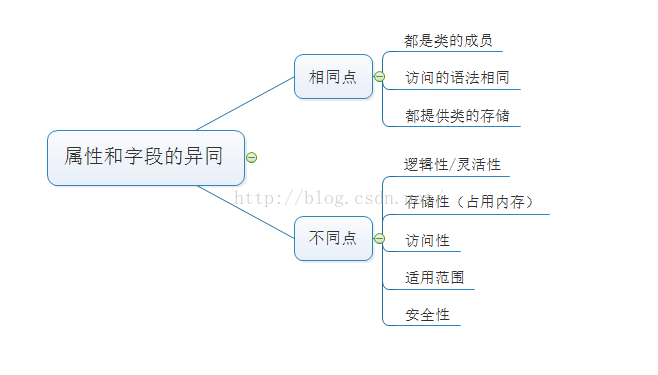
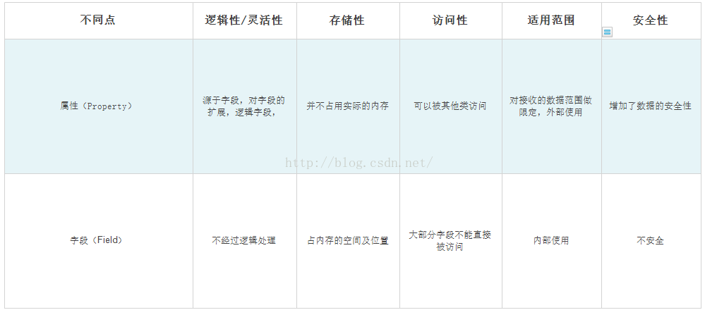

# 字段和属性

字段（Field）是一种表示与对象或类关联的变量的成员，字段声明用于引入一个或多个给定类型的字段。字段是类内部用的，private类型的变量(字段)，通常字段写法都是加个"_"符号，然后声明只读属性，字段用来储存数据。

 属性（Property）是另一种类型的类成员，定义属性的目的是在于便于一些私有字段的访问。类提供给外部调用时用的可以设置或读取一个值，属性则是对字段的封装，将字段和访问自己字段的方法组合在一起，提供灵活的机制来读取、编写或计算私有字段的值。属性有自己的名称，并且包含get 访问器和set 访问器。

```c#

属性修饰符  类型  属性名 
{
   get{
     //get访问器代码
    }
   set{
     //set访问器代码
    }

```

属性分类：根据get访问器和set访问器是否存在，属性可按下列规则分类。


----

**那么问题来了，既然已经有字段用来存储数据，为什么还要引入属性来对数据进行访问，把声明的字段直接定义成公有的不就可以了吗？**

解答：在C#中，我们可以非常自由的、毫无限制的访问公有字段，但在一些场合中，我们可能希望限制只能给字段赋于某个范围的值、或是要求字段只能读或只能写，或是在改变字段时能改变对象的其他一些状态，这些单靠字段是无法做到的，于是就有了属性，属性中包含两个块：set和get，set块负责属性的写入工作，get块负责属性的读取工作。在两个块中都可以做一些其他操作，如在set中验证赋的值是否符合要求并决定是否进行赋值。当缺少其中一块时属性就只能读或只能写，set和get块中属性必需有一个，因为即不能读又不能写的属性是没有意义的。总之，外部能够访问和修改定义为public的字段，这么做是违反类的安全性设计原则的，所以一般的字段都是设为私有的，字段的访问便是由属性来实现。

C#通过属性特性读取和写入字段（成员变量），而不直接直接读取和写入，以此来提供对类中字段的保护。







  公共字段：

          1. 允许自由读写
          2. 取值范围只收数据类型约束而无其他任何特定限制；
          3. 值的变动不需要引发类中其它任何成员的相应变化；

​     如果均满足上述条件，那么我们便可以大胆地使用公共字段；


   属性：

            1. 要求字段只能读或只能写；
            2. 限定字段的取值范围；
            3. 在改变一个字段的值的时候希望改变对象的其它一些状态；

​       如果满足上述条件中的任何一个，就应该使用属性。

