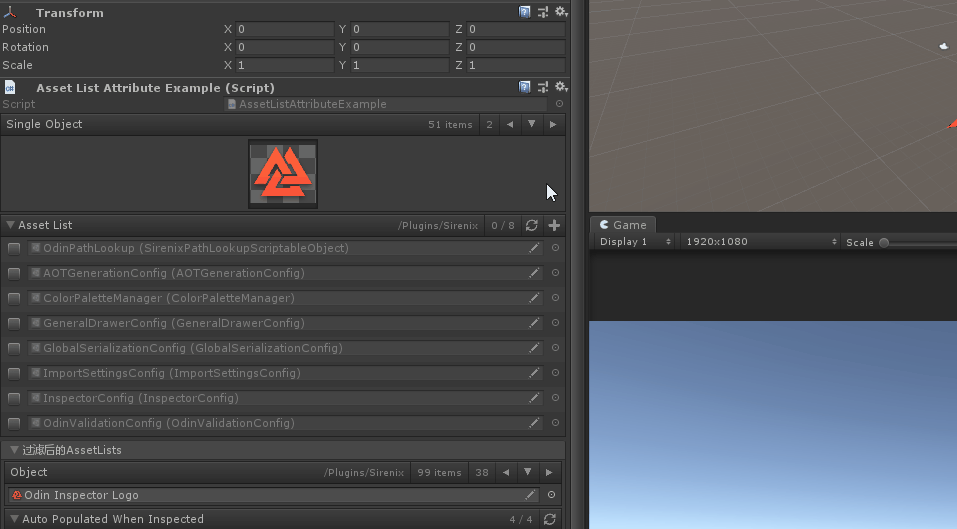
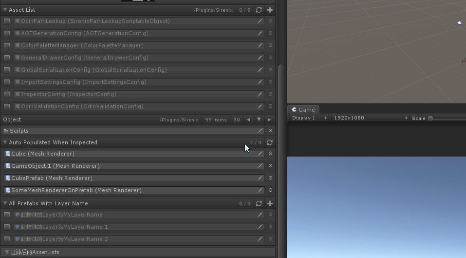
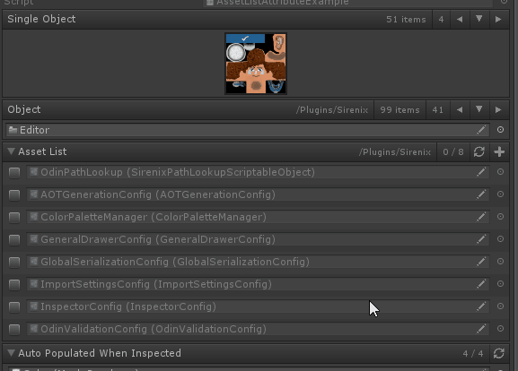
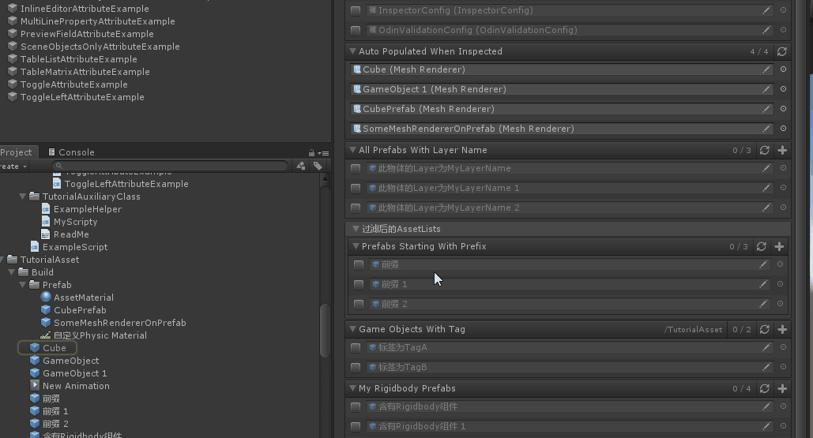
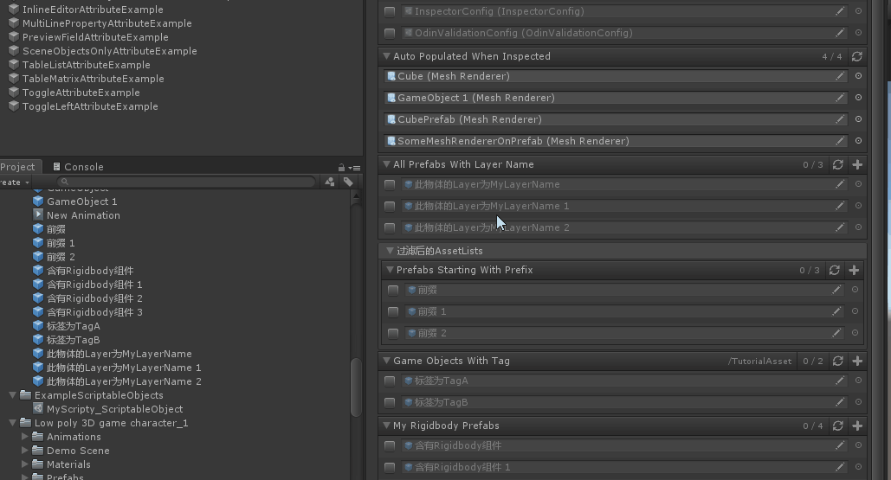
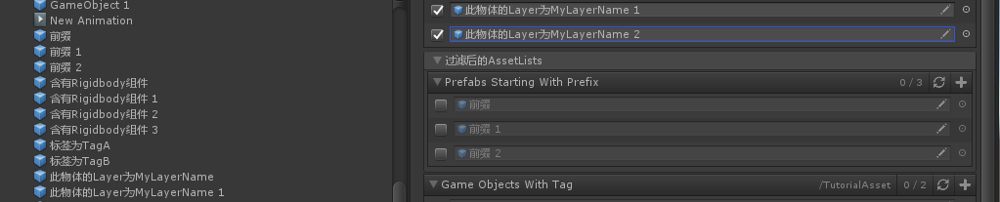
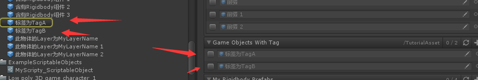
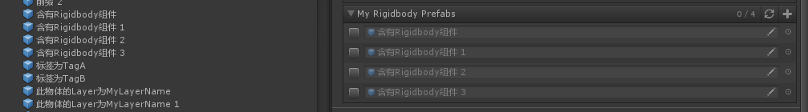

# AssetListAttribute

> *Asset List Attribute特性：用于列表和数组以及Unity type的单个元素，并将默认列表Drop替换为具有指定过滤器的所有可能资产的列表。使用此选项可以过滤并在列表或数组中包含或排除资产，而无需导航项目窗口。*


##### AssetList：创建一个指定类型的列表



```cs
    [AssetList]
    [PreviewField(70, ObjectFieldAlignment.Center)]
    public Texture2D SingleObject;
```

##### 【Path】根据指定筛选资源的路径



```cs
    [AssetList(Path = "Plugins/Sirenix/")]
    public UnityEngine.Object Object;
```

##### 如果是List，将以列表的形式表示出来,但是只有在选中时，才会被添加到List中



```cs
    [AssetList(Path = "/Plugins/Sirenix/")]
    public List<ScriptableObject> AssetList;
```

##### 【AutoPopulate】符合规则的自动添加到List中



```cs
    [AssetList(AutoPopulate = true)]//设置为true则自动填充符合规则的资源,false为只显示不填充
    public List<MeshRenderer> AutoPopulatedWhenInspected;
```

##### 【LayerNames】也可以指定layer层过滤



```cs
    [AssetList(LayerNames = "MyLayerName")]//
    public GameObject[] AllPrefabsWithLayerName;
```

##### 【AssetNamePrefix】以资源名称的前缀作为筛选条件



```cs
    [AssetList(AssetNamePrefix = "前缀")]
    [FoldoutGroup("过滤后的AssetLists")]
    public List<GameObject> PrefabsStartingWithPrefix;
```

##### 【Tags】以资源的tag作为筛选条件，可用，符号分隔多个Tag



```
    [AssetList(Tags = "TagA,TagB",Path = "/TutorialAsset")]
    public List<GameObject> GameObjectsWithTag;
```

##### 【CustomFilterMethod】自定义过滤函数



```cs
    [AssetList(CustomFilterMethod = "HasRigidbodyComponent")]
    public List<GameObject> MyRigidbodyPrefabs;

    private bool HasRigidbodyComponent(GameObject obj)
    {
        return obj.GetComponent<Rigidbody>() != null;
    }
```

##### 完整示例代码

```cs
using Sirenix.OdinInspector;
using System.Collections.Generic;
using UnityEngine;

public class AssetListAttributeExample : MonoBehaviour
{
    [AssetList]
    [PreviewField(70, ObjectFieldAlignment.Center)]
    public Texture2D SingleObject;

    [AssetList(Path = "Plugins/Sirenix/")]
    public UnityEngine.Object Object;

    [AssetList(Path = "/Plugins/Sirenix/")]
    public List<ScriptableObject> AssetList;

    [AssetList(AutoPopulate = true)]//设置为true则自动填充符合规则的资源,false为只显示不填充
    public List<MeshRenderer> AutoPopulatedWhenInspected;

    [AssetList(LayerNames = "MyLayerName")]//
    public GameObject[] AllPrefabsWithLayerName;

    [AssetList(AssetNamePrefix = "前缀")]
    [FoldoutGroup("过滤后的AssetLists")]
    public List<GameObject> PrefabsStartingWithPrefix;

    [AssetList(Tags = "TagA,TagB",Path = "/TutorialAsset")]
    public List<GameObject> GameObjectsWithTag;

    [AssetList(CustomFilterMethod = "HasRigidbodyComponent")]
    public List<GameObject> MyRigidbodyPrefabs;

    private bool HasRigidbodyComponent(GameObject obj)
    {
        return obj.GetComponent<Rigidbody>() != null;
    }
}
```