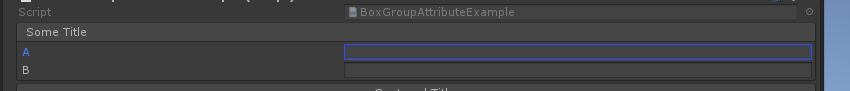
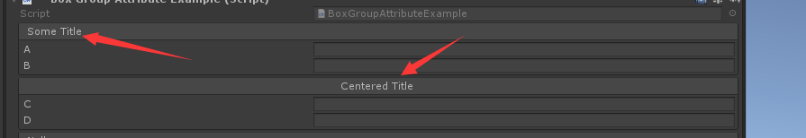
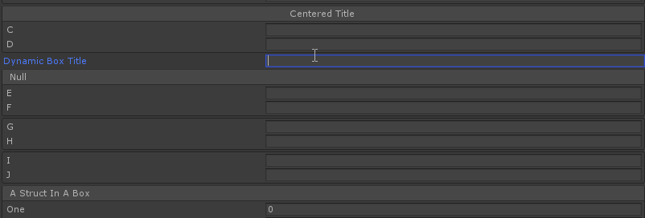
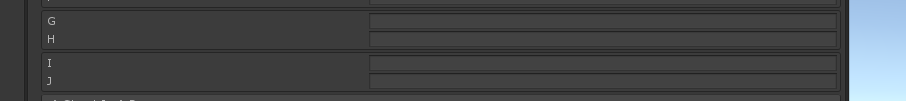
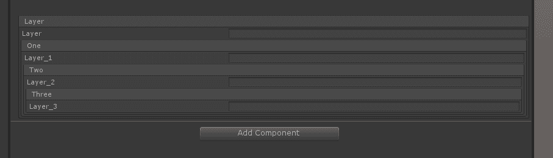

# BoxGroup

> Box Group:可以用于任何属性，并将该属性组织在一个装箱的组中。使用它可以在检查器中清晰地组织相关值。

##### 【Box Group】将一些属性装入同一个group中



```cs
    [BoxGroup("Some Title")]
    public string A;
    [BoxGroup("Some Title")]
    public string B;
```

##### 【centerLabel】 指定标题在中间位置



```cs
    [BoxGroup("Centered Title", centerLabel: true)]
    public string C;
    [BoxGroup("Centered Title")]
    public string D;
```

##### 也可以通过$特殊标志符指定一个字段的值作为标题



```cs
    public string DynamicBoxTitle = "DynamicBoxTitle";
    [BoxGroup("$DynamicBoxTitle")]
    public string E = "Dynamic box title 2";
    [BoxGroup("$DynamicBoxTitle")]
    public string F;
```

##### 默认情况或者指定标题使用showLabel可隐藏标题显示



```cs
    [BoxGroup]
    public string G;
    [BoxGroup]
    public string H;

    [BoxGroup("NoTitle", false)]
    public string I;
    [BoxGroup("NoTitle")]
    public string J;
```

##### 也可以使用嵌套结构

> 注意：嵌套结构必须要连续。**例如：直接使用Layer/One会报错，提示无法找到Layer对应的组**



```cs
    [BoxGroup("Layer")]
    public string layer = "";
    [BoxGroup("Layer/One")]
    public string layer_1 = "";
    [BoxGroup("Layer/One/Two")]
    public string layer_2 = "";
    [BoxGroup("Layer/One/Two/Three")]
    public string layer_3 = "";
```