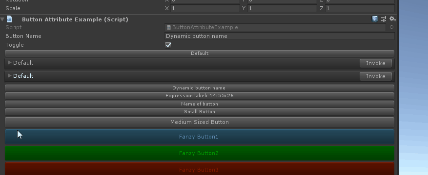
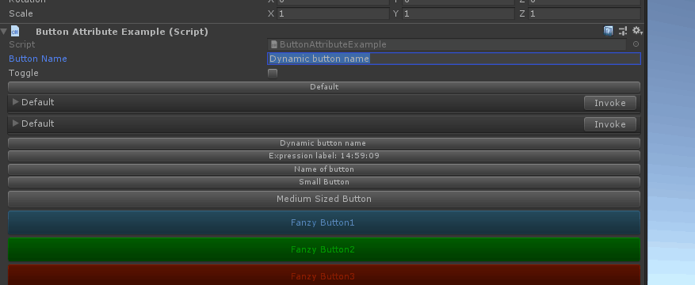
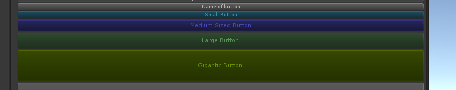
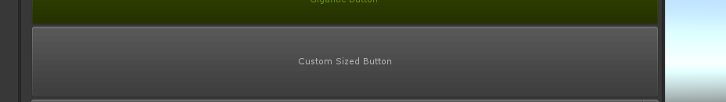
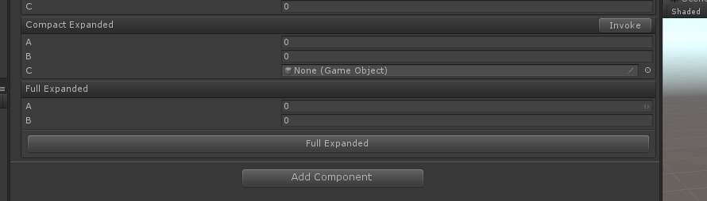

# Button

> Button Attribute特性：用于为一个方法在检查器中绘制一个触发该方法的功能按钮。

【Button】在检查器中绘制各个按钮，如果含有参数，默认以折叠的方式展示。




```cs
    [Button]
    private void Default()
    {
    }
    [Button]
    private void Default(float a, float b, GameObject c)
    {
    }

    [Button]
    private void Default(float t, float b, float[] c)
    {
    }
```

##### 以为为这个button指定一个名称，而且也可以通过特殊字符$引用一个字段作为名称



```cs
    public string ButtonName = "Dynamic button name";

    public bool Toggle;

    [Button("$ButtonName")]
    private void DefaultSizedButton()
    {
        this.Toggle = !this.Toggle;
    }
```

##### 可以通过特殊字符@ 写入方法体调用


```cs
    [Button("@\"Expression label: \" + DateTime.Now.ToString(\"HH:mm:ss\")")]
    public void ExpressionLabel()
    {
        this.Toggle = !this.Toggle;
    }
```

##### 【ButtonSizes】指定不同尺寸的按钮



```cs
    [Button(ButtonSizes.Small), GUIColor(0.3f, 0.8f, 1)]
    private void SmallButton()
    {
        this.Toggle = !this.Toggle;
    }

    [Button(ButtonSizes.Medium), GUIColor(0.4f, 0.4f, 1)]
    private void MediumSizedButton()
    {
        this.Toggle = !this.Toggle;
    }

    [Button(ButtonSizes.Large), GUIColor(0.5f, 0.8f, 0.5f)]
    private void LargeButton()
    {
        this.Toggle = !this.Toggle;
    }

    [Button(ButtonSizes.Gigantic),GUIColor(0.6f, 0.8f, 0)]
    private void GiganticButton()
    {
        this.Toggle = !this.Toggle;
    }
```

##### 也是自定义尺寸



```cs
    [Button(90)]
    private void CustomSizedButton()
    {
        this.Toggle = !this.Toggle;
    }
```

##### 【ButtonStyle】指定展示样式


```cs
    [Button(ButtonSizes.Medium, ButtonStyle.FoldoutButton)]
    private int FoldoutButton(int a = 2, int b = 2)
    {
        return a + b;
    }

    [Button(ButtonSizes.Medium, ButtonStyle.FoldoutButton)]
    private void FoldoutButton(int a, int b, ref int result)
    {
        result = a + b;
    }

    [Button(ButtonSizes.Large, ButtonStyle.Box)]
    private void Box(float a, float b, out float c)
    {
        c = a + b;
    }

    [Button(ButtonSizes.Large, ButtonStyle.Box)]
    private void Box(int a, float b, out float c)
    {
        c = a + b;
    }
    [Button(ButtonSizes.Large, ButtonStyle.CompactBox)]
    public void CompactBox(int a, float b, out float c)
    {
        c = a + b;
    }
```

##### 【Expanded】如果有参数的控制是否强制展开折页（去除折页方式）



```cs
    [Button(ButtonStyle.CompactBox, Expanded = true)]
    private void CompactExpanded(float a, float b, GameObject c)
    {
    }

    [Button(ButtonSizes.Medium, ButtonStyle.Box, Expanded = true)]
    private void FullExpanded(float a, float b)
    {
    }
```


##### 完整示例代码

```cs
using Sirenix.OdinInspector;
using System.Collections;
using System.Collections.Generic;
using UnityEngine;

public class ButtonAttributeExample : MonoBehaviour
{

    [Button]
    private void Default()
    {
    }
    [Button]
    private void Default(float a, float b, GameObject c)
    {
    }

    [Button]
    private void Default(float t, float b, float[] c)
    {
    }
    public string ButtonName = "Dynamic button name";

    public bool Toggle;

    [Button("$ButtonName")]
    private void DefaultSizedButton()
    {
        this.Toggle = !this.Toggle;
    }

    [Button("@\"Expression label: \" + DateTime.Now.ToString(\"HH:mm:ss\")")]
    public void ExpressionLabel()
    {
        this.Toggle = !this.Toggle;
    }

    [Button("Name of button")]
    private void NamedButton()
    {
        this.Toggle = !this.Toggle;
    }

    [Button(ButtonSizes.Small), GUIColor(0.3f, 0.8f, 1)]
    private void SmallButton()
    {
        this.Toggle = !this.Toggle;
    }

    [Button(ButtonSizes.Medium), GUIColor(0.4f, 0.4f, 1)]
    private void MediumSizedButton()
    {
        this.Toggle = !this.Toggle;
    }

    [Button(ButtonSizes.Large), GUIColor(0.5f, 0.8f, 0.5f)]
    private void LargeButton()
    {
        this.Toggle = !this.Toggle;
    }

    [Button(ButtonSizes.Gigantic),GUIColor(0.6f, 0.8f, 0)]
    private void GiganticButton()
    {
        this.Toggle = !this.Toggle;
    }

    [Button(90)]
    private void CustomSizedButton()
    {
        this.Toggle = !this.Toggle;
    }

    [Button(ButtonSizes.Medium, ButtonStyle.FoldoutButton)]
    private int FoldoutButton(int a = 2, int b = 2)
    {
        return a + b;
    }

    [Button(ButtonSizes.Medium, ButtonStyle.FoldoutButton)]
    private void FoldoutButton(int a, int b, ref int result)
    {
        result = a + b;
    }

    [Button(ButtonSizes.Large, ButtonStyle.Box)]
    private void Box(float a, float b, out float c)
    {
        c = a + b;
    }

    [Button(ButtonSizes.Large, ButtonStyle.Box)]
    private void Box(int a, float b, out float c)
    {
        c = a + b;
    }
    [Button(ButtonSizes.Large, ButtonStyle.CompactBox)]
    public void CompactBox(int a, float b, out float c)
    {
        c = a + b;
    }

    [Button(ButtonStyle.CompactBox, Expanded = true)]
    private void CompactExpanded(float a, float b, GameObject c)
    {
    }

    [Button(ButtonSizes.Medium, ButtonStyle.Box, Expanded = true)]
    private void FullExpanded(float a, float b)
    {
    }
}
```