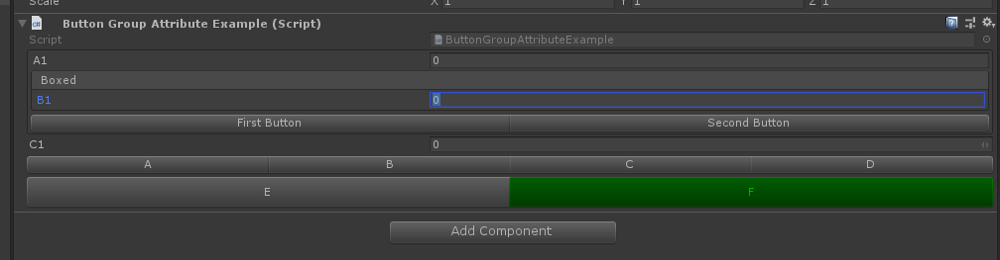

# ButtonGroup

> Button Group Attribute 特性：用于可用于任何实例函数，并将按钮添加到组织为水平组的检查器中。使用此按钮可以将多个按钮组织在一个整齐的水平组中。



```cs
using Sirenix.OdinInspector;
using UnityEngine;

public class ButtonGroupAttributeExample : MonoBehaviour
{
    [ButtonGroup]
    private void A()
    {
    }
    [ButtonGroup]
    private void B()
    {
    }
    [ButtonGroup]
    private void C()
    {
    }
    [ButtonGroup]
    private void D()
    {
    }
    [Button(ButtonSizes.Large)]
    [ButtonGroup("My Button Group")]
    private void E()
    {
    }
    [GUIColor(0, 1, 0)]
    [ButtonGroup("My Button Group")]
    private void F()
    {
    }
    [BoxGroup("Titles", ShowLabel = false)]
    public int A1;
    [BoxGroup("Titles/Boxed")]
    public int B1;
    public int C1;
    [ButtonGroup("Titles/Buttons")]
    public void FirstButton() { }
    [ButtonGroup("Titles/Buttons")]
    public void SecondButton() { }
}
```