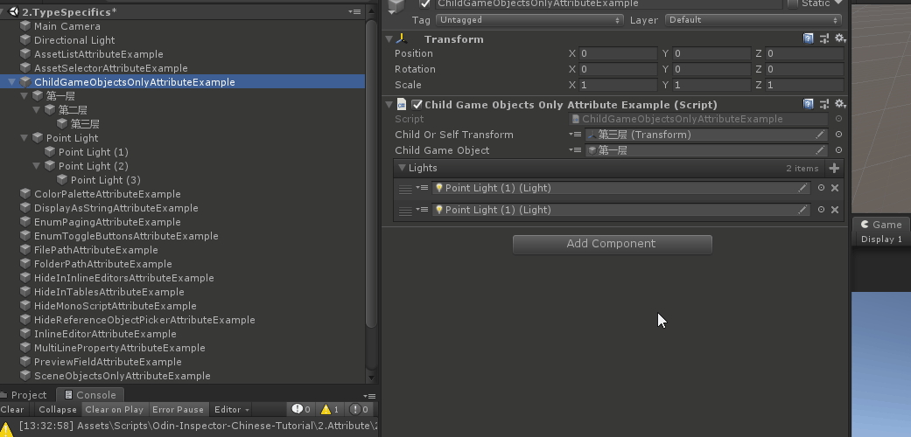

# ChildGameObjectOnly

> *用于Components和GameObject字段，并将在对象字段旁边添加一个小按钮，该按钮将在所有子游戏对象中搜索可分配对象，并将其显示在下拉列表中供用户选择。*

##### 【ChildGameObjectsOnly】获取包括自己在内以的可用节点


```cs
    [ChildGameObjectsOnly]
    public GameObject ChildGameObject;
```

##### 【IncludeSelf】是否包含自己的节点



```cs
    [ChildGameObjectsOnly(IncludeSelf = false)]//是否包含顶层定节点
    public Transform ChildOrSelfTransform;
```

##### 完整示例代码

```cs
using UnityEngine;
using Sirenix.OdinInspector;

public class ChildGameObjectsOnlyAttributeExample : MonoBehaviour
    {
    [ChildGameObjectsOnly(IncludeSelf = false)]//是否包含顶层定节点
    public Transform ChildOrSelfTransform;

    [ChildGameObjectsOnly]
    public GameObject ChildGameObject;

    [ChildGameObjectsOnly(IncludeSelf = false)]
    public Light[] Lights;

    public void Start()
    {
        Debug.Log(ChildOrSelfTransform);
        Debug.Log(ChildGameObject);
    }
}
```