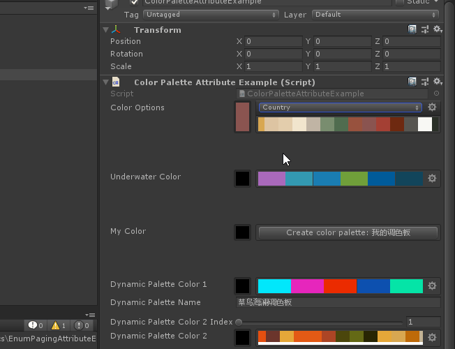
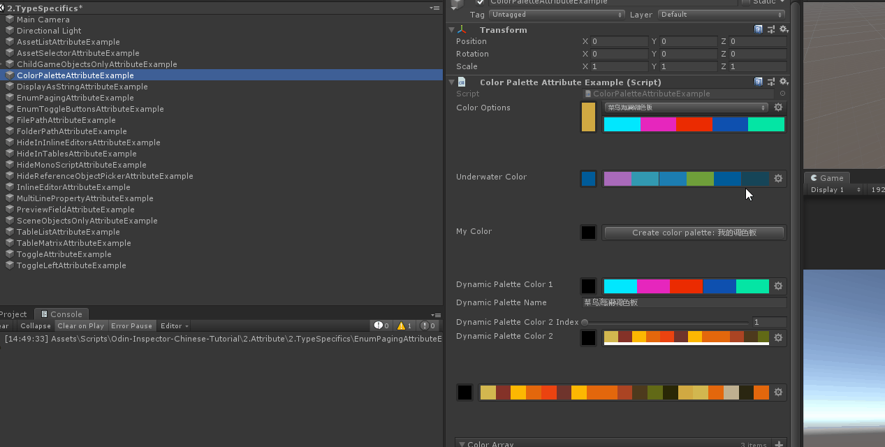
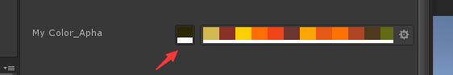
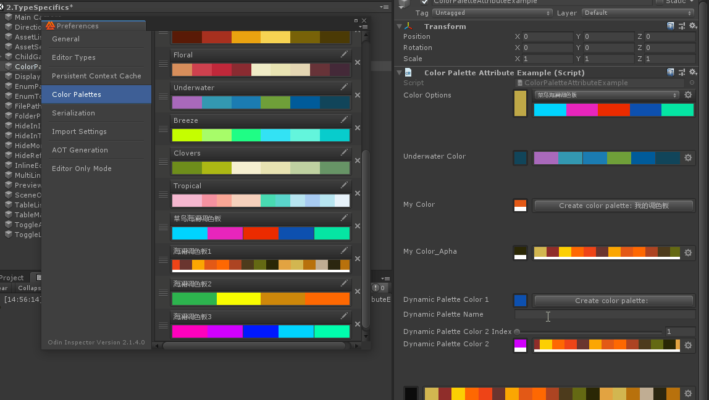
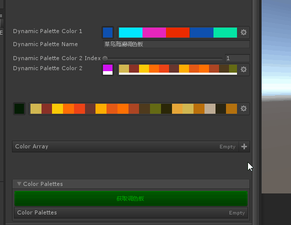
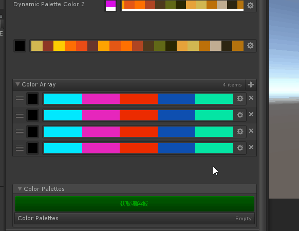

# ColorPalette

> *Color Palette Attribute：于任何Color属性，并允许从不同的可定义调色板中选择颜色。使用此选项允许用户从一组预定义的颜色选项中进行选择。*

##### 【ColorPalette】使用这个特性就回在对应的字段旁出现可用的调色板



```cs
    [ColorPalette]
    public Color ColorOptions;
```

##### 【PaletteName】也可以指定调色板名称,如果没有指定的调色板可以单击旁边的按钮创建



```cs
    [PropertySpace(50)]
    [ColorPalette("Underwater")]
    public Color UnderwaterColor;
    [PropertySpace(50)]
    [ColorPalette("我的调色板")]
    public Color MyColor;
```

##### 【ShowAlpha】也可以显示选中颜色的apha状态



```cs
    [PropertySpace(50)]
    [ColorPalette("海澜调色板1",ShowAlpha = true)]
    public Color MyColor_Apha;
```

##### ColorPalette属性同时支持成员引用和属性表达式。



```cs
    // ColorPalette属性同时支持成员引用和属性表达式。
    [PropertySpace(50)]
    [ColorPalette("$DynamicPaletteName")]
    public Color DynamicPaletteColor1;
    public string DynamicPaletteName = "Clovers";

    [PropertySpace(10)]
    [PropertyRange(1,10)]
    public int DynamicPaletteColor2Index = 0;
    [ColorPalette("@\"海澜调色板\"+ DynamicPaletteColor2Index")]
    public Color DynamicPaletteColor2;
```

##### 数组形式的Color也可以指定默认调色板，不指定用索引第一个调色板



```cs
    [PropertySpace(50,50)]
    [ColorPalette("菜鸟海澜调色板")]
    public Color[] ColorArray;
```

##### 辅助性功能，通过代码获取global调色板



```cs
    // ------------------------------------
    // 调色板可以通过代码访问和修改。注意，调色板不会自动包含在您的构建中。
    // 但是你可以很容易地通过ColorPaletteManager获取所有的调色板，并将它们包括在你的游戏中，就像这样:
    // ------------------------------------
    [FoldoutGroup("Color Palettes", expanded: false)]
    [ListDrawerSettings(IsReadOnly = true)]
    [PropertyOrder(9)]
    public List ColorPalettes;

#if UNITY_EDITOR

    [FoldoutGroup("Color Palettes"), Button("获取调色板",ButtonSizes.Large), GUIColor(0, 1, 0), PropertyOrder(8)]
    private void FetchColorPalettes()
    {
        this.ColorPalettes = Sirenix.OdinInspector.Editor.ColorPaletteManager.Instance.ColorPalettes
            .Select(x => new ColorPalette()
            {
                Name = x.Name,
                Colors = x.Colors.ToArray()
            })
            .ToList();
    }

#endif
    [Serializable]
    public class ColorPalette
    {
        [HideInInspector]
        public string Name;

        [LabelText("$Name")]
        [ListDrawerSettings(IsReadOnly = true, Expanded = false)]//IsReadOnly是否可以删除序列化数组  Expanded覆盖默认设置，是否展开，false为不展开状态
        public Color[] Colors;
    }
```

##### 完整示例代码

```cs
using UnityEngine;
using Sirenix.OdinInspector;
using System;
using System.Linq;
using System.Collections.Generic;

public class ColorPaletteAttributeExample : MonoBehaviour
{
    [ColorPalette]
    public Color ColorOptions;

    [PropertySpace(50)]
    [ColorPalette("Underwater")]
    public Color UnderwaterColor;
    [PropertySpace(50)]
    [ColorPalette("我的调色板")]
    public Color MyColor;

    [PropertySpace(50)]
    [ColorPalette("海澜调色板1",ShowAlpha = true)]
    public Color MyColor_Apha;

    // ColorPalette属性同时支持成员引用和属性表达式。
    [PropertySpace(50)]
    [ColorPalette("$DynamicPaletteName")]
    public Color DynamicPaletteColor1;
    public string DynamicPaletteName = "Clovers";

    [PropertySpace(10)]
    [PropertyRange(1,10)]
    public int DynamicPaletteColor2Index = 0;
    [ColorPalette("@\"海澜调色板\"+ DynamicPaletteColor2Index")]
    public Color DynamicPaletteColor2;

    [PropertySpace(50)]
    [ColorPalette("Fall"), HideLabel]
    public Color WideColorPalette;

    [PropertySpace(50,50)]
    [ColorPalette("菜鸟海澜调色板")]
    public Color[] ColorArray;

    // ------------------------------------
    // 调色板可以通过代码访问和修改。注意，调色板不会自动包含在您的构建中。
    // 但是你可以很容易地通过ColorPaletteManager获取所有的调色板，并将它们包括在你的游戏中，就像这样:
    // ------------------------------------
    [FoldoutGroup("Color Palettes", expanded: false)]
    [ListDrawerSettings(IsReadOnly = true)]
    [PropertyOrder(9)]
    public List ColorPalettes;

#if UNITY_EDITOR

    [FoldoutGroup("Color Palettes"), Button("获取调色板",ButtonSizes.Large), GUIColor(0, 1, 0), PropertyOrder(8)]
    private void FetchColorPalettes()
    {
        this.ColorPalettes = Sirenix.OdinInspector.Editor.ColorPaletteManager.Instance.ColorPalettes
            .Select(x => new ColorPalette()
            {
                Name = x.Name,
                Colors = x.Colors.ToArray()
            })
            .ToList();
    }

#endif
    [Serializable]
    public class ColorPalette
    {
        [HideInInspector]
        public string Name;

        [LabelText("$Name")]
        [ListDrawerSettings(IsReadOnly = true, Expanded = false)]//IsReadOnly是否可以删除序列化数组  Expanded覆盖默认设置，是否展开，false为不展开状态
        public Color[] Colors;
    }
}
```