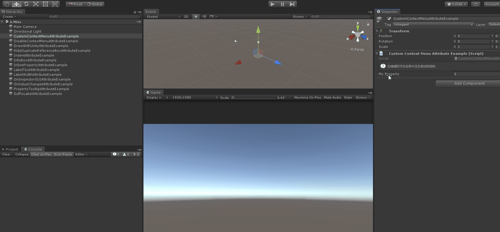

# Custom Context Menu

> Custom Context Menu Attribute:可用于任何属性，并将自定义选项添加到属性的上下文菜单。
>
> 当你要将自定义操作添加到属性的上限文菜单时，请使用此选项。



```cs
using Sirenix.OdinInspector;
using UnityEngine;

public class CustomContextMenuAttributeExample : MonoBehaviour
{
    [InfoBox("右键属性可在菜单中出发指定的函数.")]
    [CustomContextMenu("Say Hello/菜鸟海澜", "SayHelloFunction")]
    public int MyProperty;

    private void SayHelloFunction()
    {
        Debug.Log("Hello 菜鸟海澜");
    }
}
```