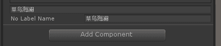

# Custom Value Drawer Attribute

> Custom Value Drawer Attribute特性，允许用户自定义一个绘制方法，字段以自定的绘制方式展示在Inspector中，非常灵活。
>
> 

##### 含有Label和不含有Label的字段



```c#
using Sirenix.OdinInspector;
using UnityEditor;
using UnityEngine;

public class CustomValueDrawerExample : MonoBehaviour
{
    public float Max = 100, Min = 0;

    [CustomValueDrawer("MyStaticCustomDrawerStatic")]
    public float CustomDrawerStatic;//float 变成slider，通过调用MyStaticCustomDrawerStatic方法来绘制
    private static float MyStaticCustomDrawerStatic(float value, GUIContent label)
    {
        return EditorGUILayout.Slider(label, value, 0f, 10f);
    }

    [CustomValueDrawer("MyStaticCustomDrawerInstance")]
    public float CustomDrawerInstance;

    private float MyStaticCustomDrawerInstance(float value, GUIContent label)
    {
        return EditorGUILayout.Slider(label, value, this.Min, this.Max);
    }

    [CustomValueDrawer("MyStaticCustomDrawerArray")]
    public float[] CustomDrawerArray = new float[] { 3f, 5f, 6f };

    private float MyStaticCustomDrawerArray(float value, GUIContent label)
    {
        return EditorGUILayout.Slider(value, this.Min, this.Max);
    }

    [CustomValueDrawer("HaveLabelNameFunction")]
    public string HaveLabelName;
    [CustomValueDrawer("NoLabelNameFunction")]
    public string NoLabelName;

    public string HaveLabelNameFunction(string tempName, GUIContent label)
    {
        return EditorGUILayout.TextField(tempName);
    }
    public string NoLabelNameFunction(string tempName, GUIContent label)
    {
        return EditorGUILayout.TextField(label, tempName);
    }
}

```

