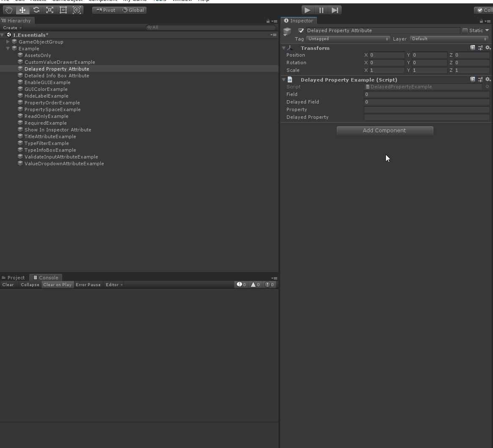
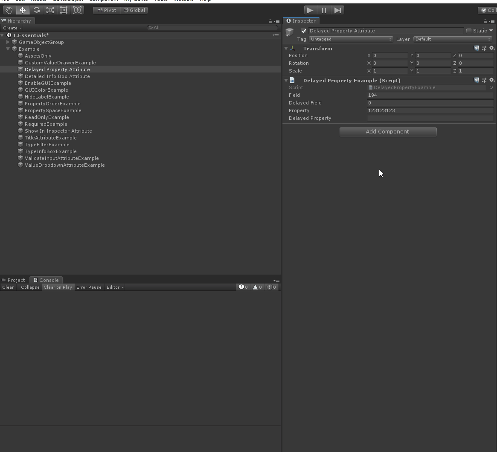

# DelayedPropertyAttribute

> *Delayed Property Attribute：此特性会延迟在editor中的序列化操作*

##### 即时性（非延迟）序列化



```c#
    [OnValueChanged("ValueChangeCallBack")]
    public int field;
    //但是，正如名称所示，DelayedProperty应用于属性。
    [ShowInInspector]
    [OnValueChanged("ValueChangeCallBack")]
    public string property { get; set; }
```

##### 延迟序列化



```cs
    // 延迟和延迟属性实际上是相同的
    [Delayed]
    [OnValueChanged ("ValueChangeCallBack")]
    public int delayedField;

    //但是，正如名称所示，DelayedProperty应用于属性。
    [ShowInInspector, DelayedProperty]
    [OnValueChanged("ValueChangeCallBack")]
    public string delayedProperty { get; set; }

    public void ValueChangeCallBack()
    {
        Debug.Log("数值有变化");
    }
```

### 完整示例代码

```cs
using Sirenix.OdinInspector;
using UnityEngine;

public class DelayedPropertyExample : MonoBehaviour
{

    [OnValueChanged("ValueChangeCallBack")]
    public int field;

    [ShowInInspector]
    [OnValueChanged("ValueChangeCallBack")]
    public string property { get; set; }

    // 延迟和延迟属性实际上是相同的
    [Delayed]
    [OnValueChanged ("ValueChangeCallBack")]
    public int delayedField;

    //但是，正如名称所示，DelayedProperty应用于属性。
    [ShowInInspector, DelayedProperty]
    [OnValueChanged("ValueChangeCallBack")]
    public string delayedProperty { get; set; }

    public void ValueChangeCallBack()
    {
        Debug.Log("数值有变化");
    }
}
```