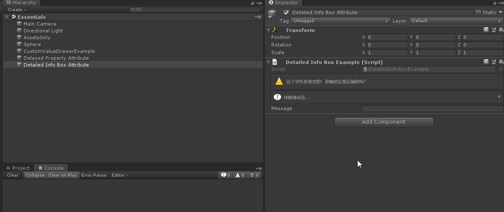
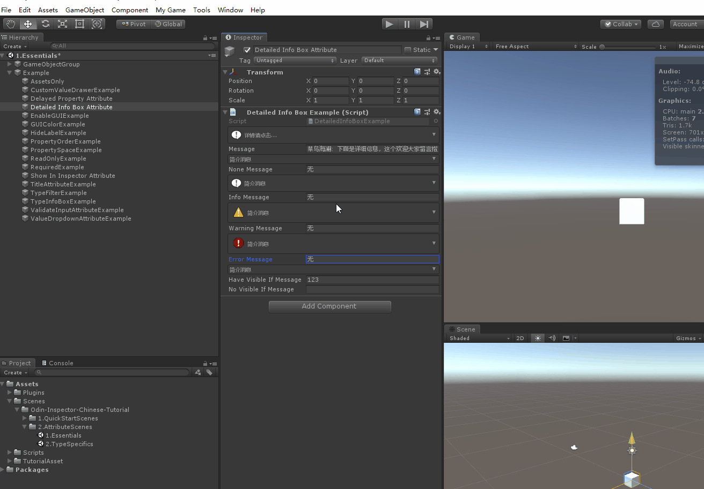
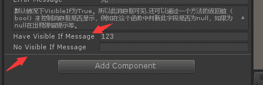

# DetailedInfoBoxAttribute

> Detailed Info Box Attribute特性：
>
> 在Inspector面板中绘制一个信息面板，添加对应标题和详细信息描述，点击时可以显示对应填写的详细信息




##### 不同形式的消息框



```cs
    [DetailedInfoBox("简介消息", "默认情况下VisibleIf为True，所以此消息框可见", InfoMessageType = InfoMessageType.None)]
    public string NoneMessage = "无";
    [DetailedInfoBox("简介消息", "默认情况下VisibleIf为True，所以此消息框可见", InfoMessageType = InfoMessageType.Info)]
    public string InfoMessage = "无";
    [DetailedInfoBox("简介消息", "默认情况下VisibleIf为True，所以此消息框可见", InfoMessageType = InfoMessageType.Warning)]
    public string WarningMessage = "无";
    [DetailedInfoBox("简介消息", "默认情况下VisibleIf为True，所以此消息框可见", InfoMessageType = InfoMessageType.Error)]
    public string ErrorMessage = "无";
```

##### 还可以通过一个方法的返回值（bool）来控制消息框是否显示，例如在这个函数中判断此字段是否为null，如果为null在出现弹窗提示等。



```cs
    [DetailedInfoBox("简介消息", "默认情况下VisibleIf为True。" +
        "所以此消息框可见.还可以通过一个方法的返回值（bool）来控制消息框是否显示，" +
        "例如在这个函数中判断此字段是否为null，如果为null在出现弹窗提示等。", 
        InfoMessageType = InfoMessageType.None, VisibleIf = "VisibleFunction")]
    public string haveVisibleIfMessage = "";

    [DetailedInfoBox("简介消息", "还可以通过一个方法的返回值（bool）来控制消息框是否显示，例如在这个函数中判断此字段是否为null，如果为null在出现弹窗提示等。", InfoMessageType = InfoMessageType.None, VisibleIf = "NoVisibleFunction")]
    public string noVisibleIfMessage = "";

    public  bool VisibleFunction()
    {
        /*
         * 根据情况下选择返回true或者false，让对应的消息框显示或者不显示
         */
        return true;
    }

    public bool NoVisibleFunction()
    {
        return string.IsNullOrEmpty(noVisibleIfMessage);
    }
```

##### 完整示例代码

```cs
using Sirenix.OdinInspector;
using UnityEngine;

public class DetailedInfoBoxExample : MonoBehaviour
{
    [DetailedInfoBox("详情请点击...",
        "菜鸟海澜：下面是详细信息，这个欢迎大家留言指正，对应的工程已经上传Github，" +
        "地址为：https://github.com/su9257/Odin-Inspector-Chinese-Tutorial")]
    public string message = "无";

    [DetailedInfoBox("简介消息", "默认情况下VisibleIf为True，所以此消息框可见", InfoMessageType = InfoMessageType.None)]
    public string NoneMessage = "无";
    [DetailedInfoBox("简介消息", "默认情况下VisibleIf为True，所以此消息框可见", InfoMessageType = InfoMessageType.Info)]
    public string InfoMessage = "无";
    [DetailedInfoBox("简介消息", "默认情况下VisibleIf为True，所以此消息框可见", InfoMessageType = InfoMessageType.Warning)]
    public string WarningMessage = "无";
    [DetailedInfoBox("简介消息", "默认情况下VisibleIf为True，所以此消息框可见", InfoMessageType = InfoMessageType.Error)]
    public string ErrorMessage = "无";

    [DetailedInfoBox("简介消息", "默认情况下VisibleIf为True。" +
        "所以此消息框可见.还可以通过一个方法的返回值（bool）来控制消息框是否显示，" +
        "例如在这个函数中判断此字段是否为null，如果为null在出现弹窗提示等。", 
        InfoMessageType = InfoMessageType.None, VisibleIf = "VisibleFunction")]
    public string haveVisibleIfMessage = "";

    [DetailedInfoBox("简介消息", "还可以通过一个方法的返回值（bool）来控制消息框是否显示，例如在这个函数中判断此字段是否为null，如果为null在出现弹窗提示等。", InfoMessageType = InfoMessageType.None, VisibleIf = "NoVisibleFunction")]
    public string noVisibleIfMessage = "";

    public  bool VisibleFunction()
    {
        /*
         * 根据情况下选择返回true或者false，让对应的消息框显示或者不显示
         */
        return true;
    }
//没有的时候就存在简介，存在文字的时候隐藏简介。
    public bool NoVisibleFunction()
    {
        return string.IsNullOrEmpty(noVisibleIfMessage);
    }
}
```