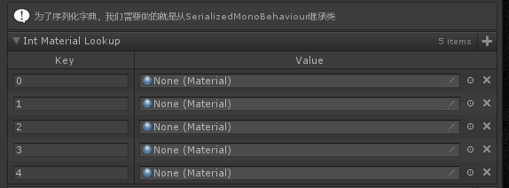
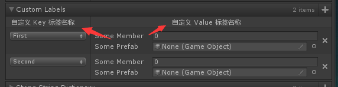
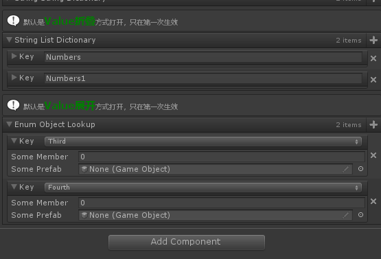

# Dictionary Drawer Settings

> *自定义字典绘制方式*




##### 默认以左侧为key，右侧为value 的形式展示，如果需要进行序列化，需要继承自SerializedMonoBehaviour

```cs
    [DictionaryDrawerSettings()]
    [ShowInInspector]
    [InfoBox("为了序列化字典，我们需要做的就是从SerializedMonoBehaviour继承类")]
    public Dictionary<int, Material> IntMaterialLookup = new Dictionary<int, Material>()
{
};
```

##### 【KeyLabel和ValueLabel】自定义标签



```cs
    [ShowInInspector]
    [DictionaryDrawerSettings(KeyLabel = "自定义 Key 标签名称", ValueLabel = "自定义 Value 标签名称")]
    public Dictionary<SomeEnum, MyCustomType> CustomLabels = new Dictionary<SomeEnum, MyCustomType>()
{
    { SomeEnum.First, new MyCustomType() },
    { SomeEnum.Second, new MyCustomType() },
};
```

##### 【DictionaryDisplayOptions】控制value默认以折叠还是展开形式显示



```cs
    [InfoBox("默认是<color=green><size=15><b>Value折叠</b></size></color>方式打开，只在第一次生效")]
    [ShowInInspector]
    [DictionaryDrawerSettings(DisplayMode = DictionaryDisplayOptions.CollapsedFoldout)]
    public Dictionary<string, List<int>> StringListDictionary = new Dictionary<string, List<int>>()
{
    { "Numbers", new List<int>(){ 1, 2, 3, 4, } },
    { "Numbers1", new List<int>(){ 1, 2, 3, 4, } },
};

    [InfoBox("默认是<color=green><size=15><b>Value展开</b></size></color>方式打开，只在第一次生效")]
    [ShowInInspector]
    [DictionaryDrawerSettings(DisplayMode = DictionaryDisplayOptions.ExpandedFoldout)]
    public Dictionary<SomeEnum, MyCustomType> EnumObjectLookup = new Dictionary<SomeEnum, MyCustomType>()
{
    { SomeEnum.Third, new MyCustomType() },
    { SomeEnum.Fourth, new MyCustomType() },
};
```

##### 完整示例代码

```cs
using Sirenix.OdinInspector;
using System.Collections;
using System.Collections.Generic;
using UnityEngine;

public class DictionaryDrawerSettingsExample : MonoBehaviour
{
    [DictionaryDrawerSettings()]
    [ShowInInspector]
    [InfoBox("为了序列化字典，我们需要做的就是从SerializedMonoBehaviour继承类")]
    public Dictionary<int, Material> IntMaterialLookup = new Dictionary<int, Material>()
{
};

    [ShowInInspector]
    [DictionaryDrawerSettings(KeyLabel = "自定义 Key 标签名称", ValueLabel = "自定义 Value 标签名称")]
    public Dictionary<SomeEnum, MyCustomType> CustomLabels = new Dictionary<SomeEnum, MyCustomType>()
{
    { SomeEnum.First, new MyCustomType() },
    { SomeEnum.Second, new MyCustomType() },
};

    [DictionaryDrawerSettings(DisplayMode = DictionaryDisplayOptions.Foldout)]
    [ShowInInspector]
    public Dictionary<string, string> StringStringDictionary = new Dictionary<string, string>()
{
    { "One", ExampleHelper.GetString() },
    { "Two", ExampleHelper.GetString() },
};

    [InfoBox("默认是<color=green><size=15><b>Value折叠</b></size></color>方式打开，只在第一次生效")]
    [ShowInInspector]
    [DictionaryDrawerSettings(DisplayMode = DictionaryDisplayOptions.CollapsedFoldout)]
    public Dictionary<string, List<int>> StringListDictionary = new Dictionary<string, List<int>>()
{
    { "Numbers", new List<int>(){ 1, 2, 3, 4, } },
    { "Numbers1", new List<int>(){ 1, 2, 3, 4, } },
};

    [InfoBox("默认是<color=green><size=15><b>Value展开</b></size></color>方式打开，只在第一次生效")]
    [ShowInInspector]
    [DictionaryDrawerSettings(DisplayMode = DictionaryDisplayOptions.ExpandedFoldout)]
    public Dictionary<SomeEnum, MyCustomType> EnumObjectLookup = new Dictionary<SomeEnum, MyCustomType>()
{
    { SomeEnum.Third, new MyCustomType() },
    { SomeEnum.Fourth, new MyCustomType() },
};

    [InlineProperty(LabelWidth = 100)]
    public struct MyCustomType
    {
        public int SomeMember;
        public GameObject SomePrefab;
    }

    public enum SomeEnum
    {
        First, Second, Third, Fourth, AndSoOn
    }
}
```