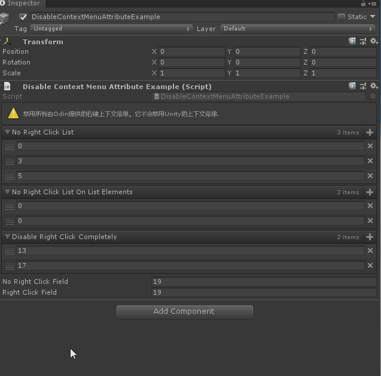

# DisableContextMenu

> 可以用于任何属性，并禁用该属性的上下文菜单。如果你不希望属性使用上下文菜单，请使用此选项。



```cs
using Sirenix.OdinInspector;
using UnityEngine;

public class DisableContextMenuAttributeExample : MonoBehaviour
{
    [InfoBox("禁用所有由Odin提供的右键上下文菜单。它不会禁用Unity的上下文菜单.", InfoMessageType.Warning)]
    [DisableContextMenu]
    public int[] NoRightClickList = new int[] { 2, 3, 5 };

    [DisableContextMenu(disableForMember: false, disableCollectionElements: true)]
    public int[] NoRightClickListOnListElements = new int[] { 7, 11 };

    [DisableContextMenu(disableForMember: true, disableCollectionElements: true)]
    public int[] DisableRightClickCompletely = new int[] { 13, 17 };

    [DisableContextMenu]
    public int NoRightClickField = 19;

    public int RightClickField = 19;
}
```