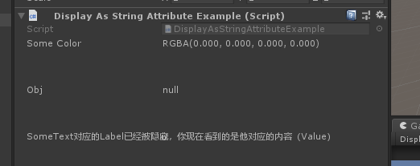
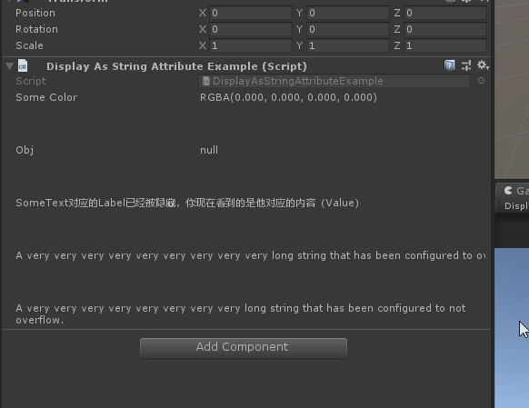

# DisplayAsString

> DisplayAsString特定：*用于任何属性，对应的值在检查器中以文本形式显示字符串。如果属性的值要在检查器中显示字符串，但不允许进行任何编辑，请使用此选项。*

##### 【DisplayAsString】直接以文本的展示value



```cs
    [DisplayAsString]
    public Color SomeColor;

    [PropertySpace(40)]
    [DisplayAsString]
    public GameObject Obj;

    [PropertySpace(40)]
    [HideLabel]
    [DisplayAsString]
    public string SomeText = "SomeText对应的Label已经被隐藏，你现在看到的是他对应的内容（Value）";
```

##### 【Overflow】也可以控制显示是否自动换行



```cs
    [PropertySpace(40)]
    [HideLabel]
    [DisplayAsString]
    public string Overflow = "A very very very very very very very very very long string that has been configured to overflow.";

    [PropertySpace(40)]
    [HideLabel]
    [DisplayAsString(false)]//这是为false时，如果inspector显示空间不足，则自动换行
    public string DisplayAllOfIt = "A very very very very very very very very long string that has been configured to not overflow.";
```

##### 完整示例代码

```cs
using UnityEngine;
using Sirenix.OdinInspector;

public class DisplayAsStringAttributeExample : MonoBehaviour
{ 
    [DisplayAsString]
    public Color SomeColor;

    [PropertySpace(40)]
    [DisplayAsString]
    public GameObject Obj;

    [PropertySpace(40)]
    [HideLabel]
    [DisplayAsString]
    public string SomeText = "SomeText对应的Label已经被隐藏，你现在看到的是他对应的内容（Value）";

    [PropertySpace(40)]
    [HideLabel]
    [DisplayAsString]
    public string Overflow = "A very very very very very very very very very long string that has been configured to overflow.";

    [PropertySpace(40)]
    [HideLabel]
    [DisplayAsString(false)]//这是为false时，如果inspector显示空间不足，则自动换行
    public string DisplayAllOfIt = "A very very very very very very very very long string that has been configured to not overflow.";
}
```