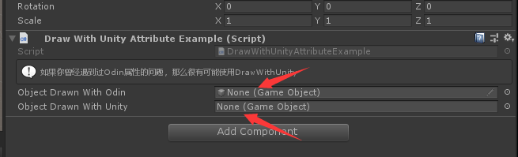

# DrawWithUnity

> *Draw With Unity Attribute特性：可以将DrawWithUnity应用于字段或属性，以使Odin使用Unity的旧绘图系统对其进行绘制。如果*
> *使用一些优先级比DrawWithUnity高的特性，则会按照优先级高的特性进行绘制。*



```cs
using Sirenix.OdinInspector;
using UnityEngine;
public class DrawWithUnityAttributeExample : MonoBehaviour
{

    [InfoBox("如果你曾经遇到过Odin属性的问题，那么很有可能使用DrawWithUnity")]
    public GameObject ObjectDrawnWithOdin;

    [DrawWithUnity]
    public GameObject ObjectDrawnWithUnity;
}
```