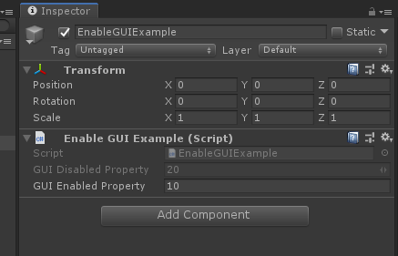

# EnableGUIAttribute

> Enable GUI Attribute特性：可以控制只用Get的属性，在Inspector中是否为灰态的（但是依然不可编辑），不写默认为灰态。



##### 完整示例代码

```cs
using Sirenix.OdinInspector;
using UnityEngine;

public class EnableGUIExample : MonoBehaviour
{
    [ShowInInspector]
    public int GUIDisabledProperty { get { return 20; } }

    [ShowInInspector, EnableGUI]
    public int GUIEnabledProperty { get { return 10; } }
}
```