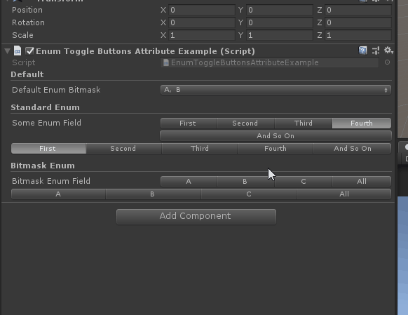

# EnumToggleButtons

> Enum Toggle Buttons:在水平按钮组中绘制枚举而不是下拉列表。
>
> 枚举多选按钮主要是应用了System.Flags



```cs
using Sirenix.OdinInspector;
using UnityEngine;

    public class EnumToggleButtonsAttributeExample : MonoBehaviour
    {
        [Title("Default")]
        public SomeBitmaskEnum DefaultEnumBitmask;

        [Title("Standard Enum")]
        [EnumToggleButtons]
        public SomeEnum SomeEnumField;

        [EnumToggleButtons, HideLabel]
        public SomeEnum WideEnumField;

        [Title("Bitmask Enum")]
        [EnumToggleButtons]
        public SomeBitmaskEnum BitmaskEnumField;

        [EnumToggleButtons, HideLabel]
        public SomeBitmaskEnum EnumFieldWide;

        public enum SomeEnum
        {
            First, Second, Third, Fourth, AndSoOn
        }

        [System.Flags]
        public enum SomeBitmaskEnum
        {
            A = 1 << 1,
            B = 1 << 2,
            C = 1 << 3,
            All = A | B | C
        }

        public void Start()
        {
            Debug.Log(DefaultEnumBitmask);
        }
    }
```