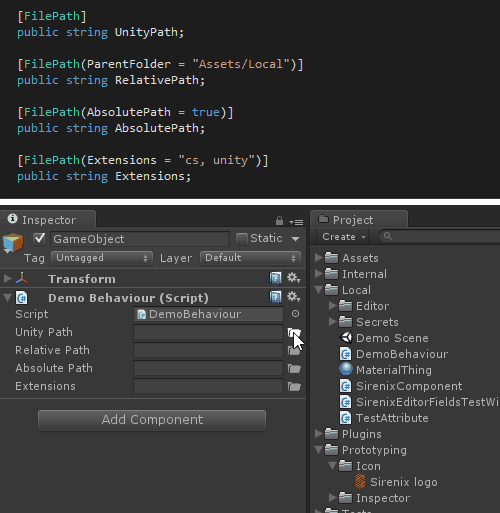
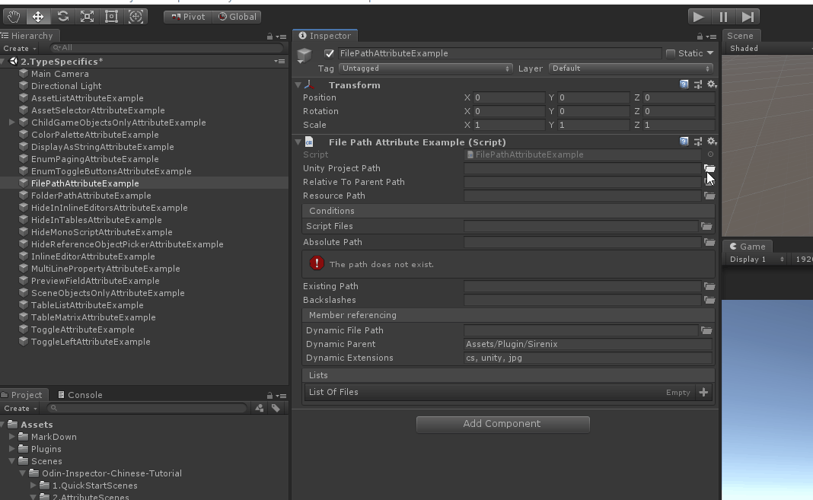
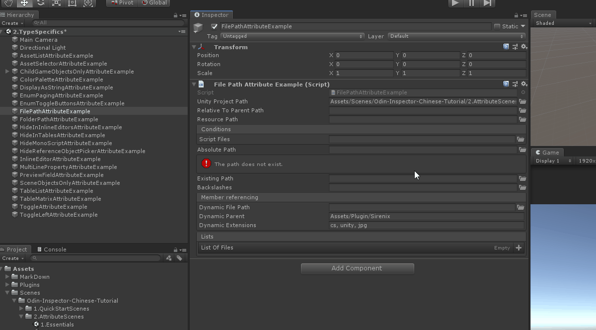
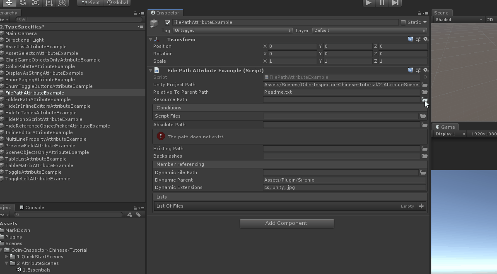
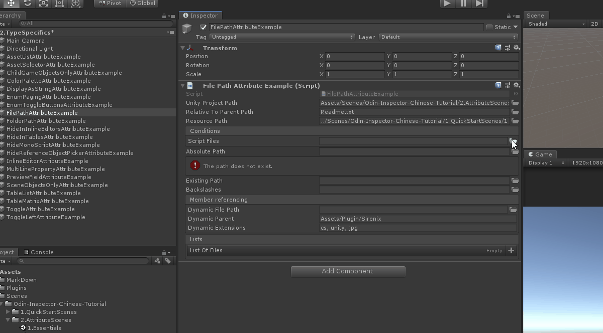
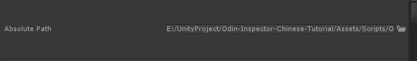
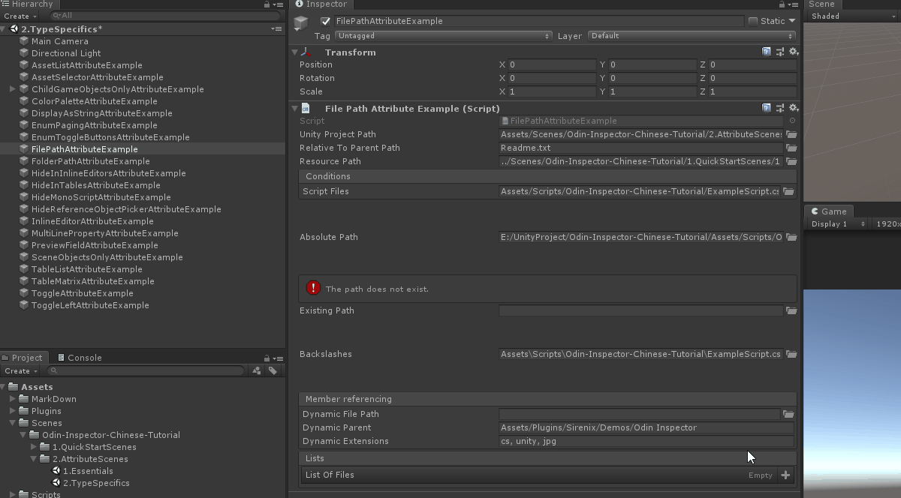
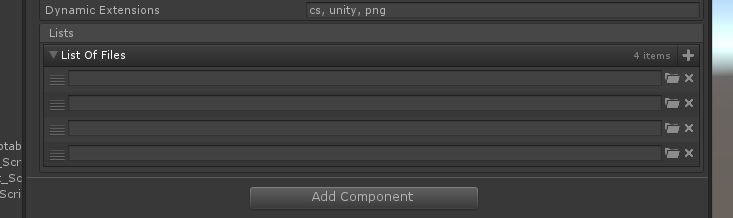

# FilePath

> File Path Attribute特性：用于字符串属性，并在Inspector面板对应的属性值旁绘制一个文件夹按钮，便于快读定位文件，并提供文件路径的接口。



##### 【FilePath】直接使用，默认提供一个相对于Unity的路径



```cs
    // 默认情况下，FolderPath提供了一个相对于Unity项目的路径。
    [FilePath]
    public string UnityProjectPath;
```

##### 【ParentFolder】可以提供自定义父路径。父路径可以是相对于Unity项目的，也可以是绝对的。



```cs
    // 可以提供自定义父路径。父路径可以是相对于Unity项目的，也可以是绝对的。
    [FilePath(ParentFolder = "Assets/Plugins/Sirenix")]
    public string RelativeToParentPath;
```

> 如果找不到最对应的路径，还可以提供一个相对于目标路径的路径



```cs
    // 使用父路径，FilePath还可以提供相对于resources文件夹的路径。
    [FilePath(ParentFolder = "Assets/Resources")]
    public string ResourcePath;
```

##### 【Extensions】根据扩展名来筛选文件



```cs
    // 提供一个逗号分隔的允许扩展列表。点（.）是可选的。
    [FilePath(Extensions = "cs, lua")]
    [BoxGroup("Conditions")]
    public string ScriptFiles;
```

##### 【AbsolutePath】设置是否显示绝对路径



```cs
    // 通过将AbsolutePath设置为true，文件路径将提供一个绝对路径。
    [PropertySpace(40,40)]
    [FilePath(AbsolutePath = true)]
    public string AbsolutePath;
```

##### 【RequireExistingPath】如果提供的路径无效，还可以将FilePath配置为显示错误信息。

```cs
    // 如果提供的路径无效，还可以将FilePath配置为显示错误信息。
    [FilePath(RequireExistingPath = true)]
    public string ExistingPath;
```

##### 【UseBackslashes】默认情况下，FilePath将强制使用前斜杠。还可以将其配置为使用反斜杠


```cs
    // 默认情况下，FilePath将强制使用前斜杠。还可以将其配置为使用反斜杠
    [PropertySpace(40, 40)]
    [FilePath(UseBackslashes = true)]
    public string Backslashes;
```

##### FilePath还支持使用$符号的成员引用。



```cs
    // FilePath还支持使用$符号的成员引用。
    [FilePath(ParentFolder = "$DynamicParent", Extensions = "$DynamicExtensions")]
    [BoxGroup("Member referencing")]
    public string DynamicFilePath;

    [BoxGroup("Member referencing")]
    public string DynamicParent = "Assets/Plugin/Sirenix";

    [BoxGroup("Member referencing")]
    public string DynamicExtensions = "cs, unity, jpg";
```

##### FilePath还支持列表和数组。



```cs
    // FilePath还支持列表和数组。
    [FilePath(ParentFolder = "Assets/Scenes/Odin-Inspector-Chinese-Tutorial/")]
    [BoxGroup("Lists")]
    public string[] ListOfFiles;
```

##### 完整示例代码

```cs
using Sirenix.OdinInspector;
using UnityEngine;

public class FilePathAttributeExample : MonoBehaviour
{
    // 默认情况下，FolderPath提供了一个相对于Unity项目的路径。
    [FilePath]
    public string UnityProjectPath;

    // 可以提供自定义父路径。父路径可以是相对于Unity项目的，也可以是绝对的。
    [FilePath(ParentFolder = "Assets/Plugins/Sirenix")]
    public string RelativeToParentPath;

    // 使用父路径，FilePath还可以提供相对于resources文件夹的路径。
    [FilePath(ParentFolder = "Assets/Resources")]
    public string ResourcePath;

    // 提供一个逗号分隔的允许扩展列表。点（.）是可选的。
    [FilePath(Extensions = "cs, lua")]
    [BoxGroup("Conditions")]
    public string ScriptFiles;

    // 通过将AbsolutePath设置为true，文件路径将提供一个绝对路径。
    [PropertySpace(40,40)]
    [FilePath(AbsolutePath = true)]
    public string AbsolutePath;

    // 如果提供的路径无效，还可以将FilePath配置为显示错误信息。
    [FilePath(RequireExistingPath = true)]
    public string ExistingPath;

    // 默认情况下，FilePath将强制使用前斜杠。还可以将其配置为使用反斜杠
    [PropertySpace(40, 40)]
    [FilePath(UseBackslashes = true)]
    public string Backslashes;

    // FilePath还支持使用$符号的成员引用。
    [FilePath(ParentFolder = "$DynamicParent", Extensions = "$DynamicExtensions")]
    [BoxGroup("Member referencing")]
    public string DynamicFilePath;

    [BoxGroup("Member referencing")]
    public string DynamicParent = "Assets/Plugin/Sirenix";

    [BoxGroup("Member referencing")]
    public string DynamicExtensions = "cs, unity, jpg";

    // FilePath还支持列表和数组。
    [FilePath(ParentFolder = "Assets/Scenes/Odin-Inspector-Chinese-Tutorial/")]
    [BoxGroup("Lists")]
    public string[] ListOfFiles;
}
```