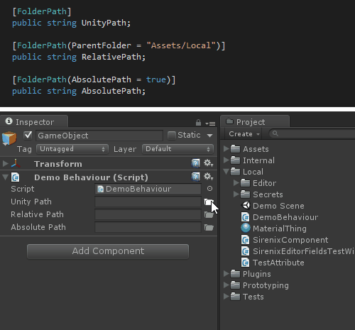
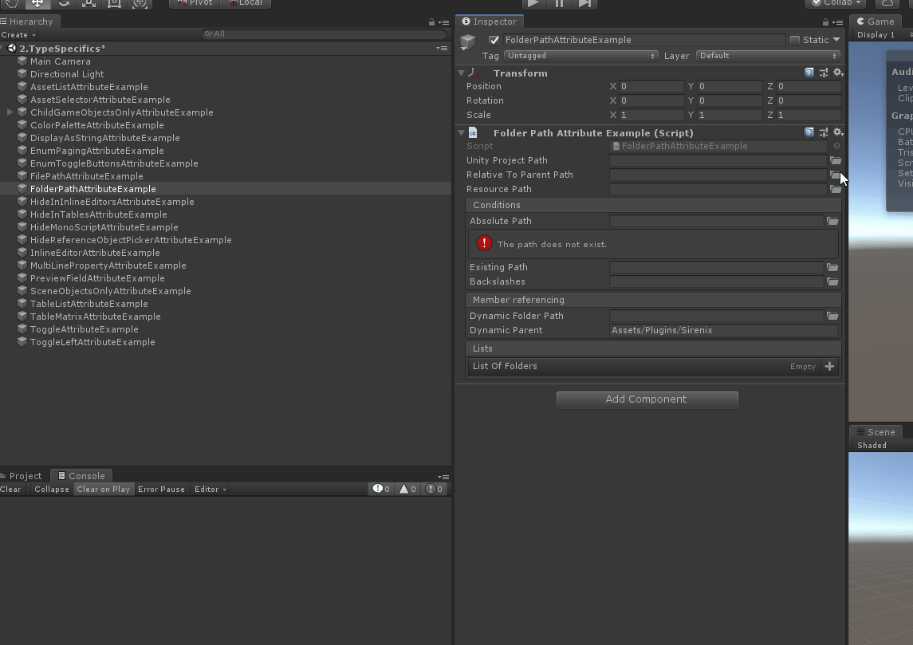
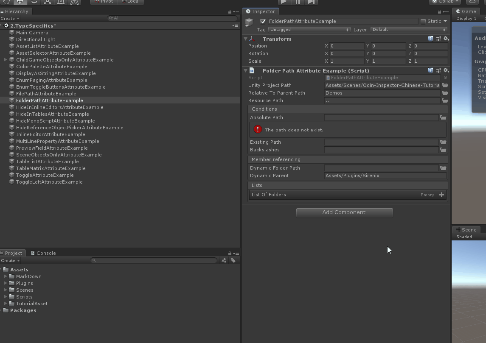
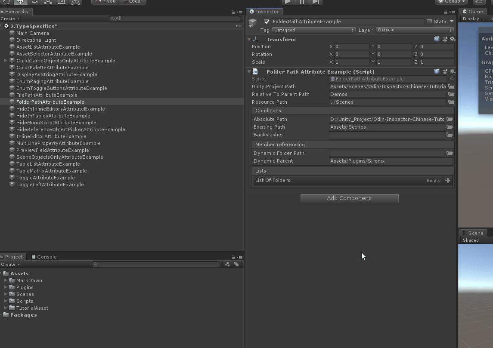

# FolderPath

> *File Path Attribute特性：用于字符串字段，并为目录路径提供接口。*



##### 【FolderPath】 默认情况下，FolderPath提供了一个相对于Unity项目的路径。



```cs
    // 默认情况下，FolderPath提供了一个相对于Unity项目的路径。
    [FolderPath]
    public string UnityProjectPath;
```

##### 【ParentFolder】可以提供自定义父路径。父路径可以是相对于Unity项目的，也可以是绝对的。


```cs
    // 可以提供自定义父路径。父路径可以是相对于Unity项目的，也可以是绝对的。
    [FolderPath(ParentFolder = "Assets/Plugins/Sirenix")]
    public string RelativeToParentPath;
```

##### 【ParentFolder】使用父路径，FolderPath还可以提供相对于resources文件夹的路径。



```cs
    // 使用父路径，FolderPath还可以提供相对于resources文件夹的路径。
    [FolderPath(ParentFolder = "Assets/Resources")]
    public string ResourcePath;
```

##### 【AbsolutePath】通过将AbsolutePath设置为true, FolderPath将提供一个绝对路径。


```cs
    // 通过将AbsolutePath设置为true, FolderPath将提供一个绝对路径。
    [FolderPath(AbsolutePath = true)]
    [BoxGroup("Conditions")]
    public string AbsolutePath;
```

##### 【RequireExistingPath】如果提供的路径无效，还可以将FolderPath配置为显示错误。



```cs
    // 如果提供的路径无效，还可以将FolderPath配置为显示错误。
    [FolderPath(RequireExistingPath = true)]
    [BoxGroup("Conditions")]
    public string ExistingPath;
```

##### 【UseBackslashes】默认情况下，FolderPath将强制使用前斜杠。还可以将其配置为使用反斜杠。


```cs
    // 默认情况下，FolderPath将强制使用前斜杠。还可以将其配置为使用反斜杠。
    [FolderPath(UseBackslashes = true)]
    [BoxGroup("Conditions")]
    public string Backslashes;
```

##### FolderPath还支持使用$符号的成员引用和属性表达式。


```cs
    // FolderPath还支持使用$符号的成员引用和属性表达式。
    [FolderPath(ParentFolder = "$DynamicParent")]
    [BoxGroup("Member referencing")]
    public string DynamicFolderPath;

    [BoxGroup("Member referencing")]
    public string DynamicParent = "Assets/Plugins/Sirenix";
```

##### FolderPath还支持列表和数组。


```cs
    // FolderPath还支持列表和数组。
    [FolderPath(ParentFolder = "Assets/Plugins/Sirenix")]
    [BoxGroup("Lists")]
    public string[] ListOfFolders;
```

##### 完整示例脚本

```cs
using Sirenix.OdinInspector;
using UnityEngine;
public class FolderPathAttributeExample : MonoBehaviour
{
    // 默认情况下，FolderPath提供了一个相对于Unity项目的路径。
    [FolderPath]
    public string UnityProjectPath;

    // 可以提供自定义父路径。父路径可以是相对于Unity项目的，也可以是绝对的。
    [FolderPath(ParentFolder = "Assets/Plugins/Sirenix")]
    public string RelativeToParentPath;

    // 使用父路径，FolderPath还可以提供相对于resources文件夹的路径。
    [FolderPath(ParentFolder = "Assets/Resources")]
    public string ResourcePath;

    // 通过将AbsolutePath设置为true, FolderPath将提供一个绝对路径。
    [FolderPath(AbsolutePath = true)]
    [BoxGroup("Conditions")]
    public string AbsolutePath;

    // 如果提供的路径无效，还可以将FolderPath配置为显示错误。
    [FolderPath(RequireExistingPath = true)]
    [BoxGroup("Conditions")]
    public string ExistingPath;

    // 默认情况下，FolderPath将强制使用前斜杠。还可以将其配置为使用反斜杠。
    [FolderPath(UseBackslashes = true)]
    [BoxGroup("Conditions")]
    public string Backslashes;

    // FolderPath还支持使用$符号的成员引用和属性表达式。
    [FolderPath(ParentFolder = "$DynamicParent")]
    [BoxGroup("Member referencing")]
    public string DynamicFolderPath;

    [BoxGroup("Member referencing")]
    public string DynamicParent = "Assets/Plugins/Sirenix";

    // FolderPath还支持列表和数组。
    [FolderPath(ParentFolder = "Assets/Plugins/Sirenix")]
    [BoxGroup("Lists")]
    public string[] ListOfFolders;
}
```