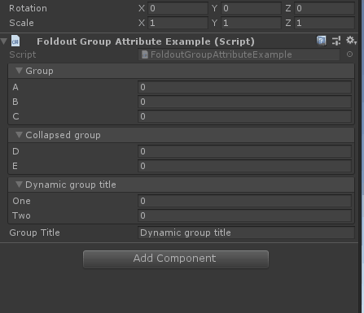

# Foldout Group

> Foldout Group 特性：可用于任何属性，并将属性组织为折叠。使用它来组织属性，并允许用户隐藏当前与他们不相关的属性。
>
> *可使用$特殊标识符获取一个成员的值作为Foldout的名称*



```cs
using Sirenix.OdinInspector;
using UnityEngine;

public class FoldoutGroupAttributeExample : MonoBehaviour
{
    [FoldoutGroup("Group")]
    public int A;

    [FoldoutGroup("Group")]
    public int B;

    [FoldoutGroup("Group")]
    public int C;

    [FoldoutGroup("Collapsed group", expanded: true)]
    public int D;

    [FoldoutGroup("Collapsed group")]
    public int E;

    [FoldoutGroup("$GroupTitle", expanded: true)]
    public int One;

    [FoldoutGroup("$GroupTitle")]
    public int Two;

    public string GroupTitle = "Dynamic group title";
}
```

