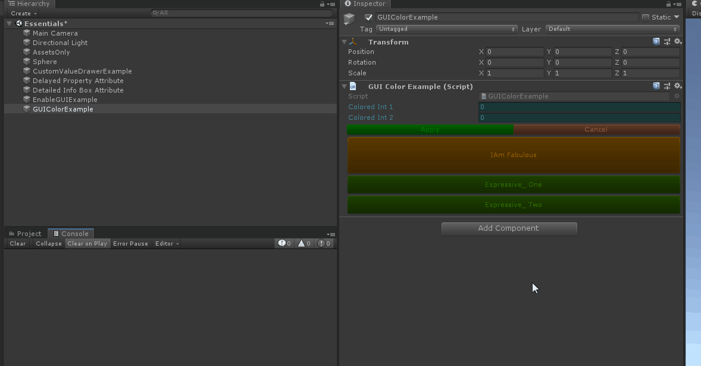
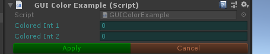
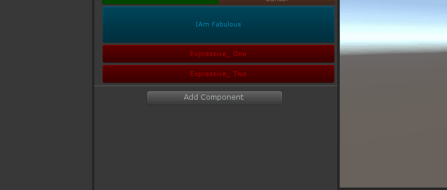

# GUIColorAttribute

> GUIColor Attribute特性：用于任何属性，并更改用于绘制属性的GUI颜色。


 

 ##### 绘制颜色提供两种形式，一种为直接填写RGBA

 

```cs
    [GUIColor(0.3f, 0.8f, 0.8f, 1f)]
    public int ColoredInt1;

    [GUIColor(0.3f, 0.8f, 0.8f, 1f)]
    public int ColoredInt2;

    [ButtonGroup]
    [GUIColor(0, 1, 0)]
    private void Apply()
    {
        Debug.Log("应用");
    }

    [ButtonGroup]
    [GUIColor(1, 0.6f, 0.4f)]
    private void Cancel()
    {
        Debug.Log("取消");
    }
```

##### 另一种是提供一个返回Color的方法，所以这种方式可有实现动态颜色效果，逼格满满



```cs
    [GUIColor("GetButtonColor")]
    [Button(ButtonSizes.Gigantic)]
    private static void IAmFabulous()
    {
    }

    private static Color GetButtonColor()
    {
        Sirenix.Utilities.Editor.GUIHelper.RequestRepaint();
        return Color.HSVToRGB(Mathf.Cos((float)UnityEditor.EditorApplication.timeSinceStartup + 1f) * 0.225f + 0.325f, 1, 1);
    }
```

##### 当然还有另一种写法，使用@关键字将对应的方法体以字符串的形式传入进去，也能达到和方法一样的效果

```cs
    // [GUIColor("@Color.Lerp(Color.red, Color.green, Mathf.Sin((float)EditorApplication.timeSinceStartup))")]
    // [GUIColor("CustomColor")]
    // 这两个写法相等
    [Button(ButtonSizes.Large)]
    [GUIColor("@Color.Lerp(Color.red, Color.green, Mathf.Sin((float)EditorApplication.timeSinceStartup))")]
    private static void Expressive_One()
    {
    }

    [Button(ButtonSizes.Large)]
    [GUIColor("CustomColor")]
    private static void Expressive_Two()
    {
    }

# if UNITY_EDITOR
    public Color CustomColor()
    {
        return Color.Lerp(Color.red, Color.green, Mathf.Sin((float)EditorApplication.timeSinceStartup));
    }
# endif
```

##### 完整示例代码

```cs
using Sirenix.OdinInspector;
using UnityEditor;
using UnityEngine;

public class GUIColorExample : MonoBehaviour
{
    [GUIColor(0.3f, 0.8f, 0.8f, 1f)]
    public int ColoredInt1;

    [GUIColor(0.3f, 0.8f, 0.8f, 1f)]
    public int ColoredInt2;

    [ButtonGroup]
    [GUIColor(0, 1, 0)]
    private void Apply()
    {
        Debug.Log("应用");
    }

    [ButtonGroup]
    [GUIColor(1, 0.6f, 0.4f)]
    private void Cancel()
    {
        Debug.Log("取消");
    }

    [GUIColor("GetButtonColor")]
    [Button(ButtonSizes.Gigantic)]
    private static void IAmFabulous()
    {
    }

    private static Color GetButtonColor()
    {
        Sirenix.Utilities.Editor.GUIHelper.RequestRepaint();
        return Color.HSVToRGB(Mathf.Cos((float)UnityEditor.EditorApplication.timeSinceStartup + 1f) * 0.225f + 0.325f, 1, 1);
    }

    // [GUIColor("@Color.Lerp(Color.red, Color.green, Mathf.Sin((float)EditorApplication.timeSinceStartup))")]
    // [GUIColor("CustomColor")]
    // 这两个写法相等
    [Button(ButtonSizes.Large)]
    [GUIColor("@Color.Lerp(Color.red, Color.green, Mathf.Sin((float)EditorApplication.timeSinceStartup))")]
    private static void Expressive_One()
    {
    }

    [Button(ButtonSizes.Large)]
    [GUIColor("CustomColor")]
    private static void Expressive_Two()
    {
    }

# if UNITY_EDITOR
    public Color CustomColor()
    {
        return Color.Lerp(Color.red, Color.green, Mathf.Sin((float)EditorApplication.timeSinceStartup));
    }
# endif
}
```
