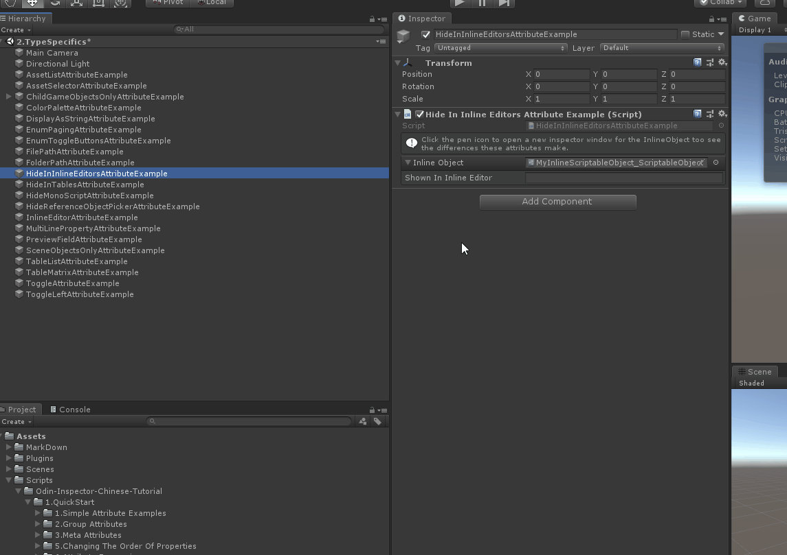

# HideInInlineEditors

> *Hide In Inline Editors Attribute特性用于：在属性对象的Inline编辑模式中隐藏不需要绘制的属性*




```cs
using Sirenix.OdinInspector;
using UnityEngine;

    public class HideInInlineEditorsAttributeExample : MonoBehaviour
    {
    [InfoBox("Click the pen icon to open a new inspector window for the InlineObject too see the differences these attributes make.")]
    [InlineEditor(Expanded = true)]
    public MyInlineScriptableObject InlineObject;

    private void Start()
        {
            InlineObject =  ExampleHelper.GetScriptableObject();
        }
    }

using Sirenix.OdinInspector;
using System.Collections;
using System.Collections.Generic;
using UnityEngine;

[CreateAssetMenu(fileName = "MyInlineScriptableObject_ScriptableObject", menuName = "CreatScriptableObject/MyInlineScriptableObject", order = 100)]
public class MyInlineScriptableObject : ScriptableObject
{
    [ShowInInlineEditors]
    public string ShownInInlineEditor;

    [HideInInlineEditors]//在绘制的里面不显示
    public string HiddenInInlineEditor;
}
```