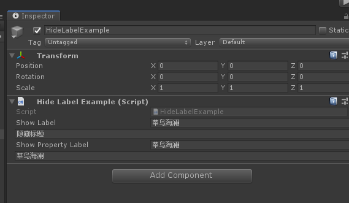

# HideLabelAttribute

> *Hide Label Attribute特性：用于任何属性，并在Inspector中中隐藏标签。使用此选项可隐藏Inspector中的属性标签。*
> *也就是把字段的名称隐藏，只留下value*




##### 完成示例代码

```cs
using Sirenix.OdinInspector;
using UnityEngine;

public class HideLabelExample : MonoBehaviour
{
    public string showLabel = "菜鸟海澜";

    [HideLabel]
    public string hideLabel = "隐藏标题";

    [ShowInInspector]
    public string ShowPropertyLabel { get; set; }

    [HideLabel][ShowInInspector]
    public string HidePropertyLabel { get; set; }
}
```