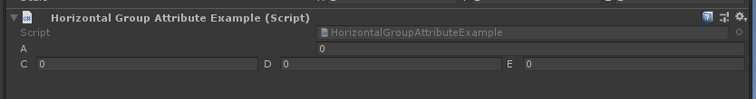
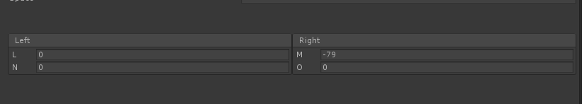

# Horizontal Group

> Horizontal Group:用于在检查器中水平分组多个属性。宽度可以指定为百分比或像素。0到1之间的所有值都将视为百分比。如果宽度为0，则会自动调整列的打下你。左右边距只能以像素为单位指定。

##### 【HorizontalGroup】制作一个水平分组



```cs
    [HorizontalGroup]
    public int A;

    [HorizontalGroup("Group 1", LabelWidth = 20)]
    public int C;

    [HorizontalGroup("Group 1")]
    public int D;

    [HorizontalGroup("Group 1")]
    public int E;
```

##### 也可以在一个横向Group中分类不同的BoxGroup



```cs
    [HorizontalGroup("Split", 0.5f, LabelWidth = 40)]
    [BoxGroup("Split/Left")]
    public int L;
    [BoxGroup("Split/Left")]
    public int N;
    [BoxGroup("Split/Right")]
    public int M;
    [BoxGroup("Split/Right")]
    public int O;
```

##### 划分一个Buttons in Boxes折页，在这个折页中划分一个Buttons in Boxes/Horizontal 组，然后在这个Horizontal Group中划分两个Box


```cs
    [Button(ButtonSizes.Large)]
    [FoldoutGroup("Buttons in Boxes")]
    [HorizontalGroup("Buttons in Boxes/Horizontal")]
    [BoxGroup("Buttons in Boxes/Horizontal/One")]
    public void Button1() { }

    [Button(ButtonSizes.Large)]
    [BoxGroup("Buttons in Boxes/Horizontal/Two")]
    public void Button2() { }

    [Button]
    [HorizontalGroup("Buttons in Boxes/Horizontal", Width = 60)]
    [BoxGroup("Buttons in Boxes/Horizontal/Double")]
    public void Accept() { }

    [Button]
    [BoxGroup("Buttons in Boxes/Horizontal/Double")]
    public void Cancel() { }
```

##### 辅助类设置：MarginLeft、MarginRight（左右边距）、PaddingLeft、PaddingRight（组与组的边距）、MinWidth与MaxWidth间距，设置Title标题


##### 完整示例代码

```cs
using Sirenix.OdinInspector;
using UnityEngine;

public class HorizontalGroupAttributeExample : MonoBehaviour
{
    [HorizontalGroup]
    public int A;

    [HorizontalGroup("Group 1", LabelWidth = 20)]
    public int C;

    [HorizontalGroup("Group 1")]
    public int D;

    [HorizontalGroup("Group 1")]
    public int E;

    [PropertySpace(40, 40)]
    public string space = "";

    [HorizontalGroup("Split", 0.5f, LabelWidth = 40)]
    [BoxGroup("Split/Left")]
    public int L;
    [BoxGroup("Split/Left")]
    public int N;
    [BoxGroup("Split/Right")]
    public int M;
    [BoxGroup("Split/Right")]
    public int O;

    [PropertySpace(40, 40)]
    public string space1 = "";

    [Button(ButtonSizes.Large)]
    [FoldoutGroup("Buttons in Boxes")]
    [HorizontalGroup("Buttons in Boxes/Horizontal")]
    [BoxGroup("Buttons in Boxes/Horizontal/One")]
    public void Button1() { }

    [Button(ButtonSizes.Large)]
    [BoxGroup("Buttons in Boxes/Horizontal/Two")]
    public void Button2() { }

    [Button]
    [HorizontalGroup("Buttons in Boxes/Horizontal", Width = 60)]
    [BoxGroup("Buttons in Boxes/Horizontal/Double")]
    public void Accept() { }

    [Button]
    [BoxGroup("Buttons in Boxes/Horizontal/Double")]
    public void Cancel() { }
}
```