# InlineEditorAttribute

> *InlineAttribute用于任何属性或字段，其类型继承自UnityEngine.Object。这包括组件和资产等。*


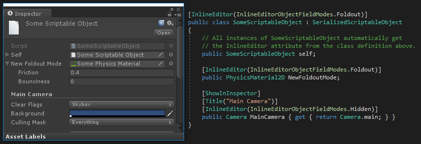

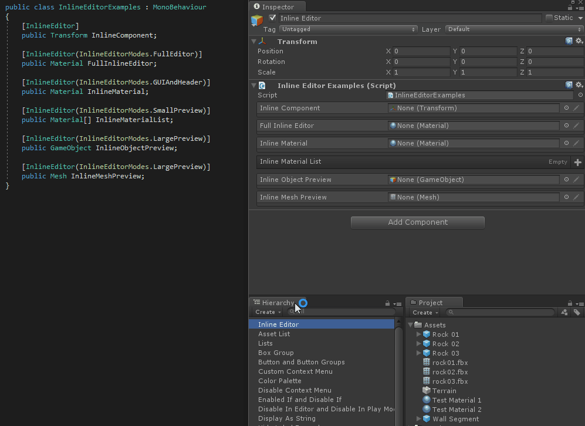

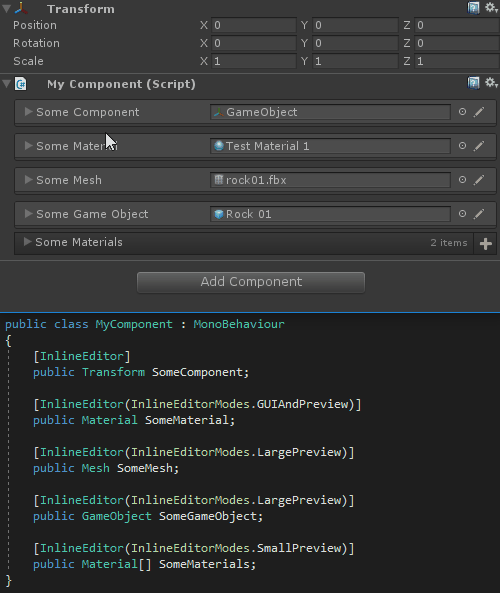

##### 【InlineEditorObjectFieldModes.Boxed】属性以Box形式展示

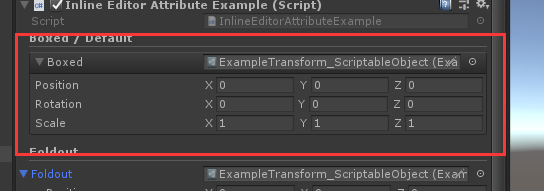

```cs
    [Title("Boxed / Default")]
    [InlineEditor(InlineEditorObjectFieldModes.Boxed)]
    public ExampleTransform Boxed;
```

##### 【InlineEditorObjectFieldModes.Foldout】属性以折页形式展示

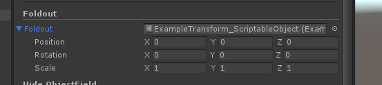

```cs
    [Title("Foldout")]
    [InlineEditor(InlineEditorObjectFieldModes.Foldout)]
    public ExampleTransform Foldout;
```

##### 【InlineEditorObjectFieldModes.CompletelyHidden】隐藏属性名称

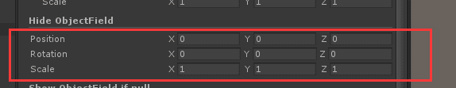

```cs
    [Title("Hide ObjectField")]
    [InlineEditor(InlineEditorObjectFieldModes.CompletelyHidden)]
    public ExampleTransform CompletelyHidden;
```

##### 【InlineEditorObjectFieldModes.Hidden】只有为null的时候才显示字段

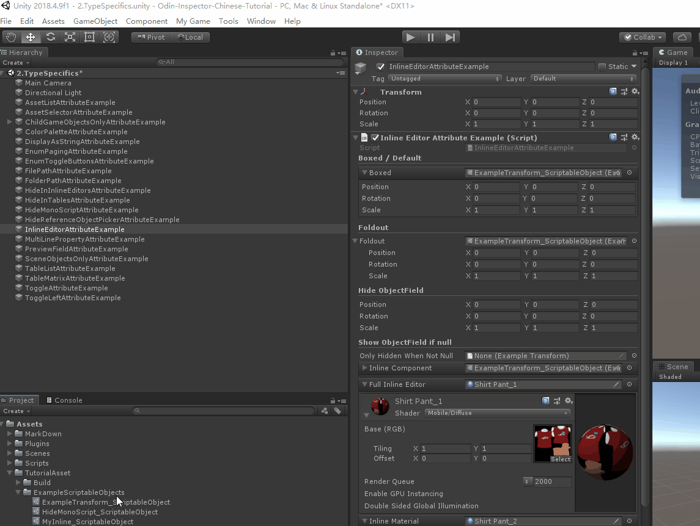

```cs
    [Title("Show ObjectField if null")]
    [ShowInInspector]
    [InlineEditor(InlineEditorObjectFieldModes.Hidden)]
    public ExampleTransform OnlyHiddenWhenNotNull;
```


> **4预览模式**

##### 【InlineEditorModes.FullEditor】

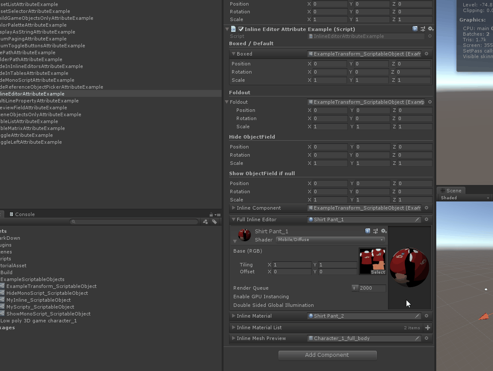

```cs
    [InlineEditor(InlineEditorModes.FullEditor)]
    public Material FullInlineEditor;
```

##### 【InlineEditorModes.GUIAndHeader】

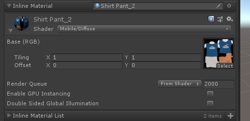

```cs
    [InlineEditor(InlineEditorModes.GUIAndHeader)]
    public Material InlineMaterial ;
```

##### 【InlineEditorModes.SmallPreview】

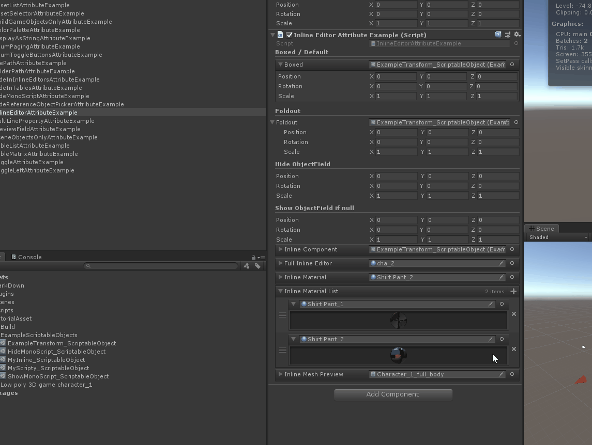

```cs
    [InlineEditor(InlineEditorModes.SmallPreview)]
    public Material[] InlineMaterialList = new Material[]
    {
    };
```

##### 【InlineEditorModes.LargePreview】

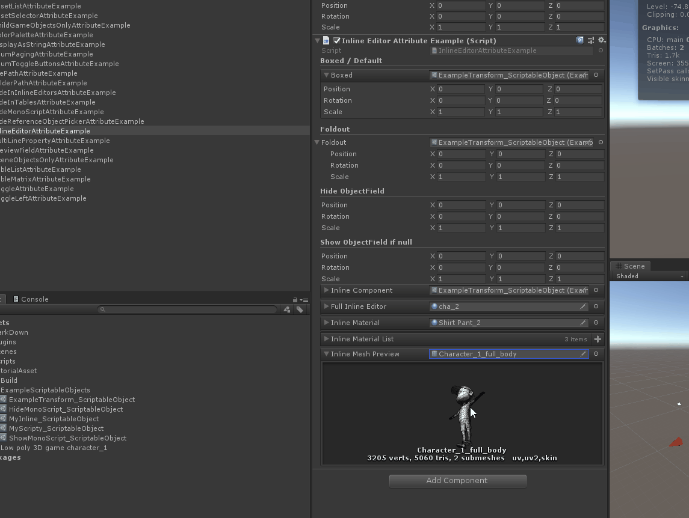

```cs
    [InlineEditor(InlineEditorModes.LargePreview)]
    public Mesh InlineMeshPreview ;
```

##### 完整示例代码

```cs
using Sirenix.OdinInspector;
using UnityEngine;

public class InlineEditorAttributeExample : MonoBehaviour
{
    [Title("Boxed / Default")]
    [InlineEditor(InlineEditorObjectFieldModes.Boxed)]
    public ExampleTransform Boxed;

    [Title("Foldout")]
    [InlineEditor(InlineEditorObjectFieldModes.Foldout)]
    public ExampleTransform Foldout;

    [Title("Hide ObjectField")]
    [InlineEditor(InlineEditorObjectFieldModes.CompletelyHidden)]
    public ExampleTransform CompletelyHidden;

    [Title("Show ObjectField if null")]
    [ShowInInspector]
    [InlineEditor(InlineEditorObjectFieldModes.Hidden)]
    public ExampleTransform OnlyHiddenWhenNotNull;

    [InlineEditor]
    public ExampleTransform InlineComponent ;

    [InlineEditor(InlineEditorModes.FullEditor)]
    public Material FullInlineEditor;

    [InlineEditor(InlineEditorModes.GUIAndHeader)]
    public Material InlineMaterial ;

    [InlineEditor(InlineEditorModes.SmallPreview)]
    public Material[] InlineMaterialList = new Material[]
    {
    };

    [InlineEditor(InlineEditorModes.LargePreview)]
    public Mesh InlineMeshPreview ;

}
```