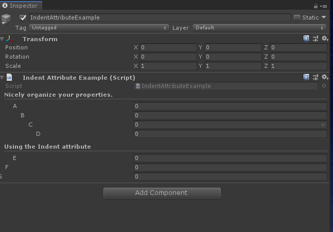

# Ident

> *Indent Attribute特性：用于缩进可用于任何属性，并将属性的标签向右移动。使用它可以清楚地组织检查器中的属性。*




```cs
using Sirenix.OdinInspector;
using System.Collections;
using System.Collections.Generic;
using UnityEngine;

public class IndentAttributeExample : MonoBehaviour
{
    [Title("Nicely organize your properties.")]
    [Indent]
    public int A;

    [Indent(2)]
    public int B;

    [Indent(3)]
    public int C;

    [Indent(4)]
    public int D;

    [Title("Using the Indent attribute")]
    [Indent]
    public int E;

    [Indent(0)]
    public int F;

    [Indent(-1)]
    public int G;
```