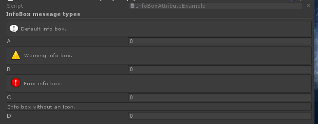
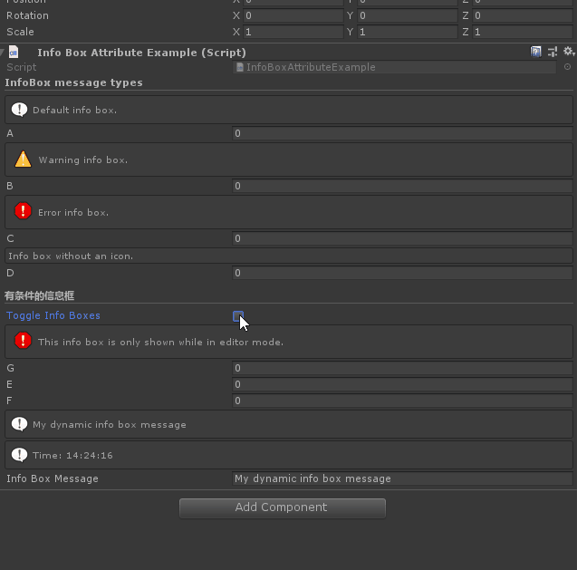
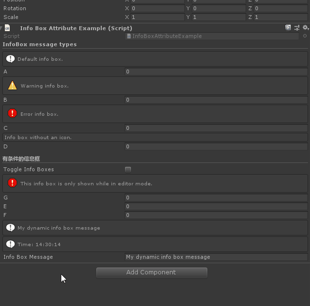

# Info Box

> *Info Box Attribute：可用于任何属性，并在检查器中在属性上方显示一个文本框。使用它来添加注释或警告使用不同的属性。*

##### 【InfoBox】添加不同提示类型的文本框



```cs
    [Title("InfoBox message types")]
    [InfoBox("Default info box.")]
    public int A;

    [InfoBox("Warning info box.", InfoMessageType.Warning)]
    public int B;

    [InfoBox("Error info box.", InfoMessageType.Error)]
    public int C;

    [InfoBox("Info box without an icon.", InfoMessageType.None)]
    public int D;
```

##### 【visibleIfMemberName】根据条件控制文本显示



```cs
    [InfoBox("This info box is only shown while in editor mode.", InfoMessageType.Error, "IsInEditMode")]
    public float G;
    private static bool IsInEditMode()
    {
        return !Application.isPlaying;
    }
```

##### 也可以通过$特殊符号引用相应属性的value作为实参，或者使用@特殊符输入表达式



```cs
    [InfoBox("$InfoBoxMessage")]
    [InfoBox("@\"Time: \" + DateTime.Now.ToString(\"HH:mm:ss\")")]
    public string InfoBoxMessage = "My dynamic info box message";
```

#### 示例完整代码

```cs
using Sirenix.OdinInspector;
using System.Collections;
using System.Collections.Generic;
using UnityEngine;

public class InfoBoxAttributeExample : MonoBehaviour
{
    [Title("InfoBox message types")]
    [InfoBox("Default info box.")]
    public int A;

    [InfoBox("Warning info box.", InfoMessageType.Warning)]
    public int B;

    [InfoBox("Error info box.", InfoMessageType.Error)]
    public int C;

    [InfoBox("Info box without an icon.", InfoMessageType.None)]
    public int D;

    [Title("有条件的信息框")]
    public  bool ToggleInfoBoxes;

    [InfoBox("This info box is only shown while in editor mode.", InfoMessageType.Error, "IsInEditMode")]
    public float G;
    private static bool IsInEditMode()
    {
        return !Application.isPlaying;
    }

    [InfoBox("此信息框可由静态字段隐藏.", "ToggleInfoBoxes")]
    public float E;

    [InfoBox("此信息框可由静态字段隐藏.", "ToggleInfoBoxes")]
    public float F;

    [InfoBox("$InfoBoxMessage")]
    [InfoBox("@\"Time: \" + DateTime.Now.ToString(\"HH:mm:ss\")")]
    public string InfoBoxMessage = "My dynamic info box message";
}
```