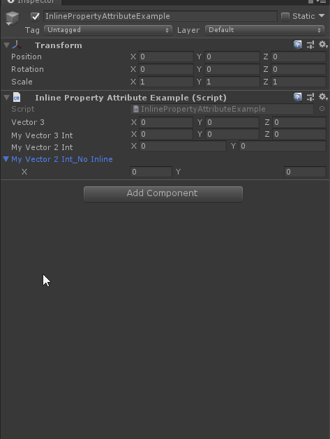

# Inline Property

> *Inline Property Attribute：用于将类型的内容放置在标签旁边，而不是呈现在折叠中。*




```cs
using Sirenix.OdinInspector;
using System;
using UnityEngine;

public class InlinePropertyAttributeExample : MonoBehaviour
{
    public Vector3 Vector3;

    public Vector3Int MyVector3Int;

    [InlineProperty(LabelWidth = 13)]
    public Vector2Int MyVector2Int;
    public Vector2Int MyVector2Int_NoInline;
    [Serializable]
    [InlineProperty(LabelWidth = 13)]
    public struct Vector3Int
    {
        [HorizontalGroup]
        public int X;

        [HorizontalGroup]
        public int Y;

        [HorizontalGroup]
        public int Z;
    }

    [Serializable]
    public struct Vector2Int
    {
        [HorizontalGroup]
        public int X;

        [HorizontalGroup]
        public int Y;
    }
}
```