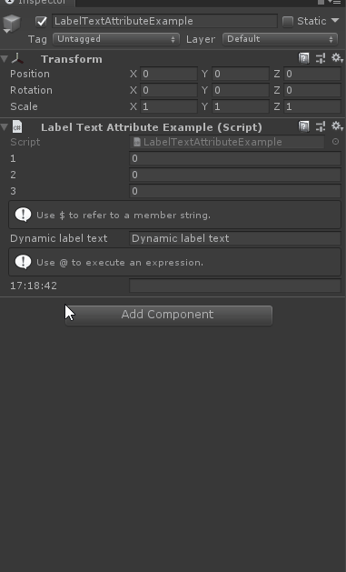

# Label Text

> *Label Text Attribute：用于更改属性的标签。如果您想要的标签与属性名称不同，请使用此标签。*



##### 同样可以通过$特殊符指定某个属性的值作为实参，也已经通过@直接书写表达式

```cs
using Sirenix.OdinInspector;
using System.Collections;
using System.Collections.Generic;
using UnityEngine;

public class LabelTextAttributeExample : MonoBehaviour
{
    [LabelText("1")]
    public int MyInt1;

    [LabelText("2")]
    public int MyInt2;

    [LabelText("3")]
    public int MyInt3;

    [InfoBox("Use $ to refer to a member string.")]
    [LabelText("$LabelText")]
    public string LabelText = "Dynamic label text";

    [InfoBox("Use @ to execute an expression.")]
    [LabelText("@DateTime.Now.ToString(\"HH:mm:ss\")")]
    public string DateTimeLabel;
}
```