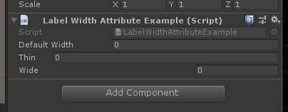

# Label Width

> *用于更改属性标签的宽度。*



```cs
using Sirenix.OdinInspector;
using System.Collections;
using System.Collections.Generic;
using UnityEngine;

public class LabelWidthAttributeExample : MonoBehaviour
{
    public int DefaultWidth;

    [LabelWidth(50)]
    public int Thin;

    [LabelWidth(250)]
    public int Wide;
}
```