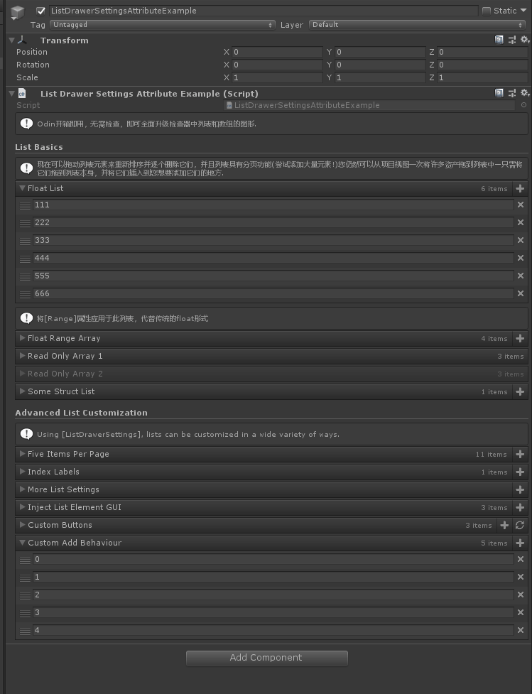
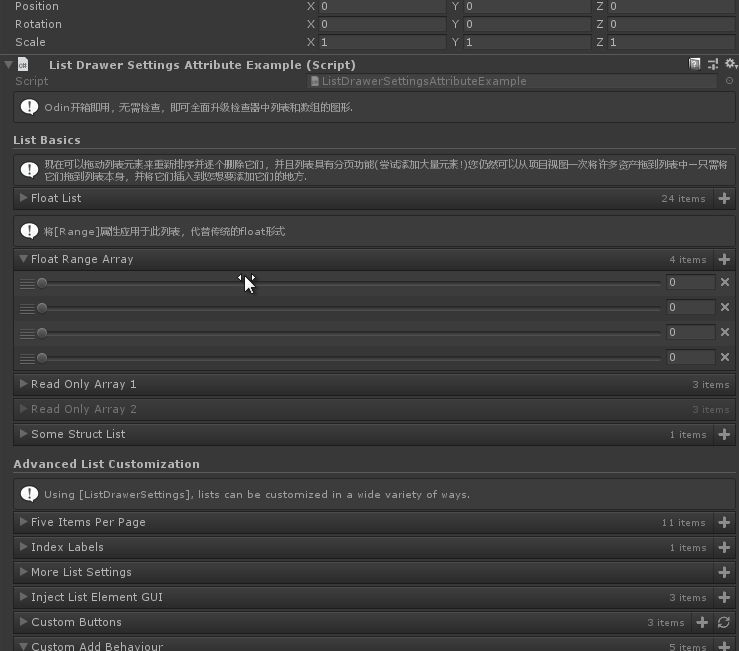
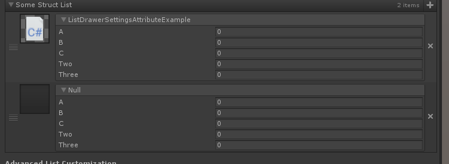
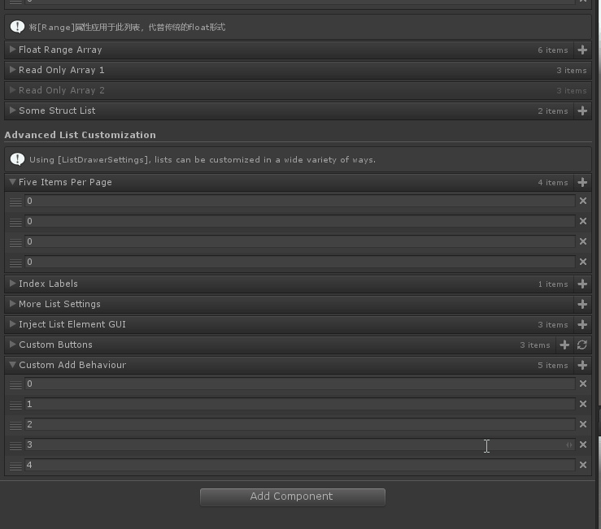
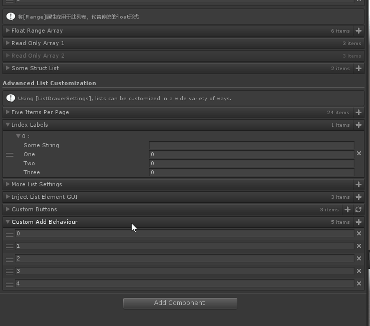
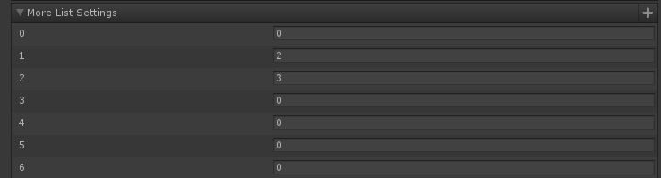
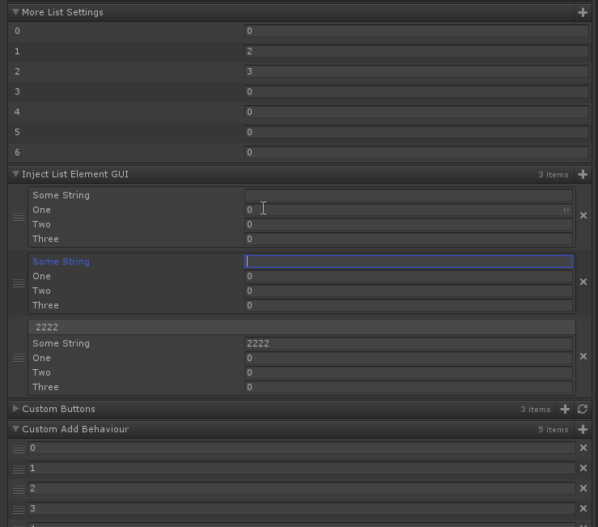
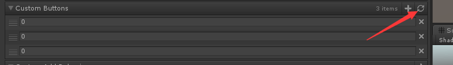
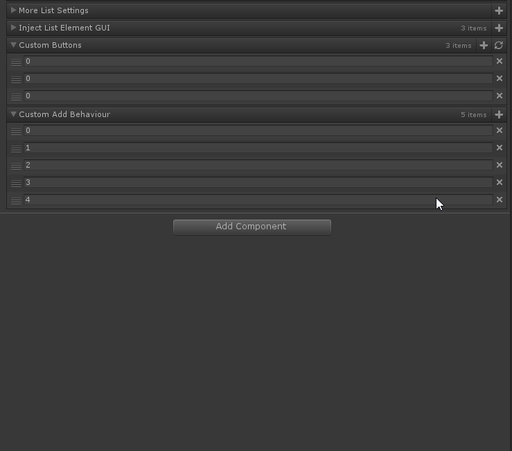

# List Drawer Settings

> *ist Drawer Settings Attribute 自定义数组或者列表绘制方式*

##### Odin已经重写对应的数组和列表的绘制



```cs
    [Title("List Basics")]
    [InfoBox("现在可以拖动列表元素来重新排序并逐个删除它们，并且列表具有分页功能(尝试添加大量元素!)您仍然可以从项目视图一次将许多资产拖到列表中—只需将它们拖到列表本身，并将它们插入到您想要添加它们的地方.")]
    public List<float> FloatList;
```

##### 将[Range]属性应用于此列表，代替传统的float形式



```cs
    [InfoBox("将[Range]属性应用于此列表，代替传统的float形式")]
    [Range(0, 1)]
    public float[] FloatRangeArray;
```

##### 不同方式的只读方式


```cs
    [ListDrawerSettings(IsReadOnly = true)]
    public int[] ReadOnlyArray1 = new int[] { 1, 2, 3 };
    [ReadOnly]
    public int[] ReadOnlyArray2 = new int[] { 1, 2, 3 };
```

##### 负责数据结构的数组或列表



```cs
    public SomeOtherStruct[] SomeStructList;
```

###### 自定义page每页的个数



```cs
    [Title("Advanced List Customization")]
    [InfoBox("Using [ListDrawerSettings], lists can be customized in a wide variety of ways.")]
    [ListDrawerSettings(NumberOfItemsPerPage = 5)]
    public int[] FiveItemsPerPage;
```

##### 显示对应元素的索引和指定其元素的标签



```cs
    [ListDrawerSettings(ShowIndexLabels = true, ListElementLabelName = "SomeString")]
    public SomeStruct[] IndexLabels;
```

##### 禁止拖拽item，禁止翻页，禁止显示item个数



```cs
    [ListDrawerSettings(DraggableItems = false, Expanded = false, ShowIndexLabels = true, ShowPaging = false, ShowItemCount = false, HideRemoveButton = true)]
    public int[] MoreListSettings = new int[] { 1, 2, 3 };
```

##### 【OnBeginListElementGUI】【OnEndListElementGUI】在每个列表元素的前后调用一个函数，并传入对应元素的索引



```cs
    [ListDrawerSettings(OnBeginListElementGUI = "BeginDrawListElement", OnEndListElementGUI = "EndDrawListElement")]
    public SomeStruct[] InjectListElementGUI;
    private void BeginDrawListElement(int index)
    {
        SirenixEditorGUI.BeginBox(this.InjectListElementGUI[index].SomeString);
    }
    private void EndDrawListElement(int index)
    {
        SirenixEditorGUI.EndBox();
    }
```

##### 使用它将自定义GUI注入到列表的标题栏中。



```cs
    [ListDrawerSettings(OnTitleBarGUI = "DrawRefreshButton")]
    public List<int> CustomButtons;
    private void DrawRefreshButton()
    {
        if (SirenixEditorGUI.ToolbarButton(EditorIcons.Refresh))
        {
            Debug.Log(this.CustomButtons.Count.ToString());
        }
    }
```

##### 【CustomAddFunction 】覆盖将对象添加到列表的默认行为。如果引用的成员返回列表类型元素，则将对每个选定对象调用该元素一次。如果引用的方法返回void，那么不管选择了多少对象，它都只会被调用一次。



```cs
    [ListDrawerSettings(CustomAddFunction = "CustomAddFunction")]
    public List<int> CustomAddBehaviour;
    private int CustomAddFunction()
    {
        return this.CustomAddBehaviour.Count+100;
    }
```

##### 完整示例代码

```cs
using Sirenix.OdinInspector;
using Sirenix.Utilities.Editor;
using System;
using System.Collections;
using System.Collections.Generic;
using UnityEngine;

public class ListDrawerSettingsAttributeExample : MonoBehaviour
{
    [PropertyOrder(int.MinValue), OnInspectorGUI]
    private void DrawIntroInfoBox()
    {
        SirenixEditorGUI.InfoMessageBox("Odin开箱即用，无需检查，即可全面升级检查器中列表和数组的图形.");
    }

    [Title("List Basics")]
    [InfoBox("现在可以拖动列表元素来重新排序并逐个删除它们，并且列表具有分页功能(尝试添加大量元素!)您仍然可以从项目视图一次将许多资产拖到列表中—只需将它们拖到列表本身，并将它们插入到您想要添加它们的地方.")]
    public List<float> FloatList;

    [InfoBox("将[Range]属性应用于此列表，代替传统的float形式")]
    [Range(0, 1)]
    public float[] FloatRangeArray;

    [ListDrawerSettings(IsReadOnly = true)]
    public int[] ReadOnlyArray1 = new int[] { 1, 2, 3 };
    [ReadOnly]
    public int[] ReadOnlyArray2 = new int[] { 1, 2, 3 };

    public SomeOtherStruct[] SomeStructList;

    [Title("Advanced List Customization")]
    [InfoBox("Using [ListDrawerSettings], lists can be customized in a wide variety of ways.")]
    [ListDrawerSettings(NumberOfItemsPerPage = 5)]
    public int[] FiveItemsPerPage;

    [ListDrawerSettings(ShowIndexLabels = true, ListElementLabelName = "SomeString")]
    public SomeStruct[] IndexLabels;

    [ListDrawerSettings(DraggableItems = false, Expanded = false, ShowIndexLabels = true, ShowPaging = false, ShowItemCount = false, HideRemoveButton = true)]
    public int[] MoreListSettings = new int[] { 1, 2, 3 };

    [ListDrawerSettings(OnBeginListElementGUI = "BeginDrawListElement", OnEndListElementGUI = "EndDrawListElement")]
    public SomeStruct[] InjectListElementGUI;
    private void BeginDrawListElement(int index)
    {
        SirenixEditorGUI.BeginBox(this.InjectListElementGUI[index].SomeString);
    }
    private void EndDrawListElement(int index)
    {
        SirenixEditorGUI.EndBox();
    }

    [ListDrawerSettings(OnTitleBarGUI = "DrawRefreshButton")]
    public List<int> CustomButtons;
    private void DrawRefreshButton()
    {
        if (SirenixEditorGUI.ToolbarButton(EditorIcons.Refresh))
        {
            Debug.Log(this.CustomButtons.Count.ToString());
        }
    }

    [ListDrawerSettings(CustomAddFunction = "CustomAddFunction")]
    public List<int> CustomAddBehaviour;
    private int CustomAddFunction()
    {
        return this.CustomAddBehaviour.Count+100;
    }

    [Serializable]
    public struct SomeStruct
    {
        public string SomeString;
        public int One;
        public int Two;
        public int Three;
    }

    [Serializable]
    public struct SomeOtherStruct
    {
        [HorizontalGroup("Split", 55), PropertyOrder(-1)]
        [PreviewField(50, Sirenix.OdinInspector.ObjectFieldAlignment.Left), HideLabel]
        public UnityEngine.MonoBehaviour SomeObject;

        [FoldoutGroup("Split/$Name", false)]
        public int A, B, C;

        [FoldoutGroup("Split/$Name", false)]
        public int Two;

        [FoldoutGroup("Split/$Name", false)]
        public int Three;

        private string Name { get { return this.SomeObject ? this.SomeObject.name : "Null"; } }
    }
}
```