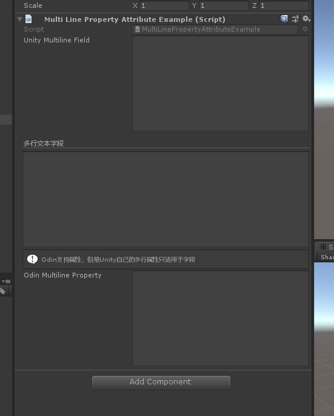

# MultiLineProperty

> *Multi Line Property Attribute特性：用于任何字符串属性。使用此选项允许用户在多行文本框中编辑字符串。*



```cs
using Sirenix.OdinInspector;
using UnityEngine;

public class MultiLinePropertyAttributeExample : MonoBehaviour
    {
        [Multiline(10)]
        public string UnityMultilineField = "";

        [Title("多行文本字段", bold: false)]
        [HideLabel]
        [MultiLineProperty(10)]
        public string WideMultilineTextField = "";

        [InfoBox("Odin支持属性，但是Unity自己的多行属性只适用于字段")]
        [ShowInInspector]
        [MultiLineProperty(10)]
        public string OdinMultilineProperty { get; set; }
    }
```