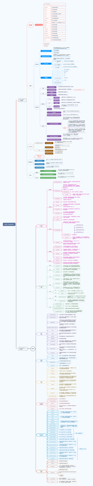

# Odin Start

Odin的常见问题总结：

### 1. Odin多达约90种不同的特性，有可以快速预览每种特性的效果吗？

*可以选择***Tools/Odin Inspector/Attribute Overview***进行快速预览，如果需要更详细的说明，可以查看主页***[革命性Unity 编辑器扩展工具 — Odin Inspector 系列教程](https://www.jianshu.com/p/f1b27e85bc35)***，配合示例工程服用效果更佳*

### 2. 可以禁用指定的Odin绘制特性吗？

*Odin是不可以禁用全局的指定绘制特性的，但是可以让指定的类型不参与Odin绘制。打开***Tools/Odin Inspector/Preferences***，在Editor Types中禁用不需要绘制的类型*

### 3. 有可以参考的示例吗？

*打开***Tools/Odin Inspector/Getting Started***，你会找到丰富的示例为你答疑解惑*

### 4.一些全局的警告提示，我选择隐藏后如何开启？

*打开***Tools/Odin Inspector/Preferences***，在Serialization中取消已经隐藏的全局警告信息即可，可以还可以copy对应的冗长警告进行翻译~~~*

### 5.如果我仅仅在Editor 模式下使用Odin,可以在出包时剥离Odin吗？

*可以最大化的剥离Odin，残留的可以忽略不计。打开***Tools/Odin Inspector/Preferences** *，启用Editor Only Mode 即可*

## MindMap

