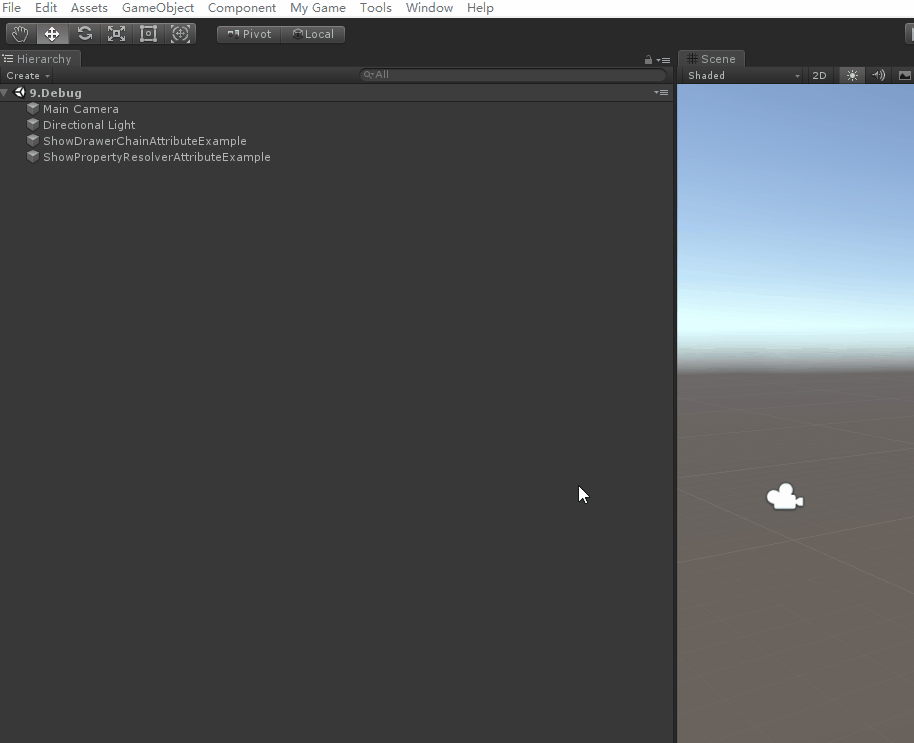
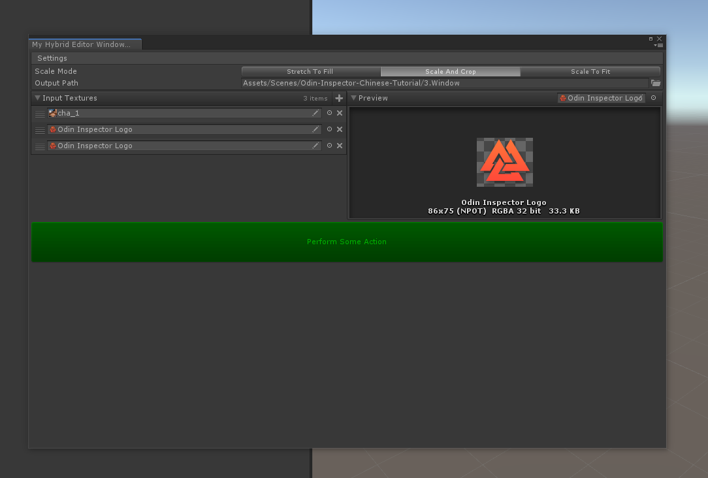
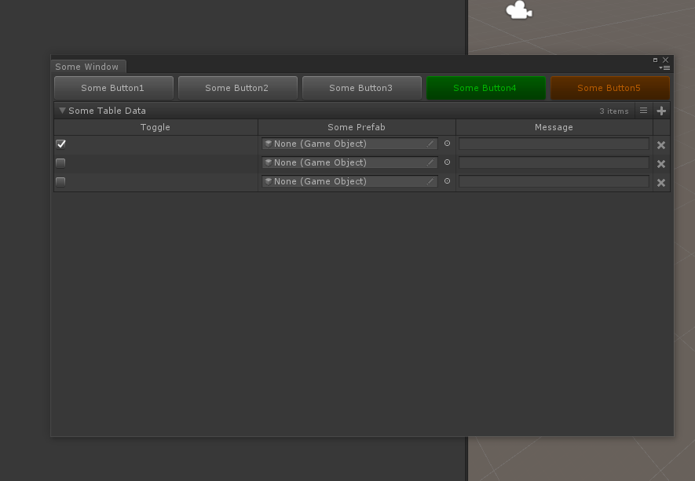
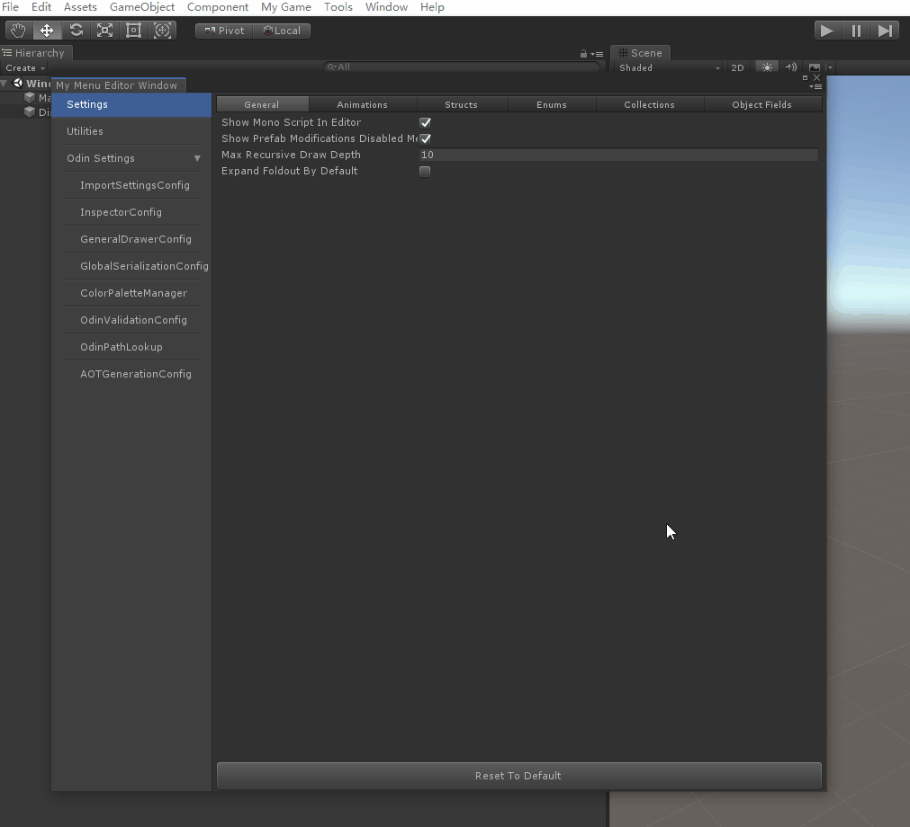
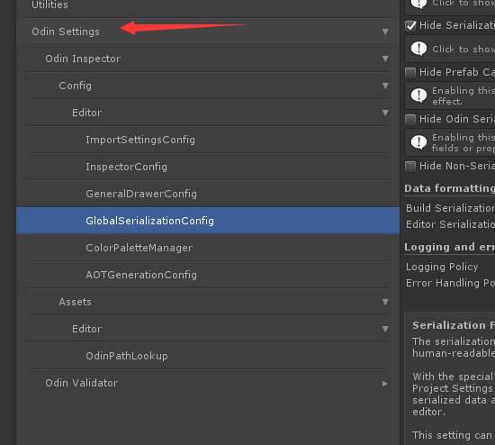
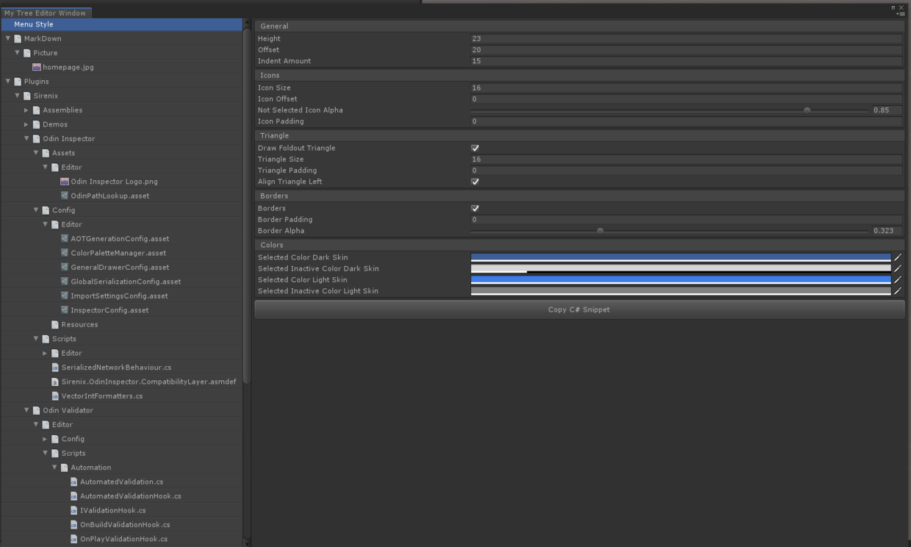
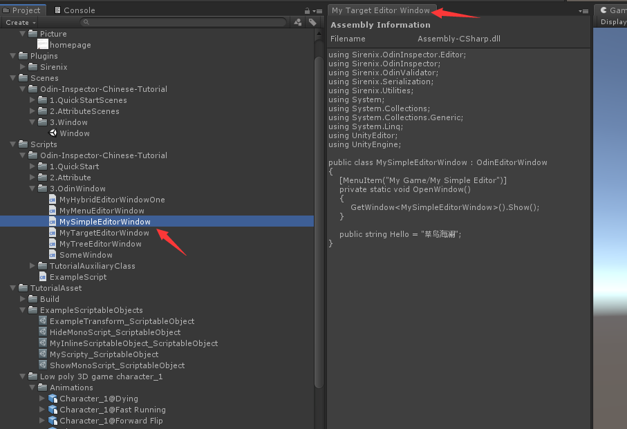

# Odin window
[toc]

## 创建一个window


```c#
public class MySimpleEditorWindow : OdinEditorWindow
{
    [MenuItem("My Game/My Simple Editor")]
    private static void OpenWindow()
    {
        GetWindow<MySimpleEditorWindow>().Show();
    }

    public string Hello = "菜鸟海澜";
}
```

## 混合Window

> 完成第一步后，我们可以根据笔者[Odin主页中的特性](https://www.jianshu.com/p/f1b27e85bc35)来填充这个Window了



```cs
public class MyHybridEditorWindowOne : OdinEditorWindow
{
    [MenuItem("My Game/My Hybrid Editor")]
    private static void OpenWindow()
    {
        GetWindow<MyHybridEditorWindowOne>().Show();
    }

    [EnumToggleButtons, BoxGroup("Settings")]
    public ScaleMode ScaleMode;

    [FolderPath(RequireExistingPath = true), BoxGroup("Settings")]
    public string OutputPath;

    [HorizontalGroup(0.5f)]//占比0.5
    public List<Texture> InputTextures;

    [HorizontalGroup, InlineEditor(InlineEditorModes.LargePreview)]
    public Texture Preview;

    [Button(ButtonSizes.Gigantic), GUIColor(0, 1, 0)]
    public void PerformSomeAction()
    {

    }
}
```



```cs
using Sirenix.OdinInspector;
using Sirenix.OdinInspector.Editor;
using System.Collections;
using System.Collections.Generic;
using UnityEditor;
using UnityEngine;

/*
 * 通过从OdinEditorWindow而不是EditorWindow继承，您可以使Unity编辑器窗口的方式与创建检查器的方式完全相同：仅使用属性。

提示：您可以使用 OnInspectorGUI 属性，如果您希望将自定义编辑器IMGUI代码与Odin绘制的编辑器混合使用
 */
public class SomeWindow : OdinEditorWindow
{
    [MenuItem("My Game/My Window")]
    private static void OpenWindow()
    {
        GetWindow<SomeWindow>().Show();
    }

    [PropertyOrder(-10)]
    [HorizontalGroup]
    [Button(ButtonSizes.Large)]
    public void SomeButton1() { }

    [HorizontalGroup]
    [Button(ButtonSizes.Large)]
    public void SomeButton2() { }

    [HorizontalGroup]
    [Button(ButtonSizes.Large)]
    public void SomeButton3() { }

    [HorizontalGroup]
    [Button(ButtonSizes.Large), GUIColor(0, 1, 0)]
    public void SomeButton4() { }

    [HorizontalGroup]
    [Button(ButtonSizes.Large), GUIColor(1, 0.5f, 0)]
    public void SomeButton5() { }

    [TableList]
    public List<SomeType> SomeTableData;
}

public class SomeType
{
    [TableColumnWidth(50)]
    public bool Toggle;

    [AssetsOnly]
    public GameObject SomePrefab;

    public string Message;

    [TableColumnWidth(160)]
    [HorizontalGroup("Actions")]
    public void Test1() { }

    [HorizontalGroup("Actions")]
    public void Test2() { }
}
```

## 使用OdinMenuEditorWindow保持井井有条



> 这个就厉害了，一个Window集成数个功能，让每个功能以菜单的形式进行选择并显示。
> 这里需要注意的是，这次并不是继承OdinEditorWindow，而是**`继承OdinMenuEditorWindow`**，并使用OdinMenuTree中的`Add`和`AddAllAssetsAtPath`函数添加菜单
>
> - **Add：** 设置菜单名称并传入对应需要渲染的类
> - **AddAllAssetsAtPath：**设置菜单名称，传入路径，示例中的第一个bool是指是否包含子路径，第二bool表示是否子路径的所有可用类都在一个层级中渲染。选择false就是下面这种形式
>   

```cs
using Sirenix.OdinInspector;
using Sirenix.OdinInspector.Editor;
using System.Collections;
using System.Collections.Generic;
using System.Linq;
using UnityEditor;
using UnityEngine;

public class MyMenuEditorWindow : OdinMenuEditorWindow
{
    [MenuItem("My Game/My Menu Editor")]
    private static void OpenWindow()
    {
        GetWindow<MyMenuEditorWindow>().Show();
    }

    protected override OdinMenuTree BuildMenuTree()
    {
        var tree = new OdinMenuTree();
        tree.Selection.SupportsMultiSelect = false;

        tree.Add("Settings", GeneralDrawerConfig.Instance);
        tree.Add("Utilities", new TextureUtilityEditor());
        tree.AddAllAssetsAtPath("Odin Settings", "Assets/Plugins/Sirenix", typeof(ScriptableObject), true, true);
        return tree;
    }
}

public class TextureUtilityEditor
{
    [BoxGroup("Tool"), HideLabel, EnumToggleButtons]
    public Tool Tool;

    public List<Texture> Textures;

    [Button(ButtonSizes.Large), HideIf("Tool", Tool.Rotate)]
    public void SomeAction() { }

    [Button(ButtonSizes.Large), ShowIf("Tool", Tool.Rotate)]
    public void SomeOtherAction() { }
}
```

## 功能强大且可自定义的OdinMenuTrees



```cs
public class MyTreeEditorWindow : OdinMenuEditorWindow
{
    [MenuItem("My Game/My Tree Editor")]
    private static void OpenWindow()
    {
        GetWindow<MyTreeEditorWindow>().Show();
    }

    protected override OdinMenuTree BuildMenuTree()
    {
        var tree = new OdinMenuTree();
        tree.DefaultMenuStyle = OdinMenuStyle.TreeViewStyle;

        tree.Add("Menu Style", tree.DefaultMenuStyle);

        var allAssets = AssetDatabase.GetAllAssetPaths()
            .Where(x => x.StartsWith("Assets/"))
            .OrderBy(x => x);

        foreach (var path in allAssets)
        {
            tree.AddAssetAtPath(path.Substring("Assets/".Length), path);
        }

        tree.EnumerateTree().AddThumbnailIcons();

        return tree;
    }
}
```

## 在编辑器窗口中渲染实例对象

> 您可以覆盖GetTarget方法，并给它任何类型的实例来呈现。



```cs
public class MyTargetEditorWindow : OdinEditorWindow
{
    [MenuItem("My Game/My Target Editor")]
    private static void OpenWindow()
    {
        GetWindow<MyTargetEditorWindow>().Show();
    }

    protected override void Initialize()
    {
        this.WindowPadding = Vector4.zero;
    }

    protected override object GetTarget()
    {
        return Selection.activeObject;
    }
}
```

# 