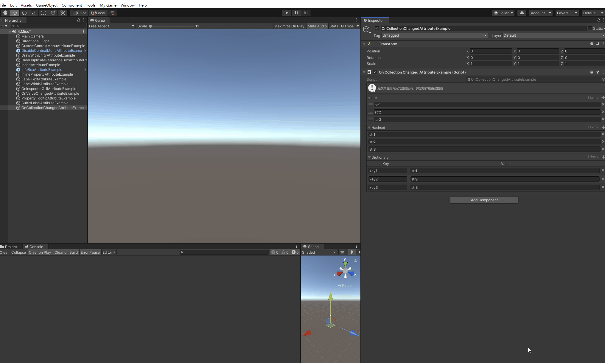

# On Collecting Changed

> OnCollectionChanged可以放在集合上，通过inspector更改集合提供事件回调。此外，它提供了CollectionChangeInfo结构，其中包含有关对集合所做的详细更改的信息。但更改其对应Value的内部值是不会进行对应回调的。



```cs
using Sirenix.OdinInspector;
using Sirenix.OdinInspector.Editor;
using System.Collections.Generic;
using UnityEngine;

public class OnCollectionChangedAttributeExample : MonoBehaviour
{
    // Start is called before the first frame update
    void Start()
    {

    }

    [InfoBox("更改集合则调用对应的回调，并获取详细更改描述.")]
    [OnCollectionChanged("Before", "After")]
    public List list = new List() { "str1", "str2", "str3" };

    [ShowInInspector]
    [OnCollectionChanged("Before", "After")]
    public HashSet hashset = new HashSet() { "str1", "str2", "str3" };

    [ShowInInspector]
    [OnCollectionChanged("Before", "After")]
    public Dictionary dictionary = new Dictionary() { { "key1", "str1" }, { "key2", "str2" }, { "key3", "str3" } };

    public void Before(CollectionChangeInfo info, object value)
    {
        Debug.Log("接收回调之前改变的信息:：\r\n" + info + ", 对应的集合实例:：\r\n " + value);
    }

    public void After(CollectionChangeInfo info, object value)
    {
        Debug.Log("接收回调后变化的信息：\r\n " + info + "对应的集合实例： \r\n " + value);
    }
}
```