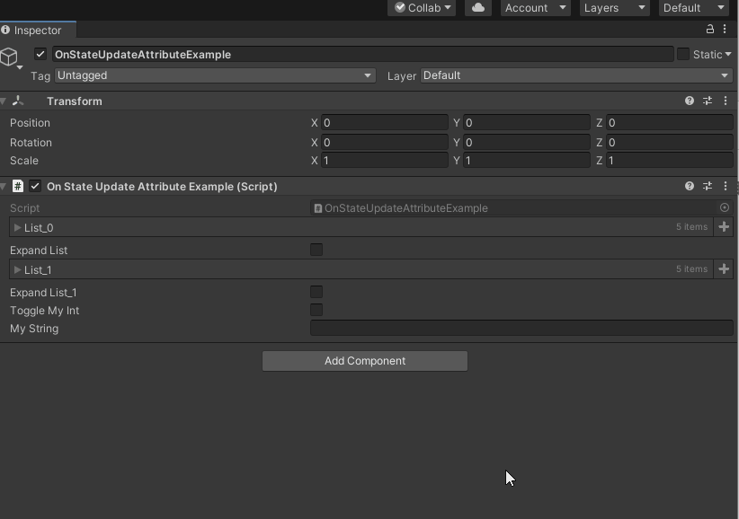

# On State Update

> 可以使用在属性字段上，属性的状态更新时，OnStateUpdate提供事件回调。回调频率每帧至少发生一次，即使属性不可见，也会调用回调。它相当于自定义一个更新回调函数，并且可以通过@+表达式的形式进行回调。



```cs
using Sirenix.OdinInspector;
using System.Collections.Generic;
using UnityEngine;

public class OnStateUpdateAttributeExample : MonoBehaviour
{
    // Start is called before the first frame update
    void Start()
    {

    }

    public List list_0;
    [OnStateUpdate("@#(list_0).State.Expanded = $value")]
    public bool ExpandList;//此 bool 值通过上述表达式控制 list_0 列表

    [OnStateUpdate("@$property.State.Expanded = ExpandList_1")]
    public List list_1;
    public bool ExpandList_1;

    [OnStateUpdate("@$property.State.Visible = ToggleMyInt")]
    public int MyInt;
    public bool ToggleMyInt;

    [OnStateUpdate("CustomPropertyUpdateCallBack")]
    public string MyString;

    private void CustomPropertyUpdateCallBack(string tempMyString)
    {
        if (!string.IsNullOrEmpty(tempMyString))
        {
            Debug.Log(tempMyString);
        }
    }
}
```