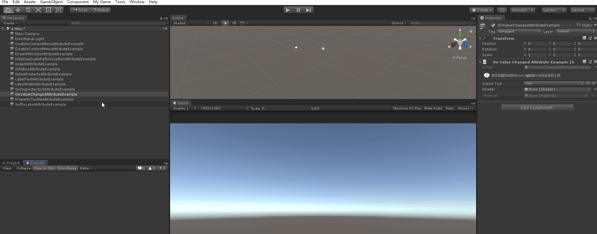

# OnValueChanged

> *On Value Changed Attribute：处理属性和字段，并且只要通过检查器更改了值，就会调用指定的函数。*



```cs
using Sirenix.OdinInspector;
using System.Collections;
using System.Collections.Generic;
using UnityEngine;

public class OnValueChangedAttributeExample : MonoBehaviour
{

    [ShowInInspector]
    [EnumPaging, OnValueChanged("SetCurrentTool")]
    [InfoBox("更改此属性将更改Unity编辑器中当前选择的工具.")]
    private UnityEditor.Tool sceneTool;

    private void SetCurrentTool()
    {
        UnityEditor.Tools.current = this.sceneTool;
        Debug.Log($"更改为：{UnityEditor.Tools.current}");
    }

    [OnValueChanged("CreateMaterial")]
    public Shader Shader;

    [ReadOnly, InlineEditor(InlineEditorModes.LargePreview)]
    public Material Material;

    private void CreateMaterial()
    {
        if (this.Material != null)
        {
            Material.DestroyImmediate(this.Material);
        }

        if (this.Shader != null)
        {
            this.Material = new Material(this.Shader);
        }
    }
}
```