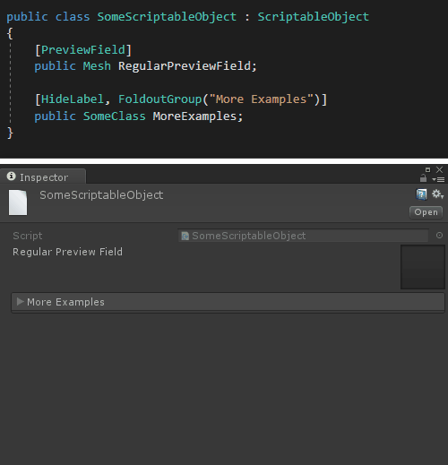
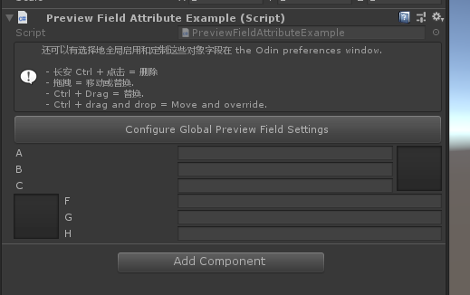

# PreviewFieldAttribute

> *Preview Field Attribute特性：用于绘制一个方形ObjectField，它呈现UnityEngine.Object类型的预览。此对象字段还添加了对拖放的支持，将对象拖动到另一个方形对象字段，交换值。如果在放开时按住控制它将替换值，并且您可以Ctr+单击对象字段以快速删除它保存的值。*





```cs
using Sirenix.OdinInspector;
using UnityEngine;
using UnityEngine.UI;

public class PreviewFieldAttributeExample : MonoBehaviour
{
    [VerticalGroup("row1/left")]
    public string A, B, C;

    [HideLabel]
    [PreviewField(50, ObjectFieldAlignment.Right)]
    [HorizontalGroup("row1", 50), VerticalGroup("row1/right")]
    public Object D;

    [HideLabel]
    [PreviewField(50, ObjectFieldAlignment.Left)]
    [HorizontalGroup("row2", 50), VerticalGroup("row2/left")]
    public Object E;

    [VerticalGroup("row2/right"), LabelWidth(-54)]
    public string F, G, H;

    [InfoBox(
        "还可以有选择地全局启用和定制这些对象字段" +
        "在 the Odin preferences window.\n\n" +
        " - 长安 Ctrl + 点击 = 删除\n" +
        " - 拖拽 = 移动或替换.\n" +
        " - Ctrl + Drag = 替换.\n" +
        " - Ctrl + drag and drop = Move and override.")]
    [PropertyOrder(-1)]
    [Button(ButtonSizes.Large)]
    private void ConfigureGlobalPreviewFieldSettings()
    {
        Sirenix.OdinInspector.Editor.GeneralDrawerConfig.Instance.OpenInEditor();
    }
}
```