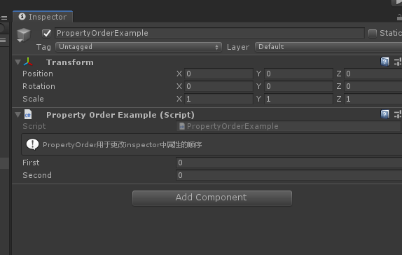

# PropertyOrderAttribute

> *PropertyOrder特性：用于任何属性，并允许对属性进行排序。使用此选项可以定义属性的显示顺序。*



##### 完整示例代码

```cs
using Sirenix.OdinInspector;
using UnityEngine;

public class PropertyOrderExample : MonoBehaviour
{
    [PropertyOrder(1)]
    public int Second;

    [InfoBox("PropertyOrder用于更改inspector中属性的顺序")]
    [PropertyOrder(-1)]
    public int First;
}
```