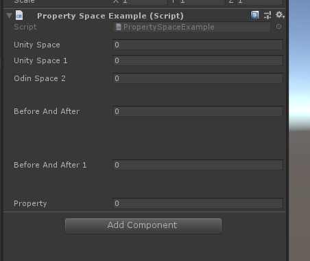

# PropertySpaceAttribute

> *PropertySpace特性：与Unity的现有Space属性具有相同的功能，但可以应用于任何属性而不仅仅是字段*
> *而且还可以控制与前后字段的间距*



##### 完整示例代码

```cs
using Sirenix.OdinInspector;
using UnityEngine;

public class PropertySpaceExample : MonoBehaviour
{
    [Space]
    public int unitySpace;

    [Space(5)]
    public int unitySpace1;
    [PropertySpace]
    public int OdinSpace2;

    //get set 要加上 ShowInInspector才能显示
    [ShowInInspector, PropertySpace]
    public int Property { get; set; }

    // 还可以控制PropertySpace属性前后的间距。
    [PropertySpace(SpaceBefore = 30, SpaceAfter = 30)]
    public int BeforeAndAfter;
    [PropertySpace(SpaceBefore = 30, SpaceAfter = 30)]
    public int BeforeAndAfter1;
}
```