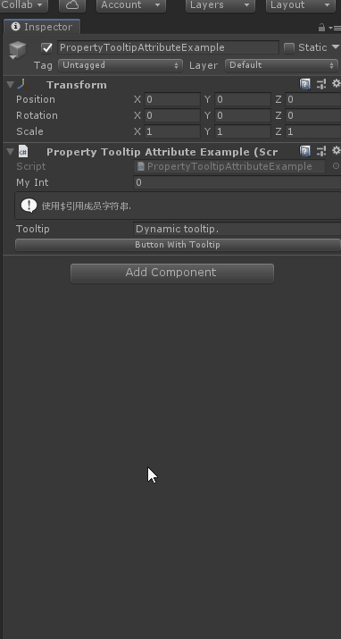

# PropertyTooltip

> *Property Tooltip Attribute：可用于任何属性，并在将属性悬停在检查器中时创建工具提示。用它来解释目的或如何使用属性。*



```cs
using Sirenix.OdinInspector;
using System.Collections;
using System.Collections.Generic;
using UnityEngine;

public class PropertyTooltipAttributeExample : MonoBehaviour
{
    [PropertyTooltip("放在属性上显示对应的悬停提示.")]
    public int MyInt;

    [InfoBox("使用$引用成员字符串.")]
    [PropertyTooltip("$Tooltip")]
    public string Tooltip = "Dynamic tooltip.";

    [Button, PropertyTooltip("Button Tooltip")]
    private void ButtonWithTooltip()
    {
        // ...
    }
}
```