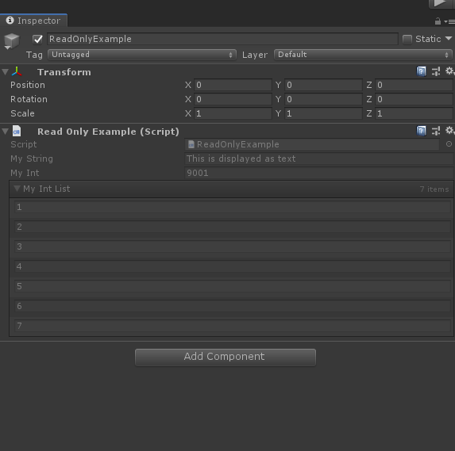

# ReadOnlyAttribute

> *ReadOnly特性：用于任何属性，并禁用该属性在检查器中更改。如果要在检查器中查看属性的值，但不希望更改它，请使用此选项。*
> *就是以灰态的形式展示*



##### 完整示例代码

```cs
using Sirenix.OdinInspector;
using UnityEngine;

public class ReadOnlyExample : MonoBehaviour
{
    [ReadOnly]
    public string MyString = "这将显示为文本";

    [ReadOnly]
    public int MyInt = 9001;

    [ReadOnly]
    public int[] MyIntList = new int[] { 1, 2, 3, 4, 5, 6, 7, };
}
```