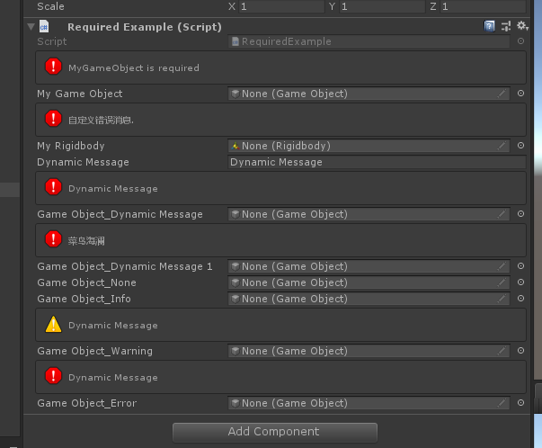
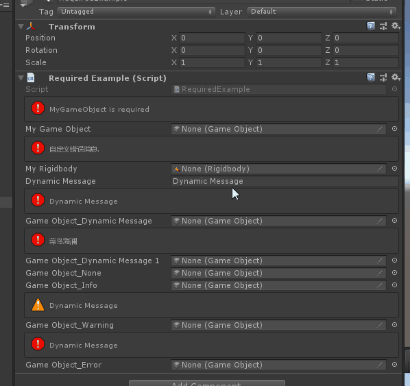
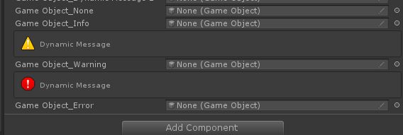

# Required Attribute

> *Required Attribute特性：用于任何对象属性，如果对应属性没有赋值，则在检查器中出现对应的提示消息。*



##### 直接添加特性


```cs
    [Required]
    public GameObject MyGameObject;
```

##### 也可以自定义消息


```cs
    [Required("自定义错误消息.")]
    public Rigidbody MyRigidbody;
```

##### 当然可以使用$关键字使用动态消息



```cs
    public string DynamicMessage = "Dynamic Message";
    [Required("$DynamicMessage")]
    public GameObject GameObject_DynamicMessage;

    [Required("$ReturnStringFunction")]
    public GameObject GameObject_DynamicMessage1;
    public string ReturnStringFunction()
    {
        return "菜鸟海澜";
    }
```

##### 也可以显示不同的消息类型，但是None和Info不显示，目前不知道就是这么设定的还是BUG？、



```cs
    [Required("$DynamicMessage", InfoMessageType.None)]
    public GameObject GameObject_None;
    [Required("$DynamicMessage", InfoMessageType.Info)]
    public GameObject GameObject_Info;
    [Required("$DynamicMessage", InfoMessageType.Warning)]
    public GameObject GameObject_Warning;
    [Required("$DynamicMessage",InfoMessageType.Error)]
    public GameObject GameObject_Error;
```

###### 完整示例代码

```cs
using Sirenix.OdinInspector;
using UnityEngine;

public class RequiredExample : MonoBehaviour
{

    [Required]
    public GameObject MyGameObject;

    [Required("自定义错误消息.")]
    public Rigidbody MyRigidbody;

    public string DynamicMessage = "Dynamic Message";
    [Required("$DynamicMessage")]
    public GameObject GameObject_DynamicMessage;

    [Required("$ReturnStringFunction")]
    public GameObject GameObject_DynamicMessage1;
    public string ReturnStringFunction()
    {
        return "菜鸟海澜";
    }

    [Required("$DynamicMessage", InfoMessageType.None)]
    public GameObject GameObject_None;
    [Required("$DynamicMessage", InfoMessageType.Info)]
    public GameObject GameObject_Info;
    [Required("$DynamicMessage", InfoMessageType.Warning)]
    public GameObject GameObject_Warning;
    [Required("$DynamicMessage",InfoMessageType.Error)]
    public GameObject GameObject_Error;
}
```