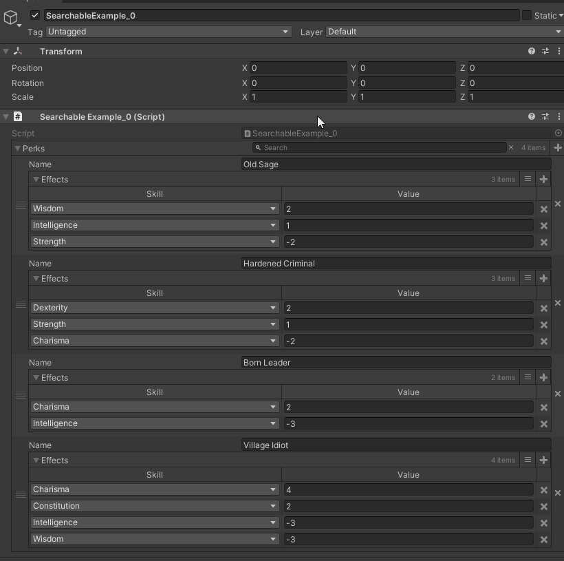
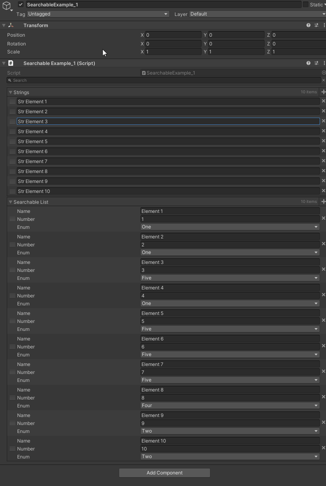
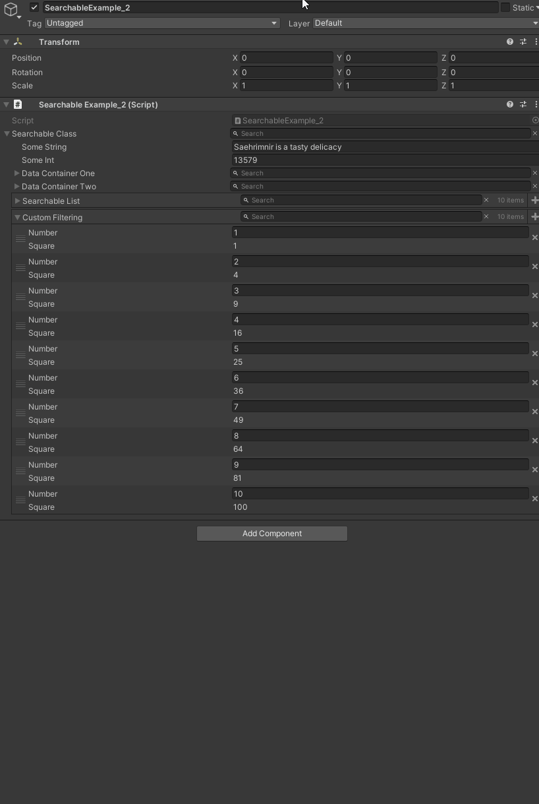

# Searchable Atribute

> 通过添加SearchableAttribute特性为其添加一个搜索框，可用于搜索对应的类或其子类的成员，但目前不可用于字典类型。



```cs
using Sirenix.OdinInspector;
using System;
using System.Collections.Generic;
using UnityEngine;

public class SearchableExample_0 : MonoBehaviour
{
    [Searchable]
    public List Perks = new List()
{
    new Perk()
    {
        Name = "Old Sage",
        Effects = new List()
        {
            new Effect() { Skill = Skill.Wisdom, Value = 2, },
            new Effect() { Skill = Skill.Intelligence, Value = 1, },
            new Effect() { Skill = Skill.Strength, Value = -2 },
        },
    },
    new Perk()
    {
        Name = "Hardened Criminal",
        Effects = new List()
        {
            new Effect() { Skill = Skill.Dexterity, Value = 2, },
            new Effect() { Skill = Skill.Strength, Value = 1, },
            new Effect() { Skill = Skill.Charisma, Value = -2 },
        },
    },
    new Perk()
    {
        Name = "Born Leader",
        Effects = new List()
        {
            new Effect() { Skill = Skill.Charisma, Value = 2, },
            new Effect() { Skill = Skill.Intelligence, Value = -3 },
        },
    },
    new Perk()
    {
        Name = "Village Idiot",
        Effects = new List()
        {
            new Effect() { Skill = Skill.Charisma, Value = 4, },
            new Effect() { Skill = Skill.Constitution, Value = 2, },
            new Effect() { Skill = Skill.Intelligence, Value = -3 },
            new Effect() { Skill = Skill.Wisdom, Value = -3 },
        },
    },
};

    [Serializable]
    public class Perk
    {
        public string Name;

        [TableList]
        public List Effects;
    }

    [Serializable]
    public class Effect
    {
        public Skill Skill;
        public float Value;
    }

    public enum Skill
    {
        Strength,
        Dexterity,
        Constitution,
        Intelligence,
        Wisdom,
        Charisma,
    }
}
```

## 放置在类顶进行全局搜索



```cs
using Sirenix.OdinInspector;
using Sirenix.OdinInspector.Editor.Examples;
using System;
using System.Collections.Generic;
using System.Linq;
using UnityEngine;

[Searchable]
public class SearchableExample_1 : MonoBehaviour
{
    public List strings = new List(Enumerable.Range(1, 10).Select(i => "Str Element " + i));

    public List searchableList = new List(Enumerable.Range(1, 10).Select(i => new ExampleStruct(i)));

    [Serializable]
    public struct ExampleStruct
    {
        public string Name;
        public int Number;
        public ExampleEnum Enum;

        public ExampleStruct(int nr) : this()
        {
            this.Name = "Element " + nr;
            this.Number = nr;
            this.Enum = (ExampleEnum)ExampleHelper.RandomInt(0, 5);
        }
    }

    public enum ExampleEnum
    {
        One, Two, Three, Four, Five
    }
}
```

## Searchable应用到对应的类型上后，使用对应的类型都会出现搜索栏，也可以通过 `ISearchFilterable`接口自定义搜索规则



```cs
using Sirenix.OdinInspector;
using Sirenix.OdinInspector.Editor.Examples;
using System;
using System.Collections.Generic;
using System.Linq;
using UnityEngine;

public class SearchableExample_2 : MonoBehaviour
{
    [Searchable]
    public ExampleClass searchableClass = new ExampleClass();

    [Searchable]
    public List searchableList = new List(Enumerable.Range(1, 10).Select(i => new ExampleStruct(i)));

    [Searchable(FilterOptions = SearchFilterOptions.ISearchFilterableInterface)]
    public List customFiltering = new List(Enumerable.Range(1, 10).Select(i => new FilterableBySquareStruct(i)));

    [Serializable]
    public class ExampleClass
    {
        public string SomeString = "Saehrimnir is a tasty delicacy";
        public int SomeInt = 13579;

        public DataContainer DataContainerOne = new DataContainer() { Name = "Example Data Set One" };
        public DataContainer DataContainerTwo = new DataContainer() { Name = "Example Data Set Two" };
    }

    [Serializable, Searchable] // You can also apply it on a type like this, and it will become searchable wherever it appears
    public class DataContainer
    {
        public string Name;
        public List Data = new List(Enumerable.Range(1, 10).Select(i => new ExampleStruct(i)));
    }

    [Serializable]
    public struct FilterableBySquareStruct : ISearchFilterable
    {
        public int Number;

        [ShowInInspector, DisplayAsString, EnableGUI]
        public int Square { get { return this.Number * this.Number; } }

        public FilterableBySquareStruct(int nr)
        {
            this.Number = nr;
        }

        public bool IsMatch(string searchString)
        {
            return searchString.Contains(Square.ToString());
        }
    }

    [Serializable]
    public struct ExampleStruct
    {
        public string Name;
        public int Number;
        public ExampleEnum Enum;

        public ExampleStruct(int nr) : this()
        {
            this.Name = "Element " + nr;
            this.Number = nr;

            this.Enum = (ExampleEnum)ExampleHelper.RandomInt(0, 5);
        }
    }

    public enum ExampleEnum
    {
        One, Two, Three, Four, Five
    }
}
```