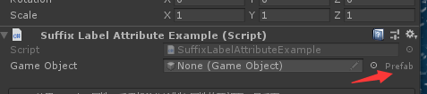
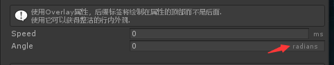
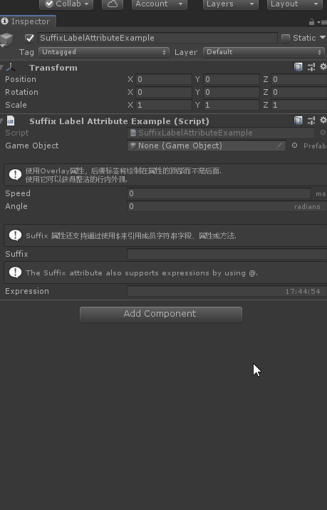

# SuffixLabel

> Suffix Label:*属性在属性的末尾绘制一个标签。用它来传达有关属性的意图。*



```cs
    [SuffixLabel("Prefab")]
    public GameObject GameObject;
```

##### 【Overlay】使后缀覆盖在框内而不是单独的在末尾处



```cs
    [SuffixLabel("ms", Overlay = false)]
    public float Speed;

    [SuffixLabel("radians", Overlay = true)]
    public float Angle;
```

##### 可以使用$引用字段、属性和方法的值作为实参 ，也可以使用@直接输入对应的表达式



```cs
    [Space(15)]
    [InfoBox("Suffix 属性还支持通过使用$来引用成员字符串字段、属性或方法.")]
    [SuffixLabel("$Suffix", Overlay = true)]
    public string Suffix = "Dynamic suffix label";

    [InfoBox("Suffix属性还支持使用@表达式 .")]
    [SuffixLabel("@DateTime.Now.ToString(\"HH:mm:ss\")", true)]
    public string Expression;
```

#### 完整示例代码

```cs
using Sirenix.OdinInspector;
using System.Collections;
using System.Collections.Generic;
using UnityEngine;

public class SuffixLabelAttributeExample : MonoBehaviour
{
    [SuffixLabel("Prefab")]
    public GameObject GameObject;

    [Space(15)]
    [InfoBox(
        "使用Overlay属性，后缀标签将绘制在属性的顶部而不是后面.\n" +
        "使用它可以获得整洁的行内外观.")]
    [SuffixLabel("ms", Overlay = false)]
    public float Speed;

    [SuffixLabel("radians", Overlay = true)]
    public float Angle;

    [Space(15)]
    [InfoBox("Suffix 属性还支持通过使用$来引用成员字符串字段、属性或方法.")]
    [SuffixLabel("$Suffix", Overlay = true)]
    public string Suffix = "Dynamic suffix label";

    [InfoBox("Suffix属性还支持使用@表达式 .")]
    [SuffixLabel("@DateTime.Now.ToString(\"HH:mm:ss\")", true)]
    public string Expression;
}
```