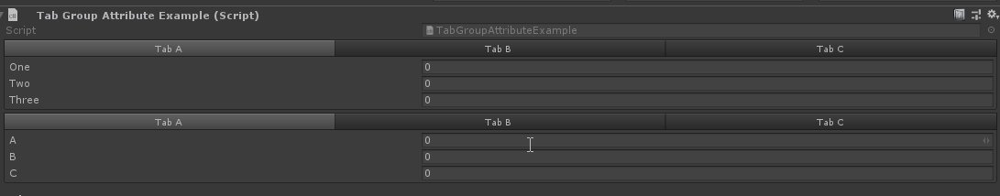
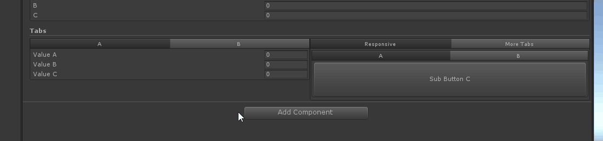

# Tab Group

> Tab Group特性：可以用于热河属性，并将属性组织到不同的选项卡中。使用它来组织不同的值，以便清洁检查器变的易于使用。

【TabGroup】创建一个选项卡组，并指定选项卡祖的名称。




```cs
    [TabGroup("Tab A")]
    public int One;
    [TabGroup("Tab A")]
    public int Two;
    [TabGroup("Tab A")]
    public int Three;
    [TabGroup("Tab B")]
    public string MyString;
    [TabGroup("Tab B")]
    public float MyFloat;
    [TabGroup("Tab C")]
    [HideLabel]
    public MyTabObject TabC;
```

##### 也可以为选项卡指定对应的组

```cs
    [TabGroup("New Group", "Tab A")]
    public int A;
    [TabGroup("New Group", "Tab A")]
    public int B;
    [TabGroup("New Group", "Tab A")]
    public int C;
    [TabGroup("New Group", "Tab B")]
    public string D;
    [TabGroup("New Group", "Tab B")]
    public float E;
    [TabGroup("New Group", "Tab C")]
    public MyTabObject F;
    [Serializable]
    public class MyTabObject
    {
        public int A;
        public int B;
        public int C;
    }
```

##### 嵌套复杂的情况



```cs
    [TitleGroup("Tabs")]
    [HorizontalGroup("Tabs/Split", Width = 0.5f)]
    [TabGroup("Tabs/Split/Parameters", "A")]
    public string NameA, NameB, NameC;

    [TabGroup("Tabs/Split/Parameters", "B")]
    public int ValueA, ValueB, ValueC;

    [TabGroup("Tabs/Split/Buttons", "Responsive")]
    [ResponsiveButtonGroup("Tabs/Split/Buttons/Responsive/ResponsiveButtons")]
    public void Hello() { }

    [ResponsiveButtonGroup("Tabs/Split/Buttons/Responsive/ResponsiveButtons")]
    public void World() { }

    [ResponsiveButtonGroup("Tabs/Split/Buttons/Responsive/ResponsiveButtons")]
    public void And() { }

    [ResponsiveButtonGroup("Tabs/Split/Buttons/Responsive/ResponsiveButtons")]
    public void Such() { }

    [Button]
    [TabGroup("Tabs/Split/Buttons", "More Tabs")]
    [TabGroup("Tabs/Split/Buttons/More Tabs/SubTabGroup", "A")]
    public void SubButtonA() { }

    [Button]
    [TabGroup("Tabs/Split/Buttons/More Tabs/SubTabGroup", "A")]
    public void SubButtonB() { }

    [Button(ButtonSizes.Gigantic)]
    [TabGroup("Tabs/Split/Buttons/More Tabs/SubTabGroup", "B")]
    public void SubButtonC() { }
```


##### 完整示例代码

```cs
using Sirenix.OdinInspector;
using System;
using UnityEngine;

public class TabGroupAttributeExample : MonoBehaviour
{
    [TabGroup("Tab A")]
    public int One;
    [TabGroup("Tab A")]
    public int Two;
    [TabGroup("Tab A")]
    public int Three;
    [TabGroup("Tab B")]
    public string MyString;
    [TabGroup("Tab B")]
    public float MyFloat;
    [TabGroup("Tab C")]
    [HideLabel]
    public MyTabObject TabC;

    [TabGroup("New Group", "Tab A")]
    public int A;
    [TabGroup("New Group", "Tab A")]
    public int B;
    [TabGroup("New Group", "Tab A")]
    public int C;
    [TabGroup("New Group", "Tab B")]
    public string D;
    [TabGroup("New Group", "Tab B")]
    public float E;
    [TabGroup("New Group", "Tab C")]
    public MyTabObject F;
    [Serializable]
    public class MyTabObject
    {
        public int A;
        public int B;
        public int C;
    }

    [TitleGroup("Tabs")]
    [HorizontalGroup("Tabs/Split", Width = 0.5f)]
    [TabGroup("Tabs/Split/Parameters", "A")]
    public string NameA, NameB, NameC;

    [TabGroup("Tabs/Split/Parameters", "B")]
    public int ValueA, ValueB, ValueC;

    [TabGroup("Tabs/Split/Buttons", "Responsive")]
    [ResponsiveButtonGroup("Tabs/Split/Buttons/Responsive/ResponsiveButtons")]
    public void Hello() { }

    [ResponsiveButtonGroup("Tabs/Split/Buttons/Responsive/ResponsiveButtons")]
    public void World() { }

    [ResponsiveButtonGroup("Tabs/Split/Buttons/Responsive/ResponsiveButtons")]
    public void And() { }

    [ResponsiveButtonGroup("Tabs/Split/Buttons/Responsive/ResponsiveButtons")]
    public void Such() { }

    [Button]
    [TabGroup("Tabs/Split/Buttons", "More Tabs")]
    [TabGroup("Tabs/Split/Buttons/More Tabs/SubTabGroup", "A")]
    public void SubButtonA() { }

    [Button]
    [TabGroup("Tabs/Split/Buttons/More Tabs/SubTabGroup", "A")]
    public void SubButtonB() { }

    [Button(ButtonSizes.Gigantic)]
    [TabGroup("Tabs/Split/Buttons/More Tabs/SubTabGroup", "B")]
    public void SubButtonC() { }
}
```