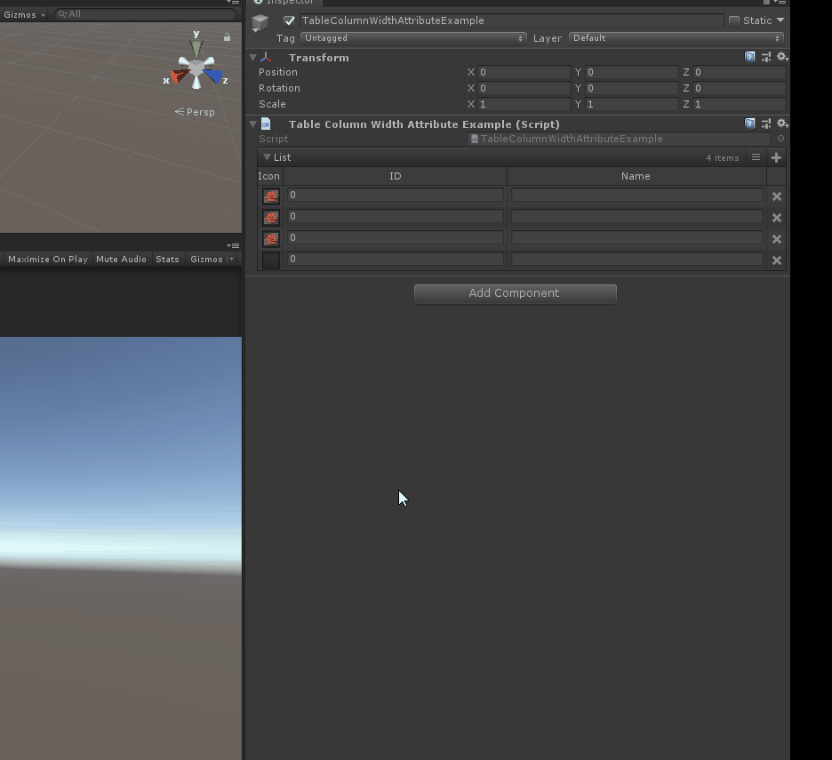

# Table Column Width

> *用于进一步自定义使用“ TableListAttribute” 绘制的表中的列的宽度。*

##### 【Resizable】 控制是否自动调整大小



```cs
using Sirenix.OdinInspector;
using Sirenix.Utilities.Editor;
using System;
using System.Collections;
using System.Collections.Generic;
using UnityEngine;

public class TableColumnWidthAttributeExample : MonoBehaviour
{
    [TableList]
    public List List = new List()
{
    new MyItem(),
    new MyItem(),
    new MyItem(),
};

    [Serializable]
    public class MyItem
    {
        [PreviewField(Height = 20)]
        [TableColumnWidth(30, Resizable = false)]
        public Texture2D Icon;

        [TableColumnWidth(60)]
        public int ID;
        [TableColumnWidth(100)]
        public string Name;
    }
}
```