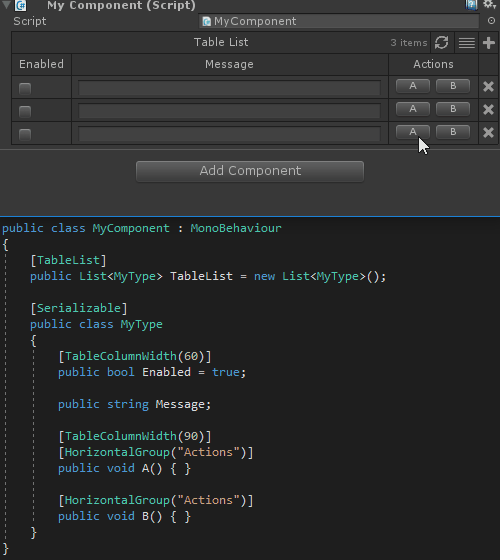
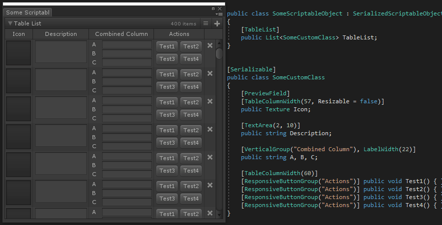
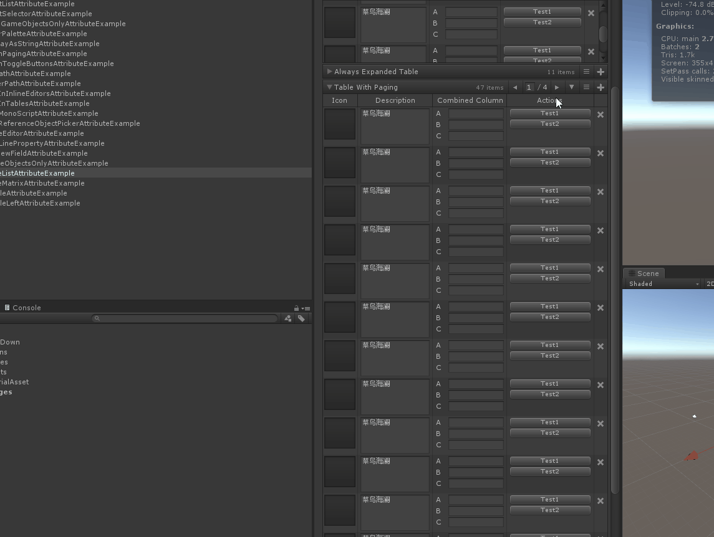

# Table List

> *用于在检查器中将列表和数组呈现为表。*






##### 【ShowIndexLabels】设置为True，则为每个元素绘制一个标签，其中显示元素的索引。


```cs
    [TableList(ShowIndexLabels = true)]
    public List TableListWithIndexLabels = new List()
{
    new SomeCustomClass(),
    new SomeCustomClass(),
};
```

##### 【DrawScrollView 】为True，为table添加一个滚动条，并设置滚动条最大高度（MaxScrollViewHeight ）和最小高度（MinScrollViewHeight ）


```cs
    [TableList(DrawScrollView = true, MaxScrollViewHeight = 200, MinScrollViewHeight = 100)]
    public List MinMaxScrollViewTable = new List()
{
    new SomeCustomClass(),
    new SomeCustomClass(),
};
```

##### 【ShowPaging】设置为True，则绘制一个翻页的选项 【NumberOfItemsPerPage】则设置每个分页含有的Item数量，默认15个



```cs
    [TableList(ShowPaging = true, DrawScrollView = false)]
    public List TableWithPaging = new List()
{
    new SomeCustomClass(),
    new SomeCustomClass(),
    new SomeCustomClass(),
    new SomeCustomClass(),
    new SomeCustomClass(),
    new SomeCustomClass(),
    new SomeCustomClass(),
};
```

##### 辅助性功能

- **【IsReadOnly】在检查器中不可修改**
- **【HideToolbar】隐藏翻页等工具**
- **【CellPadding】每个Item及属性的间隔**
- **【ScrollViewHeight】固定滚动条高度**
- **【MinScrollViewHeight】最小滚动条高度**
- **【MaxScrollViewHeight】最大滚动条高度**


##### 完整示例代码

```cs
using Sirenix.OdinInspector;
using System;
using System.Collections.Generic;
using UnityEngine;
using UnityEngine.UI;

public class TableListAttributeExample : MonoBehaviour
{
    [TableList(ShowIndexLabels = true)]
    public List TableListWithIndexLabels = new List()
{
    new SomeCustomClass(),
    new SomeCustomClass(),
};

    [TableList(DrawScrollView = true, MaxScrollViewHeight = 200, MinScrollViewHeight = 100)]
    public List MinMaxScrollViewTable = new List()
{
    new SomeCustomClass(),
    new SomeCustomClass(),
};

    [TableList(DrawScrollView = false)]
    public List AlwaysExpandedTable = new List()
{
    new SomeCustomClass(),
    new SomeCustomClass(),
};

    [TableList(ShowPaging = true, DrawScrollView = false)]
    public List TableWithPaging = new List()
{
    new SomeCustomClass(),
    new SomeCustomClass(),
    new SomeCustomClass(),
    new SomeCustomClass(),
    new SomeCustomClass(),
    new SomeCustomClass(),
    new SomeCustomClass(),
};

    [Serializable]
    public class SomeCustomClass
    {
        [TableColumnWidth(57, Resizable = false)]
        [PreviewField(Alignment = ObjectFieldAlignment.Center)]
        public Texture Icon;

        [TextArea]
        public string Description = ExampleHelper.GetString();

        [VerticalGroup("Combined Column"), LabelWidth(22)]
        public string A, B, C;

        [TableColumnWidth(60)]
        [Button, VerticalGroup("Actions")]
        public void Test1() { }

        [TableColumnWidth(60)]
        [Button, VerticalGroup("Actions")]
        public void Test2() { }
    }
}
```